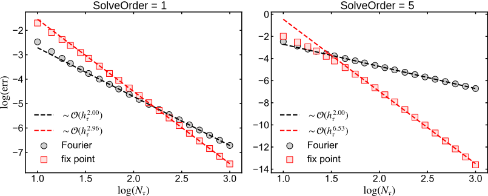
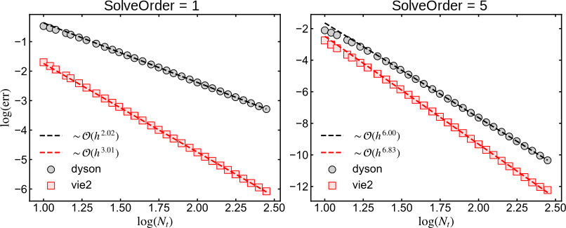

.. _testeq:

Test of accuracy of Dyson solver: equilibrium
==============================================

.. contents::
   :local:
   :depth: 2

:ref:`Back to top <P4>`

.. _testeq_1:

Synopsis
--------

This test program tests the accuracy of the solution of the Dyson equation on the Matsubara axis (see :ref:`PMan07`) in the context of a numerically exactly solvable downfolding problem. The scaling of the averaged error can be obtained for different values of ``SolveOrder``.

.. _testeq_2:

Details and implementation
--------------------------

We consider a :math:`2\times 2` matrix-valued time-independent Hamiltonian

.. math::
   :label: eq:ham2x2

   \epsilon = \begin{pmatrix} \epsilon_1 & i \lambda \\ -i\lambda &
     \epsilon_2 \end{pmatrix}  \ .

The corresponding numerically exact Green's function :math:`G(t,t^\prime)` (assuming fermions) is computed using the routine ``cntr::green_from_H``. One can also calculate the (1,1) component of this Green's function by **downfolding**. In this procedure, we solve

.. math::
   :label: eq:downfold1

   \left(i \partial_t - \epsilon_1 \right) g_1(t,t^\prime)  =
   \delta_\mathcal{C}(t,t^\prime)
   + \int_{\mathcal{C}}d \bar{t}\, \Sigma(t,\bar t) g_1(\bar t,t^\prime)

with the embedding self-energy :math:`\Sigma(t,t^\prime) = |\lambda|^2 g_2(t,t^\prime)`. Here, :math:`g_2(t,t^\prime)` is the free Green's function with respect to

.. math::

   \left(i \partial_t - \epsilon_2 \right) g_2(t,t^\prime)  =
   \delta_\mathcal{C}(t,t^\prime) \ .

The solution of the downfolding Dyson equation :eq:`eq:downfold1` must be identical to the :math:`(1,1)` matrix element of :math:`G`: :math:`G_{1,1}(t,t^\prime)=g_1(t,t^\prime)`.

The test program for the equilibrium problem solves Eq. :eq:`eq:downfold1` for the Matsubara component only (``tstp=-1``), and computes the differences between the exact and approximate solution as

.. math::
   :label: eq:test_eq_err

   \mathrm{err.} = \frac{1}{N_\tau} \Delta[G_{1,1},g_1] \ .

Here, :math:`\Delta[A,B]` denotes the norm difference (see :ref:`PMan09S01`) at ``tstp=-1``.

In the test program ``programs/test_equilibrium.cpp``, we have implemented this task in a straightforward way.
The code is a direct extension of a generic ``libcntr``-based program (see :ref:`P2S2`). The parameters of the Hamiltonian are defined as constants. In particular, we fix :math:`\epsilon_1=-1`, :math:`\epsilon_2=1`, :math:`\lambda=0.5`. The chemical potential is set to :math:`\mu=0` and the inverse temperature fixed to :math:`\beta=20`. After reading the input from file (see :ref:`PMan14`), we define the :math:`2\times 2` Hamiltonian :eq:`eq:ham2x2` as an `eigen3 <http://eigen.tuxfamily.org/index.php?title=Main_Page>`_ complex matrix:

.. code-block:: cpp

      cdmatrix eps_2x2(2,2);
      eps_2x2(0,0) = eps1;
      eps_2x2(1,1) = eps2;
      eps_2x2(0,1) = I*lam;
      eps_2x2(1,0) = -I*lam;

The :math:`1\times 1` Hamiltonian representing :math:`\epsilon_1` is constructed as

.. code-block:: cpp

      CFUNC eps_11_func(-1,1);
      eps_11_func.set_constant(eps1*MatrixXcd::Identity(1,1));

Here, ``eps_11_func`` is a contour function entering the solvers below. Note the first argument in the constructor of ``CFUNC``: the number of real-time points :math:`N_t` is set to -1. In this case, only the Matsubara part is addressed. Its value is fixed to the constant :math:`1\times 1` matrix by the last line. With the Hamiltonians defined, we can initialize and construct the free :math:`2\times 2` exact Green's function by

.. code-block:: cpp

      GREEN G2x2(-1,Ntau,2,FERMION);
      cntr::green_from_H(G2x2,mu,eps_2x2,beta,h);

The time step ``h`` is a dummy argument here, as the real-time components are not addressed. From the exact Green's function, we extract the submatrix :math:`G_{1,1}` by

.. code-block:: cpp

      GREEN G_exact(-1,Ntau,1,FERMION);
      G_exact.set_matrixelement(-1,0,0,G2x2);

Finally, we define the embedding self-energy by

.. code-block:: cpp

      GREEN Sigma(-1,Ntau,1,FERMION);
      cdmatrix eps_22=eps2*MatrixXcd::Identity(1,1);
      cntr::green_from_H(Sigma, mu, eps_22, beta, h);
      Sigma.smul(-1,lam*lam);

The last line performs the multiplication of :math:`\mathcal{T}[\Sigma]_{-1}` with the scalar :math:`\lambda^2`. After initializing the approximate Green's function ``G_approx``, we can solve the Matsubara Dyson equation and compute the average error:

.. code-block:: cpp

      cntr::dyson_mat(G_approx,  mu, eps_11_func, Sigma, beta, SolveOrder, CNTR_MAT_FOURIER);
      err_fourier = cntr::distance_norm2(-1,G_exact,G_approx) / Ntau;

      cntr::dyson_mat(G_approx,  mu, eps_11_func, Sigma, beta, SolveOrder, CNTR_MAT_FIXPOINT);
      err_fixpoint = cntr::distance_norm2(-1,G_exact,G_approx) / Ntau;

The relevant source files are the following:

.. list-table::
   :header-rows: 0

   * - ``programs/test_equilibrium.cpp``
     - source code of program
   * - ``utils/test_equilibrium.py``
     - python driver script

.. _testeq_3:

Running the program
-------------------

The program is run by

.. code-block:: sh

   ./exe/test_equilibrium.x inp/input_equilibrium.inp

Here, ``inp/input_equilibrium.inp`` is a ``libcntr`` input file with the format described in :ref:`PMan14`. It contains the variables

.. list-table::
   :header-rows: 0

   * - ``Ntau``
     - Number of points on the Matsubara axis
   * - ``SolveOrder``
     - Solution order

The output is appended to the file ``out/test_nonequilibrium.dat`` in two columns, the error of the Fourier method and the Newton iteration. For instance, the input ``Ntau=100`` and ``SolveOrder=2`` yields the output

.. code-block:: sh

   $ cat out/test_equilibrium.dat
   1.9385e-05 7.0587e-06

We provide a useful python driver script, which runs ``test_equilibrium.x`` for a range of values of ``Ntau``.
It uses the python module ``ReadCNTR`` (see :ref:`PMan13`). It can be launched via

.. code-block:: sh

   python utils/test_equilibrium.py 2

The last argument is ``SolveOrder=1,...,5``. After running the calculation, the logarithm of the error is plotted against :math:`\log(N_\tau)`, and the scaling of the error is extracted by a linear regression.

.. _Equilibrium_scaling:

   Equilibrium scaling: Average error of solving the Matsubara Dyson equation with the Fourier method (circles) and the fix-point iteration (squares) for ``SolveOrder=1`` (left) and ``SolveOrder=5`` (right panel).

:ref:`Back to top <P4>`

.. _testneq:

Test of accuracy of Dyson solver: nonequilibrium
=================================================

.. contents::
   :local:
   :depth: 2

.. _testneq_1:

Synopsis
--------

This test program tests — similar to the example :ref:`testeq` — the accuracy of the solution of the Dyson equation (see :ref:`PMan07`) and Volterra integral equation (see :ref:`PMan08`) for the numerically exactly solvable downfolding problem. The scaling of the averaged error can be obtained for different values of ``SolveOrder``.

.. _testneq_2:

Details and Implementation
--------------------------

In this example, we solve the Dyson equation :eq:`eq:downfold1` on the whole Kadanoff-Baym contour :math:`\mathcal{C}`. Equivalently, one can also solve the Dyson equation in integral form

.. math::
   :label: eq:downfold1_vie

   & g_1(t,t^\prime) + [F\ast g_1](t,t^\prime) = g^{(0)}_1(t,t^\prime) \ , \\
   & g_1(t,t^\prime) +  [g_1\ast F^\ddagger](t,t^\prime) = g^{(0)}_1(t,t^\prime) \ ,

where :math:`F= -\Sigma\ast g_1^{(0)}` and :math:`F^\ddagger=-g_1^{(0)}\ast \Sigma`. The free Green's function :math:`g_1^{(0)}(t,t^\prime)` is known analytically and computed by calling the routine ``cntr::green_from_H`` (see :ref:`PMan12S02`).

The structure of the test program is analogous to the equilibrium case. After reading the parameters from the input file and fixing ``h=Tmax/Nt``, the embedding self-energy is constructed on the whole contour by

.. code-block:: cpp

   cntr::green_from_H(Sigma, mu, eps_22, beta, h);

   for(tstp=-1; tstp<=Nt; tstp++) {
       Sigma.smul(tstp,lam*lam);
   }

Solving a generic Dyson equation is accomplished by three steps (see :ref:`PMan07`):

1. solve the equilibrium problem by solving the corresponding Matsubara Dyson equation,
2. compute the NEGFs for time steps ``n=0,...,SolveOrder`` by using the starting algorithm (bootstrapping), and
3. perform the time stepping for ``n=SolveOrder+1,...,Nt``.

For Eq. :eq:`eq:downfold1`, this task is accomplished by

.. code-block:: cpp

   GREEN G_approx(Nt, Ntau, 1, FERMION);

   // equilibrium
   cntr::dyson_mat(G_approx, mu, eps_11_func, Sigma, beta, SolveOrder);

   // start
   cntr::dyson_start(G_approx, mu, eps_11_func, Sigma, beta, h, SolveOrder);

   // time stepping
   for (tstp=SolverOrder+1; tstp<=Nt; tstp++) {
       cntr::dyson_timestep(tstp, G_approx, mu, eps_11_func, Sigma, beta, h, SolveOrder);
   }

The deviation of the nonequilibrium Keldysh components from the exact solution is calculated using the Euclidean norm distance (see :ref:`PMan09S01`). Here, we define the average error by

.. code-block:: cpp

   err_dyson=0.0;
   for(tstp=0; tstp<=Nt; tstp++){
       err_dyson += 2.0 * cntr::distance_norm2_les(tstp, G_exact, G_approx) / (Nt*Nt);
       err_dyson += 2.0 * cntr::distance_norm2_ret(tstp, G_exact, G_approx) / (Nt*Nt);
       err_dyson += cntr::distance_norm2_tv(tstp, G_exact, G_approx) / (Nt*Ntau);
   }

Note that we compare here individual components of the Green's functions (``G_exact`` and ``G_approx``) by using ``cntr::distance_norm2_XXX``. One may use also a single ``cntr::distance_norm2`` routine.

Solving the integral form :eq:`eq:downfold1_vie` by using ``vie2`` proceeds in three analogous steps, as for Dyson (see :ref:`PMan08S01`). The following source code demonstrates the implementation:

.. code-block:: cpp

   // noninteracting 1x1 Greens function (Sigma=0)
   GREEN G0(Nt,Ntau,1,FERMION);
   cdmatrix eps_11=eps1*MatrixXcd::Identity(1,1);
   cntr::green_from_H(G0, mu, eps_11, beta, h);

   GREEN G_approx(Nt,Ntau,1,FERMION);
   GREEN F(Nt,Ntau,1,FERMION);
   GREEN Fcc(Nt,Ntau,1,FERMION);

   // equilibrium
   GenKernel(-1, G0, Sigma, F, Fcc, beta, h, SolveOrder);
   cntr::vie2_mat(G_approx, F, Fcc, G0, beta, SolveOrder);

   // start
   for(tstp=0; tstp <= SolveOrder; tstp++){
       GenKernel(tstp, G0, Sigma, F, Fcc, beta, h, SolveOrder);
   }
   cntr::vie2_start(G_approx, F, Fcc, G0, beta, h, SolveOrder);

   // time stepping
   for (tstp=SolveOrder+1; tstp<=Nt; tstp++) {
       GenKernel(tstp, G0, Sigma, F, Fcc, beta, h, SolveOrder);
       cntr::vie2_timestep(tstp, G_approx, F, Fcc, G0, beta, h, SolveOrder);
   }

For convenience, we have defined the routine ``GenKernel`` which calculates the convolution kernels :math:`F` and :math:`F^\ddagger`:

.. code-block:: cpp

   void GenKernel(int tstp, GREEN &G0, GREEN &Sigma, GREEN &F, GREEN &Fcc, const double beta, const double h, const int SolveOrder){
       cntr::convolution_timestep(tstp, F, G0, Sigma, beta, h, SolveOrder);
       cntr::convolution_timestep(tstp, Fcc, Sigma, G0, beta, h, SolveOrder);
       F.smul(tstp,-1);
       Fcc.smul(tstp,-1);
   }

The error is computed in the same way as above:

.. code-block:: cpp

   err_dyson=0.0;
   for(tstp=0; tstp<=Nt; tstp++){
       err_vie2 += 2.0 * cntr::distance_norm2_les(tstp, G_exact, G_approx) / (Nt*Nt);
       err_vie2 += 2.0 * cntr::distance_norm2_ret(tstp, G_exact, G_approx) / (Nt*Nt);
       err_vie2 += cntr::distance_norm2_tv(tstp, G_exact, G_approx) / (Nt*Ntau);
   }

The implementation of this example can be found here:

.. list-table::
   :header-rows: 0

   * - ``programs/test_nonequilibrium.cpp``
     - source code of program
   * - ``utils/test_nonequilibrium.py``
     - python driver script

.. _testneq_3:

Running the program
-------------------

The program is run by

.. code-block:: sh

   ./exe/test_nonequilibrium.x inp/input_nonequilibrium.inp

As above, ``inp/input_nonequilibrium.inp`` is an input file formatted as explained in :ref:`PMan14`, providing the following input variables:

.. list-table::
   :header-rows: 0

   * - ``Nt``
     - Number of points on the real-time axis
   * - ``Ntau``
     - Number of points on the Matsubara axis
   * - ``Tmax``
     - Propagation time, defines the time step interval by ``h=Tmax/Nt``
   * - ``SolveOrder``
     - Solution order

The output is appended to the file ``out/test_nonequilibrium.dat``. The two columns contain the error of solving the problem as Dyson equation and as Volterra integral equation, respectively. As an example, setting ``Nt=100``, ``Ntau=200``, ``Tmax=5.0`` and ``SolveOrder=1`` yields

.. code-block:: sh

   $ cat out/test_nonequilibrium.dat
   0.0081178 4.5843e-05

The python driver script ``utils/test_nonequilibrium.py`` provides a simple interface to run the test program, which performs calculations for a series of values of ``Nt``. Simply run

.. code-block:: sh

   python utils/test_nonequilibrium.py k

where ``k=1,...,5`` stands for the ``SolveOrder`` input.

After running the calculations, the logarithm of the error is plotted against :math:`\log(N_t)`. The scaling of the error is extracted by a linear regression of the logarithmic errors. The plots produced by ``utils/test_nonequilibrium.py`` are shown in :numref:`test_nonequilibrium`. As confirmed in :numref:`test_nonequilibrium`, the average error scales as :math:`\mathcal{O}(h^{k+1})` for ``dyson``, while solving the problem using ``vie2`` yields a :math:`\mathcal{O}(h^{k+2})` scaling (:math:`k` stands for ``SolveOrder``.)

.. _Nonequilibrium_scaling:

.. _test_nonequilibrium:

   Nonequilibrium scaling: Average error for the integro-differential (Dyson) and integral (VIE2) formulation of the downfolding problem for ``SolveOrder=1`` (left) and ``SolveOrder=5`` (right panel). We adopt the same parameters as for the equilibrium case but fix ``Ntau=800``.

:ref:`Back to top <P4>`
