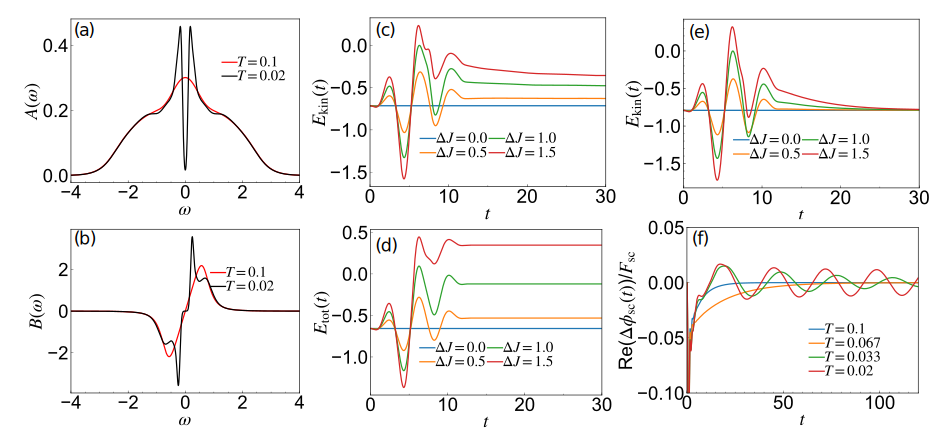

.. _Sec_Hols_dmft:

DMFT for the Holstein model
============================

.. contents::
   :local:
   :depth: 2

.. _Sec_Hols_dmft_1:

Synopsis
--------

Here, we consider the lattice version of the previous problem, the so-called Holstein model,
whose Hamiltonian is

.. math::
   :label: eq:Holstein

   H(t)=-J(t)\sum_{\langle i,j\rangle,\sigma}\hat{c}_{i,\sigma}^{\dagger}\hat{c}_{j,\sigma}-\mu\sum_i \hat{n}_i
   +\omega_0\sum_i \hat{a}^{\dagger}_i \hat{a}_i+g(t)\sum_i (\hat{a}_i^{\dagger}+\hat{a}_i)\hat{n}_i.

Here :math:`\mu` is the chemical potential and the remaining terms are the same as in the previous section.
For simplicity, in the following we consider the Bethe lattice (with infinite coordination number). For this lattice, the free problem has a semi-circular density of states,
:math:`\rho_0(\epsilon) = \frac{1}{2\pi J^{*2}}\sqrt{4J^{*2}-\epsilon^2}`, with :math:`J^*` a properly renormalized hopping amplitude. Here we take :math:`J^*=1`.
Assuming spin symmetry, the lattice Green's functions are

.. math::

   G_{ij}(t,t') &= -i \langle T_{\mathcal{C}}\hat{c}_{i,\sigma}(t) \hat{c}_{j,\sigma}^{\dagger}(t') \rangle, \\
   D_{ij}(t,t') &= -i\langle T_{\mathcal{C}} \Delta\hat{X}_i(t) \Delta\hat{X}_j(t') \rangle.

In this example, we treat the dynamics of the Holstein model using the DMFT formalism, where we map the lattice model to an effective impurity model with a self-consistently adjusted free electron bath. We provide examples for the normal state and

.. _SC_def:

the superconducting (SC) state with the self-consistent Migdal (sMig) and the unrenormalized Migdal (uMig) approximations as impurity solvers.

.. _Sec_Hols_dmft_2:

Details and implementation
--------------------------

The source code is organized as follows:

.. list-table::
   :header-rows: 0

   * - ``programs/Holstein_bethe_uMig.cpp``
     - main program for DMFT with the unrenormalized Migdal approximation
   * - ``programs/Holstein_bethe_Migdal.cpp``
     - main program for DMFT with the self-consistent Migdal approximation
   * - ``programs/Holstein_bethe_Nambu_uMig.cpp``
     - main program for DMFT with the unrenormalized Migdal approximation for SC
   * - ``programs/Holstein_bethe_Nambu_Migdal.cpp``
     - main program for DMFT with the self-consistent Migdal approximation for SC
   * - ``programs/Holstein_utils_impl.cpp``
     - subroutines for the evaluation of the phonon energy and the phonon displacement
   * - ``programs/Holstein_impurity_impl.cpp``
     - implementation of self-energy approximations

We note that ``Holstein_utils_impl.cpp`` and ``Holstein_impurity_impl.cpp`` are shared with the previous examples.

.. _Sec_Hols_dmft_2_1:

Idea of DMFT
~~~~~~~~~~~~

For the normal states, the corresponding effective impurity model for the Holstein model is the model considered in the previous section with a general hybridization function :math:`\Delta(t,t')` (corresponding to an infinite number of bath sites).
The hybridization function is self-consistently determined so that the impurity Green's function (:math:`G_{\rm imp}(t,t')`) and the impurity self-energy (:math:`\Sigma_{\rm imp}`) are identical
to the local Green's function (:math:`G_{\rm loc}=G_{ii}`) and the local self-energy of the lattice problem, respectively.
In the case of a Bethe lattice, the DMFT lattice self-consistency procedure simplifies and the hybridization function can be determined directly from the Green's function,

.. math::
   :label: eq:bethe_condition

   \Delta(t,t')=J^*(t) G_{\rm imp}(t,t') J^*(t').

When the impurity self-energy is given, the impurity Green's functions are determined by solving Eqs. :eq:`eq:Dyson_imp`, :eq:`eq:D_dyson` and :eq:`eq:X` regarding :math:`G_{00}` as :math:`G_{\rm imp}` and :math:`D` as :math:`D_{\rm imp}`.
For the impurity self-energy, we can again use the :ref:`sMig_def` approximation or the :ref:`uMig_def` approximation.
In this case, the main difference between the DMFT simulation of the Holstein model on the Bethe lattice and the Holstein impurity problem discussed in the previous example is
whether or not the hybridization function is updated according to Eq. :eq:`eq:bethe_condition`.

After the non-equilibrium Green's functions are obtained,
we can calculate some observables such as different energy contributions.
The expressions for the energies (per site) are the same as in the case of the impurity, except for the kinetic energy,
which now becomes

.. math::

   E_{\rm kin}(t)=\frac{1}{N}\sum_{\langle i,j\rangle,\sigma}-J(t)\langle c_{i,\sigma}^{\dagger}(t)c_{j,\sigma}(t)\rangle
   =-2i[\Delta \ast G_{\rm loc}]^<(t,t).

.. _Sec_Hols_dmft_2_2:

Structure of the example program
~~~~~~~~~~~~~~~~~~~~~~~~~~~~~~~~~

The corresponding programs are implemented in ``Holstein_bethe_Migdal.cpp`` and ``Holstein_bethe_uMig.cpp`` for the normal states.
The structure of the code is almost the same as that for the impurity problem and the major difference is the update of the hybridization function.
To clarify this, we show the implementation of the time propagation in ``Holstein_bethe_Migdal.cpp``,

.. code-block:: cpp

   for(tstp = SolverOrder+1; tstp <= Nt; tstp++){
       // Predictor: extrapolation
       cntr::extrapolate_timestep(tstp-1,G,CINTEG(SolverOrder));
       cntr::extrapolate_timestep(tstp-1,Hyb,CINTEG(SolverOrder));

       // Corrector
       for (int iter=0; iter < CorrectorSteps; iter++){
           //=========================
           // Solve Impurity problem
           // ========================
           cdmatrix rho_M(1,1), Xph_tmp(1,1);
           cdmatrix g_elph_tmp(1,1),h0_imp_MF_tmp(1,1);

           //update self-energy
           Hols::Sigma_Mig(tstp, G, Sigma, D0, D, Pi, D0_Pi, Pi_D0, g_elph_t, beta, h, SolverOrder);

           //update phonon displacement
           G.density_matrix(tstp,rho_M);
           rho_M *= 2.0;//spin number=2
           n_tot_t.set_value(tstp,rho_M);
           Hols::get_phonon_displace(tstp, Xph_t, n_tot_t, g_elph_t, D0, Phfreq_w0, SolverOrder,h);

           //update mean-field
           Xph_t.get_value(tstp,Xph_tmp);
           g_elph_t.get_value(tstp,g_elph_tmp);
           h0_imp_MF_tmp = h0_imp + Xph_tmp*g_elph_tmp;
           h0_imp_MF_t.set_value(tstp,h0_imp_MF_tmp);

           //solve Dyson for impurity
           Hyb_Sig.set_timestep(tstp,Hyb);
           Hyb_Sig.incr_timestep(tstp,Sigma,1.0);
           cntr::dyson_timestep(tstp, G, 0.0, h0_imp_MF_t, Hyb_Sig, beta, h, SolverOrder);

           //===================================
           // DMFT lattice self-consistency (Bethe lattice)
           // ===================================
           //Update hybridization
           Hyb.set_timestep(tstp,G);
           Hyb.right_multiply(tstp,J_hop_t);
           Hyb.left_multiply(tstp,J_hop_t);
       }
   }

At the beginning of each time step, we extrapolate the local Green's function and the hybridization function,
which serves as a predictor.
Next, we iterate the DMFT self-consistency loop (corrector) for several times.
In this loop, we first solve the impurity problem to update the local self-energy and Green's function.
Then we update the hybridization function by the lattice self-consistency condition, which in the case of the Bethe lattice simplifies to Eq. :eq:`eq:bethe_condition`.

.. _Sec_Hols_dmft_2_3:

s-wave SC: Nambu formalism
~~~~~~~~~~~~~~~~~~~~~~~~~~~

Because of the attractive interaction mediated by the phonons, this model exhibits an s-wave SC state at low enough temperatures.
We can treat this situation as well using the Nambu formalism.
By defining :math:`\hat{\Psi}^\dagger_i = [c^\dagger_{i\uparrow}, c_{i\downarrow}]`, the Holstein model is expressed as

.. math::
   :label: eq:Holstein_Nambu

   H(t)=-\sum_{\langle i,j\rangle}\hat{\Psi}_{i}^{\dagger}\hat{J}(t)\hat{\Psi}_{j}-\mu'\sum_i \hat{\Psi}_{i}^{\dagger}{\boldsymbol\sigma}_z\hat{\Psi}_{i}
   +\omega_0\sum_i \hat{b}^{\dagger}_i \hat{b}_i+g\sum_i (\hat{b}_i^{\dagger}+\hat{b}_i)\hat{\Psi}_{i}^{\dagger}{\boldsymbol\sigma}_z\hat{\Psi}_{i}
   +F_{\rm sc}(t) \sum_i \hat{\Psi}_{i}^{\dagger}{\boldsymbol\sigma}_x\hat{\Psi}_{i}.

Here :math:`{\boldsymbol\sigma}_a` is the normal Pauli matrix, and :math:`\hat{J}(t) = {\rm diag}[J(t),-J(t)]`.
In this expression, we introduce a new phonon operator as :math:`\hat{b}^\dagger = \hat{a}^\dagger + \frac{g}{\omega_0}` and :math:`\mu' = \mu +\frac{2g^2}{\omega_0}`.
We take :math:`\phi_{sc}\equiv \langle \hat{c}^\dagger_{i,\uparrow} \hat{c}^\dagger_{i,\downarrow} + h.c. \rangle` as the superconducting order parameter and choose it real in equilibrium.
We also introduce the time-dependent pair field, :math:`F_{\rm sc}(t) \sum_i (\hat{c}^\dagger_{i,\uparrow} \hat{c}^\dagger_{i,\downarrow} + h.c.) =F_{\rm sc}(t) \sum_i \hat{\Psi}_{i}^{\dagger}{\boldsymbol \sigma}_x\hat{\Psi}_{i}`, which is
useful to numerically evaluate the dynamical pair susceptibility,
:math:`\chi^R_{\rm pair}(t,t') = -i \frac{1}{N} \langle [\hat{B}(t),\hat{B}(t')]\rangle` with :math:`\hat{B}(t) = \sum_i \hat{c}^\dagger_{i,\uparrow} \hat{c}^\dagger_{i,\downarrow} + h.c.`.
In the Nambu formalism, the lattice Green's functions are defined as

.. math::

   {\bf G}_{ij}(t,t') &= -i \Bigl\langle T_{\mathcal{C}}\hat{\Psi}_{i}(t) \hat{\Psi}_{j}^{\dagger}(t')\Bigl\rangle, \\
   D_{ij}(t,t') &= -i\langle T_{\mathcal{C}} \Delta\hat{X}_{b,i}(t) \Delta\hat{X}_{b,j}(t') \rangle,

for electrons and phonons, respectively. Here :math:`\hat{X}_{b,i} = \hat{b}^\dagger_i + \hat{b}_i` and :math:`\Delta \hat{X}_{b,i} = \hat{X}_{b,i}-\langle \hat{X}_{b,i}(t)\rangle`.
We can also treat this problem with DMFT but the corresponding impurity problem now includes the hybridization function between :math:`\hat{c}^\dagger_{i\uparrow}` (:math:`\hat{c}_{i,\downarrow}`) and :math:`\hat{c}^\dagger_{i,\downarrow}` (:math:`\hat{c}_{i,\uparrow}`).
We can solve the impurity problem with the self-consistent Migdal approximation or with the unrenormalized Migdal approximations as in the normal states, and the corresponding programs are implemented in ``Holstein_bethe_Nambu_Migdal.cpp`` and ``Holstein_bethe_Nambu_uMig.cpp``.

.. _Sec_Hols_dmft_3:

Running the example programs
-----------------------------

For the simulation of normal states, we provide two programs for the sMig and uMig approximations, respectively: ``Holstein_bethe_Migdal.x`` and ``Holstein_bethe_uMig.x``.
For the simulation of superconducting states, we additionally provide ``Holstein_bethe_Nambu_Migdal.x`` and ``Holstein_bethe_Nambu_uMig.x``.
In these programs, we use :math:`\mu_{\mathrm{MF}}\equiv \mu - gX(0)` (or :math:`\mu_{\mathrm{MF}}\equiv \mu' - gX_b(0)` for the Nambu case) as an input parameter instead of :math:`\mu` (:math:`\mu'`).
(:math:`\mu` and :math:`\mu'` are determined in a post processing step.)
For the normal phase, excitations via modulations of the hopping and el-ph coupling are implemented, while for the superconducting phase, excitations via a time-dependent pair field (the excitation term is :math:`F_{\rm sc}(t) \sum_i (\hat{c}^\dagger_{i,\uparrow} \hat{c}^\dagger_{i,\downarrow} + h.c.)`) and hopping modulation are implemented.
The driver scripts ``demo_Holstein.py`` and ``demo_Holstein_sc.py`` located in the ``utils/`` directory provide a simple interface to these programs.
They have essentially the same structure as ``demo_Holstein_impurity.py`` described in the previous section.
After specifying the system parameters and excitation conditions, simply run

.. code-block:: sh

   python utils/demo_Holstein.py
   python utils/demo_Holstein_sc.py

The form of the excitation provided in these python scripts are the same as in the previous example, see Eq. :eq:`eq:g_mod_shape`.

.. _Sec_Hols_dmft_4:

Discussion
----------

.. _hostein_dmft:

   Simulation results for the Holstein model within DMFT formalism.
   (a) Local spectral functions of the electrons above and below the SC transition temperature obtained using DMFT + sMig.
   (b) Corresponding local phonon spectrum.
   (c)(d) Time evolution of the kinetic energy and the total energy after excitation via hopping modulation with different strengths calculated within DMFT + sMig.
   (e) Time evolution of the kinetic energy after the excitation via hopping modulation within DMFT + uMig.
   (f) Response of the superconducting order parameter :math:`\phi_{\rm sc} = \langle \hat{c}^\dagger_\uparrow \hat{c}^\dagger_\downarrow \rangle` against the SC field with the maximum field strength :math:`F_{\rm sc} = 0.01` obtained within DMFT + sMig.
   We consider half-filled systems. For (a)(b)(f) we use :math:`g=0.72\;\omega_0=1.0`, and for (c)(d)(e) we use :math:`g=0.5\; \omega_0=0.5` and :math:`\beta=10.0`.
   For (c)(d)(e) we use a :math:`\sin^2` envelope for the hopping modulation with excitation frequency :math:`\Omega=1.5` and pulse duration :math:`T_{\rm end}=12.56`.
   For (f), we use a pair field pulse of the same shape with :math:`T_{\rm end}=0.6` and :math:`\Omega=0.0`.

In :numref:`hostein_dmft` (a)--(b), we show the equilibrium spectral functions in the normal phase and the SC phase. These results were obtained using DMFT + sMig. One can observe the opening of the SC gap below the transition temperature.
Within DMFT + sMig, the phonon spectrum is renormalized, see :numref:`hostein_dmft` (b).
In the normal phase, the peak in the phonon spectrum is shifted relative to the bare phonon frequency and it exhibits a finite width.
If the electron-phonon coupling is sufficiently strong (in the SC phase), a peculiar peak around the energy scale of the SC gap appears.
In :numref:`hostein_dmft` (c),(d), we show the time evolution of the kinetic energy and the total energy after an excitation via hopping modulation
using DMFT + sMig.
The kinetic energy approaches a value above the equilibrium value, and the total energy is conserved.
Here, the system is expected to gradually approach an equilibrium state with an elevated temperature, whose total energy is the same as the conserved total energy during the time evolution.
On the other hand, within DMFT + uMig, the phonons act as a heat bath which absorbs the injected energy and the total energy is not conserved. As a result, the system relaxes back to the original equilibrium state as exemplified by the kinetic energy returning to the original value, see :numref:`hostein_dmft` (e).
In :numref:`hostein_dmft` (f), we show the response of the system against a small pair field, which is roughly corresponding to the dynamical pair susceptibility, :math:`\chi^R_{\rm sc} = -i \theta(t)\langle [\hat{B}(t),\hat{B}(0)]\rangle` with :math:`\hat{B}(t)=(\hat{c}^\dagger_{i,\uparrow} \hat{c}^\dagger_{i,\downarrow} + h.c.)`.
One can see that above the transition temperature, the signal damps without any oscillation but the damping speed becomes slower as we approach the transition temperature. At the transition temperature, the damping time diverges.
In the SC phase, there emerge oscillations, whose excitation frequency and life-time increase with decreasing temperature. This is nothing but the amplitude Higgs mode of the superconductor.
