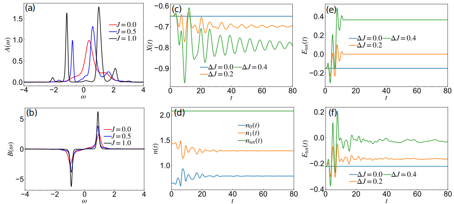

.. _Sec_Hols_Imp:

Holstein impurity model coupled to a bath
==========================================

.. contents::
   :local:
   :depth: 2

:ref:`Back to top <P4>`

.. _Sec_Hols_Imp_1:

Synopsis
--------

In this example and the next example, we consider electron-phonon (el-ph) coupled systems. We start with a simple model describing electrons on two sites :math:`i=0,1` and a phonon mode coupled to site 0. The Hamiltonian reads

.. math::
   :label: eq:Holstein_imp

   \hat{H}(t)=-J(t)\sum_{\sigma}(\hat{c}_{0\sigma}^{\dagger}\hat{c}_{1\sigma}+\hat{c}_{1\sigma}^{\dagger}\hat{c}_{0\sigma})
   +  \sum_{i} \epsilon_i \hat{n}_{i}
   +\omega_0\sum_i \hat{a}^{\dagger}_i \hat{a}_i+g(t)\sum_i (\hat{a}_i^{\dagger}+\hat{a}_i)\hat{n}_0.

Here, :math:`\hat{c}^\dagger_{i\sigma}` is the creation operator of an electron with spin :math:`\sigma` at lattice site :math:`i`, :math:`\hat{n}_i = \sum_{\sigma}\hat{c}_{i\sigma}^{\dagger}\hat{c}_{i\sigma}`, and :math:`\hat{a}^\dagger` creates an Einstein phonon coupled to the 0th site. :math:`J(t)` is the hopping parameter of the electrons, :math:`\epsilon_i` is the energy level of site :math:`i`, :math:`\omega_0` is the phonon frequency and :math:`g(t)` is the el-ph coupling. If we regard the 0th site as an impurity, this model corresponds to a Holstein impurity model with a single bath site. This type of impurity model is self-consistently solved in a dynamical mean-field theory calculation, which we explain in the next example.

In the present example, we consider excitations via a modulation of the hopping parameter or the el-ph coupling. We treat the dynamics within the self-consistent Migdal approximation or the unrenormalized Migdal approximation.

.. _Sec_Hols_Imp_2:

Details and implementation
--------------------------

The source code is organized as follows:

.. list-table::
   :header-rows: 0

   * - ``programs/Holstein_impurity_singlebath_uMig.cpp``
     - main program for the unrenormalized Migdal approximation
   * - ``programs/Holstein_impurity_singlebath_Migdal.cpp``
     - main program for the self-consistent Migdal approximation
   * - ``programs/Holstein_utils_impl.cpp``
     - subroutines for the evaluation of the phonon energy and the phonon displacement
   * - ``programs/Holstein_impurity_impl.cpp``
     - implementation of self-energy approximations

The corresponding declarations of the routines are in the ``.hpp`` files with the same name as the ``.cpp`` files. We will first discuss how to solve the problem, and then explain the Migdal approximations.

We first introduce the Green's functions for the electrons and phonons as

.. math::

   G_{ij}(t,t') &= -i \Bigl\langle  T_{\mathcal{C}}\hat{c}_{i\sigma}(t) \hat{c}^{\dagger}_{j\sigma} (t')\Bigl\rangle, \\
   D(t,t') &= -i\langle T_{\mathcal{C}} \Delta\hat{X}(t) \Delta\hat{X}(t') \rangle,

where :math:`\hat{X} = \hat{a}^\dagger + \hat{a}` and :math:`\Delta\hat{X}(t) = \hat{X}(t) - \langle \hat{X}(t) \rangle`. Here, we consider the spin symmetric case.

Since the system is coupled to the phonon only at site 0, one can trace out the contribution from the bath site (site 1) and focus on the Green's function for site 0, :math:`G_{00}`. Then the electron and phonon Green's functions are determined by the Dyson equations

.. math::
   :label: eq:Dyson_imp

   [i\partial_{t}-\epsilon_0-\Sigma^{\rm MF}(t)]G_{00}(t,t')-[(\Delta + \Sigma^{\rm corr})* G_{00}](t,t')=\delta_{\mathcal C}(t,t'),

.. math::
   :label: eq:D_dyson

   D(t,t^\prime) = D_{0}(t,t^\prime) + [D_{0}*\Pi * D](t,t^\prime),

and the phonon displacement, :math:`X(t)=\langle \hat{X}(t)\rangle`, which can be calculated as

.. math::
   :label: eq:X

   X(t) = -\frac{2 g(0)}{\omega_0} n_0(0) + \int^t_0 d\bar{t} D_0^R(t,\bar{t})[g({\bar t})n_0(\bar{t})-g(0)n_0(0)].

Here the mean-field contribution (:math:`\Sigma^{\rm MF}(t)`) corresponds to

.. math::
   :label: eq:H_mf_Holstein

   \Sigma^{\rm MF}(t) = g(t)X(t),

and :math:`\Delta(t,t')` is the hybridization function, which can be expressed as

.. math::
   :label: eq:Hyb_imp

   \Delta(t,t') = J(t) G_{0,11}(t,t') J(t')

with :math:`[i\partial_t -\epsilon_j]G_{0,jj}(t,t')=\delta_\mathcal{C}(t,t')`. :math:`\Sigma^{\rm corr}(t,\bar{t})` is the beyond-mean-field contribution to the self-energy, :math:`D_{0}(t,t')\equiv-i\langle \Delta\hat{X}(t) \Delta\hat{X}(t') \rangle_0` is the Green's function for the free phonon system, :math:`\Pi` is the phonon self-energy and :math:`n_0(t)= \langle \hat{n}_0(t) \rangle`.

For a general impurity model, the hybridization function :math:`\Delta(t,t')` takes an arbitrary form; however, the structure of equations (Eqs. :eq:`eq:Dyson_imp`, :eq:`eq:D_dyson`, :eq:`eq:X`, :eq:`eq:H_mf_Holstein`) stays the same. This type of impurity problem is solved within nonequilibrium dmft, where the hybridization function is self-consistently determined (see :ref:`Sec_Hols_dmft_2_1`).

Once :math:`G_{00}` and :math:`\Sigma` are obtained, the remaining electron Green's functions can be easily calculated. For example, :math:`G_{10} = -G_{0,11} * J * G_{00}`. The energies can be also evaluated in a post processing operation. The kinetic energy (the expectation value of the first two terms of the Hamiltonian :eq:`eq:Holstein_imp`) is

.. math::

   E_{\rm kin}(t)=-2i[\Delta \ast G_{00}+G_{00} \ast \Delta]^<(t,t) +  \sum_{i} \epsilon_i n_{i}(t) .

The interaction energy (the expectation of the third term of Eq. :eq:`eq:Holstein_imp`) can be expressed as

.. math::

   E_{\rm nX}(t)=g(t) X(t) n_0(t) - 2i[\Sigma^{\rm corr} * G_{00}]^<(t,t),

where the first term is the mean-field contribution and the second term is the correlation energy. The phonon energy (the expectation value of the last term of Eq. :eq:`eq:Holstein_imp`) is

.. math::
   :label: eq:ph_energy

   E_{\rm ph}(t)=\frac{\omega_{0}}{4} [iD^<(t,t) +  X(t)^2]+\frac{\omega_{0}}{4} [iD_{\rm PP}^<(t,t) + P(t)^2].

Here :math:`D_{\rm PP}(t,t')=-i\langle T_\mathcal{C} \Delta\hat{P}(t) \Delta\hat{P}(t')\rangle` with :math:`\hat{P}=\frac{1}{i}(\hat{a}-\hat{a}^\dagger)`, :math:`P(t) \equiv \langle\hat{P}(t)\rangle` and :math:`\Delta\hat{P}(t) \equiv \hat{P}(t) - \langle \hat{P}(t)\rangle`.

.. _sMig_def:

.. _Sec_Hols_Imp_2_1:

Self-consistent Migdal approximation as an impurity solver: sMig
~~~~~~~~~~~~~~~~~~~~~~~~~~~~~~~~~~~~~~~~~~~~~~~~~~~~~~~~~~~~~~~~~

The self-consistent Migdal approximation is the lowest order (:math:`\mathcal{O}(g^2)`) self-consistent approximation for the self-energies, based on renormalized Green's functions. Within this approximation, one can treat the dynamics and the renormalization of the phonons induced by the electron-phonon coupling. Even though the phonons can absorb energy from the electrons, the total energy of the system is conserved in this approximation. The impurity self-energies for the electrons and phonons are approximated as

.. math::
   :label: eq:sMig_el

   \hat{\Sigma}^{\rm sMig,corr}(t,t') =ig(t)g(t') D(t,t')G_{00}(t,t'),

.. math::
   :label: eq:sMig_ph

   \Pi^{\rm sMig}(t,t')=-2 i g(t)g(t') G_{00}(t,t') G_{00}(t',t).

In the sample program, the sMig self-energy is computed by the routine ``Sigma_Mig`` (found in ``programs/Holstein_impurity_impl.cpp``). We provide two interfaces for :math:`0\leq` ``tstp`` :math:`\leq` ``SolverOrder`` (bootstrapping part) and ``tstp`` :math:`=-1`, ``tstp`` :math:`>` ``SolverOrder`` (Matsubara part and the time-stepping part), respectively. Here, we show the latter as an example:

.. code-block:: cpp

   void Sigma_Mig(int tstp, GREEN &G, GREEN &Sigma, GREEN &D0, GREEN &D, GREEN &Pi, GREEN &D0_Pi, GREEN &Pi_D0, CFUNC &g_el_ph, double beta, double h, int SolverOrder, int MAT_METHOD){

       int Norb=G.size1();
       int Ntau=G.ntau();

       //step1: phonon self-energy gGgG
       GREEN_TSTP gGg(tstp,Ntau,Norb,FERMION);
       G.get_timestep(tstp,gGg);
       gGg.right_multiply(g_el_ph);
       gGg.left_multiply(g_el_ph);

       GREEN_TSTP Pol(tstp,Ntau,1,BOSON);

       Pi.set_timestep_zero(tstp);

       Bubble1(tstp,Pol,0,0,gGg,0,0,G,0,0);
       Pi.incr_timestep(tstp,Pol,-2.0);

       //step2: solve phonon Dyson to evaluate D^corr
       step_D(tstp, D0, D, Pi, D0_Pi, Pi_D0, beta, h, SolverOrder, MAT_METHOD);

       //step3: evaluate electron self-energy
       Bubble2(tstp,Sigma,0,0,D,0,0,gGg,0,0);
   }

This routine contains three steps.

1. The phonon self-energy (Eq. :eq:`eq:sMig_ph`) is evaluated using ``cntr::Bubble1``.
2. The Dyson equation of the phonon Green's function (Eq. :eq:`eq:D_dyson`) is solved using the routine ``step_D``, see below. Here ``MAT_METHOD`` specifies which method is used to solve the Dyson equation of the Matsubara part.
3. The electron self-energy (Eq. :eq:`eq:sMig_el`) is evaluated using ``cntr::Bubble2``.

For the bootstrapping part, we carry out these steps for ``tstp`` :math:`\leq` ``SolverOrder`` at once, using ``start_D`` instead of ``step_D``.

The routine for solving the Dyson equation for the phonons is implemented using the ``cntr`` routines ``vie2_**``. The interface for solving the Matsubara Dyson equation and time stepping (``step_D``) is given by

.. code-block:: cpp

   void step_D(int tstp,GREEN &D0, GREEN &D, GREEN &Pi, GREEN &D0_Pi, GREEN &Pi_D0,
     double beta, double h, int SolverOrder, int MAT_METHOD){

       //step1: set D0_Pi=-D0*Pi
       cntr::convolution_timestep(tstp,D0_Pi,D0,Pi,beta,h,SolverOrder);
       D0_Pi.smul(tstp,-1.0);

       cntr::convolution_timestep(tstp,Pi_D0,Pi,D0,beta,h,SolverOrder);
       Pi_D0.smul(tstp,-1.0);

       //step2: solve [1-D0*Pi]*D=[1+D0_Pi]*D=D0
       if(tstp==-1){
           cntr::vie2_mat(D,D0_Pi,Pi_D0,D0,beta,SolverOrder,MAT_METHOD);
       }else {
           cntr::vie2_timestep(tstp,D,D0_Pi,Pi_D0,D0,beta,h,SolverOrder);
       }
   }

This routine is separated into two steps.

1. :math:`-D_0 * \Pi`, which is the kernel of Eq. :eq:`eq:D_dyson`, and its conjugate for :math:`-\Pi * D_0` are prepared by ``cntr::convolution_timestep``.
2. Eq. :eq:`eq:D_dyson` is solved as a ``vie`` with ``vie2_**`` for the corresponding time step.

In ``start_D``, we perform these steps for :math:`0 \leq` ``tstp`` :math:`\leq` ``SolverOrder`` at the same time, and use ``vie2_start``.

The free phonon Green's function, :math:`D_{0}(t,t')/2` is computed using the ``cntr`` routine

.. code-block:: cpp

   cntr::green_single_pole_XX(D0,Phfreq_w0,beta,h);

.. _uMig_def:

.. _Sec_Hols_Imp_2_2:

Unrenormalized Migdal approximation as an impurity solver: uMig
~~~~~~~~~~~~~~~~~~~~~~~~~~~~~~~~~~~~~~~~~~~~~~~~~~~~~~~~~~~~~~~~

In the unrenormalized Migdal approximation, the phonons are kept in equilibrium and play the role of a heat bath. Therefore, the total energy is not conserved. The impurity self-energy for the electrons is approximated as

.. math::
   :label: eq:uMig

   \hat{\Sigma}^{\rm uMig,corr}(t,t') =ig(t)g(t')D_{0}(t,t') G_{00}(t,t').

We call this approximation uMig. The implementation is simpler than in the case of sMig and can be found in the routine ``Sigma_uMig``.

.. _Sec_Hols_Imp_2_3:

Structure of the example program
~~~~~~~~~~~~~~~~~~~~~~~~~~~~~~~~~~

The example programs for the sMig and uMig approximations are provided in ``programs/Holstein_impurity_singlebath_Migdal.cpp`` and ``programs/Holstein_impurity_single_bath_uMig.cpp``. The main body of the example programs consists of two parts. In the first part, we focus on :math:`G_{00}` and evaluate it by solving the equations with the corresponding approximations for the self-energies. Once :math:`G_{00}` and the self-energies are determined, all other Green's functions and the energies are evaluated in the second part.

As in the case of the Hubbard chain, the first part consists of three main steps: (i) solving the Matsubara Dyson equation, (ii) bootstrapping (``tstp`` :math:`\leq` ``SolverOrder``) and (iii) time propagation for ``tstp`` :math:`>` ``SolverOrder``. Since the generic structure of each part is similar to that of the Hubbard chain, we only show here the part corresponding to the time propagation.

.. code-block:: cpp

   for(tstp = SolverOrder+1; tstp <= Nt; tstp++){
       // Predictor: extrapolation
       cntr::extrapolate_timestep(tstp-1,G,integration::I<double>(SolverOrder));
       // Corrector
       for (int iter=0; iter < CorrectorSteps; iter++){
          cdmatrix rho_M(1,1), Xph_tmp(1,1);
          cdmatrix g_elph_tmp(1,1), h00_MF_tmp(1,1);

          //update correlated self-energies
          Hols::Sigma_Mig(tstp, G00, Sigma, D0, D, Pi, D0_Pi, Pi_D0, g_elph_t, beta, h, SolverOrder);

          //update phonon displacement
          G00.density_matrix(tstp,rho_M);
          rho_M *= 2.0;//spin number=2
          n0_tot_t.set_value(tstp,rho_M);

              Hols::get_phonon_displace(tstp, Xph_t, n0_tot_t, g_elph_t, D0, Phfreq_w0, SolverOrder, h);

              //update mean-field
              Xph_t.get_value(tstp,Xph_tmp);
              g_elph_t.get_value(tstp,g_elph_tmp);
              h00_MF_tmp = h00 + Xph_tmp*g_elph_tmp;
              h00_MF_t.set_value(tstp,h00_MF_tmp);

              //solve Dyson for G00
              Hyb_Sig.set_timestep(tstp,Hyb);
              Hyb_Sig.incr_timestep(tstp,Sigma,1.0);
              cntr::dyson_timestep(tstp, G00, 0.0, h00_MF_t, Hyb_Sig, beta, h, SolverOrder);

       }
   }

Here the hybridization :math:`\Delta(t,t')` is initially fixed via Eq. :eq:`eq:Hyb_imp`. At the beginning of each time step, we extrapolate :math:`G_{00}` to the current time step, which works as a predictor. Next, we iterate Eqs. :eq:`eq:Dyson_imp`, :eq:`eq:D_dyson`, :eq:`eq:X`, :eq:`eq:H_mf_Holstein`, :eq:`eq:sMig_el` and :eq:`eq:sMig_ph` (or :eq:`eq:uMig`) to self-consistently determine the self-energies, which works as a corrector. During the iteration, we also update the phonon displacement, :math:`X(t)`, using Eq. :eq:`eq:X`. The update of :math:`X(t)` is implemented in the routine ``get_phonon_displace`` using a ``cntr`` routine for the (Gregory) integration, ``integration::Integrator``.

In the second part, we evaluate the rest of the Green's functions. For the energies, the ``cntr`` routines ``correlation_energy_convolution`` and ``convolution_density_matrix`` are used. In particular, the calculation of the phonon energy :eq:`eq:ph_energy` is implemented by the routine ``evaluate_phonon_energy``.

.. _Sec_Hols_Imp_2_4:

Storing Green's functions
~~~~~~~~~~~~~~~~~~~~~~~~~~

In the example programs, we store Green's functions with the ``hdf5`` format using routines provided in ``cntr::herm_matrix``, ``cntr::herm_matrix::write_to_hdf5_slices`` and ``cntr::herm_matrix::write_to_hdf5_tavtrel``. The corresponding part looks

.. code-block:: cpp

   char fnametmp[1000];
   std::sprintf(fnametmp,"%s_green.h5",flout);
   hid_t file_id = open_hdf5_file(std::string(fnametmp));
   hid_t group_id = create_group(file_id,"parm");

   //parameters
   store_int_attribute_to_hid(group_id,"Nt",Nt);
   store_int_attribute_to_hid(group_id,"Ntau",Ntau);
   store_double_attribute_to_hid(group_id,"dt",dt);
   store_double_attribute_to_hid(group_id,"beta",beta);
   close_group(group_id);

   //green's function
   //G at each t_n: G^R(t_n,t), G^<(t,t_n), G^tv(t_n,\tau) for t<=t_n
   group_id = create_group(file_id, "G00_slice");
   G.write_to_hdf5_slices(group_id,OutEvery);
   close_group(group_id);
   // G(t_rel,t_av) for t_av = [0,OutEvery*dt,2*OutEvery*dt...] for t_rel >= 0
   group_id = create_group(file_id, "G00_tavrel");
   G.write_to_hdf5_tavtrel(group_id,OutEvery);
   close_group(group_id);

It is useful to store the number of time steps (``Nt,Ntau``), the size of the time step (``dt``) and the inverse temperature as ``parm`` in the same ``hdf5`` file. The routine ``write_to_hdf5_slices`` stores the contour function :math:`F(t,t')` in the form of :math:`F^R({\rm tstp},n), F^<(n,{\rm tstp}), F^{\rceil}(n,\tau)` for :math:`n\leq {\rm tstp}` at :math:`{\rm tstp} = m\cdot {\rm OutEvery}`. The routine ``write_to_hdf5_tavtrel`` stores the retarded and lesser parts in the form of :math:`F(t_{\rm rel};t_{\rm av})`, where :math:`t_{\rm rel}=t-t'` and :math:`t_{\rm av}=\frac{t+t'}{2}`, for :math:`\frac{t_{\rm av}}{dt}` = :math:`[0,{\rm OutEvery} ,2{\rm OutEvery},...]` for :math:`t_{\rm rel}\geq 0`.

.. _Sec_Hols_Imp_3:

Running the example programs
-----------------------------

There are two programs for sMig and uMig, respectively: ``Holstein_impurity_singlebath_Migdal.x`` and ``Holstein_impurity_singlebath_uMig.x``. These programs allow to treat excitations via a modulation of the hopping parameter and the el-ph coupling. We use :math:`\epsilon_{0,\mathrm{MF}}\equiv \epsilon_{0} + gX(0)` as an input parameter instead of :math:`\epsilon_{0}`. (:math:`\epsilon_{0}` is determined in the post processing.) The driver script ``demo_Holstein_impurity.py`` located in the ``utils/`` directory provides a simple interface to these programs. After defining the system parameters, calculation scheme (sMig or uMig, time step, convergence parameter, etc.) and excitation parameters, the script creates the corresponding input file and starts the simulation. So simply run

.. code-block:: sh

   python utils/demo_Holstein_impurity.py

In ``demo_Holstein_impurity.py``, the shape of the excitation is

.. math::
   :label: eq:g_mod_shape

   g(t) & = g + \Delta g \sin\Bigl(\frac{\pi t}{T_{\rm end}}\Bigl)^2\cos(\Omega t), \\
   J(t) & = J + \Delta J \sin\Bigl(\frac{\pi t}{T_{\rm end}}\Bigl)^2\cos(\Omega t),

and one needs to specify :math:`T_{\rm end}`, :math:`\Omega`, :math:`\Delta g` and :math:`\Delta J`. At the end of the simulation, the number of particles per spin for each site (:math:`n_{i,\sigma}(t)`), the phonon displacement (:math:`X(t)`), phonon momentum (:math:`P(t)`) and the energies are plotted. In addition, the spectral functions of the electrons and phonons,

.. math::
   :label: eq:spectrum_demo

   A^R(\omega;t_{\rm av}) = -\frac{1}{\pi} \int dt_{\rm rel} e^{i\omega t_{\rm rel}} F_{\rm gauss}(t_{\rm rel}) G^R (t_{\rm rel};t_{\rm av}),

.. math::
   :label: eq:spectrum_demo2

   B^R(\omega;t_{\rm av}) = -\frac{1}{\pi} \int dt_{\rm rel} e^{i\omega t_{\rm rel}} F_{\rm gauss}(t_{\rm rel}) D^R (t_{\rm rel};t_{\rm av}),

for the average time :math:`t_{\rm av}=\frac{Nt \cdot h}{2}`. Here :math:`t_{\rm rel}` indicates the relative time, and :math:`F_{\rm gauss}(t_{\rm rel})` is a Gaussian window function, which can also be specified in ``demo_Holstein_impurity.py``. Specifically, the evaluation of the spectral function is done in two steps as

.. code-block:: python

   t_rel,G_ret,G_les = read_gf_ret_let_tavtrel(output_file + '_green.h5','Gloc_tavrel',dt,tstp_plot)
   A_w = evaluate_spectrum_windowed(G_ret,t_rel,ome,method,Fwindow)

In the first line, with a python routine ``read_gf_ret_let_tavtrel`` in ``python3/SpectrumCNTRhdf5.py``, the relative time and the corresponding retarded and lesser Green's functions are obtained from the ``.h5`` file for the Green's functions stored in the form of :math:`G (t_{\rm rel};t_{\rm av})`. Here :math:`t_{\rm av}` specified with ``tstp_plot``. In the second line, we operate Eq. :eq:`eq:spectrum_demo` with a subroutine ``evaluate_spectrum_windowed`` in ``python3/SpectrumCNTRhdf5.py``. Here one can specify the order of the interpolation of Green's functions for the Fourier transformation, and ``Fwindow`` is the window function, which we take a Gauss function in this example.

.. _Sec_Hols_Imp_4:

Discussion
----------

In :numref:`holstein_imp` (a)--(b), we show the electron spectral function measured at site 0 and the phonon spectrum evaluated within the sMig approximation. For :math:`J=0`, the site 0 is decoupled from the site 1. The electron spectrum shows a main peak around :math:`\omega=0.5=\epsilon_{0,\mathrm{MF}}` and side peaks around :math:`\epsilon_{0,\mathrm{MF}}\pm\omega_0`. As the hopping parameter is increased, the electron levels at the site 0 and the site 1 hybridize and an additional sharp peak at :math:`\omega<0` appears in the electron spectrum, see panel (a). The phonon spectrum shown in panel (b) reveals a shift of the peak position from the bare value :math:`\omega_0=1.0` and a finite width of the peak (phonon renormalization).

In :numref:`holstein_imp` (c)--(e), we show the time evolution of the phonon displacement, the density and the total energy after an excitation via hopping modulation. These results were obtained using the sMig approximation. The phonon displacement shows damped oscillations, see panel (c). Panel (d) demonstrates that after the excitation, the number of electrons at site 0 and site 1 changes with time, while the total number is conserved. Within sMig the total energy is also conserved after the excitation, as is shown in panel (e). On the other hand, when uMig is used, the total energy is not conserved after the excitation, see panel (f). In uMig, the phonons can act as a heat bath and dissipate energy, which is clearly evident when the method is used to treat extended systems, see next section.

.. _holstein_imp:

   Simulation results for the Holstein impurity model. (a)(b) Spectral functions of the electrons at site 0 (a) and phonon spectrum (b) for various :math:`J` obtained using sMig. (c)(d)(e) Time evolution of the phonon displacement, the electron density and the total energy after excitation via hopping modulations with different strengths obtained within sMig. (f) Time evolution of the total energy after excitation via hopping modulations with different strength obtained within uMig. For (a-f), we use :math:`g=0.5`, :math:`\omega_0=1.0`, :math:`\beta=2.0`, :math:`\epsilon_{0,mf}=0.5`, :math:`\epsilon_1=-0.5`. For (a-b), a window width :math:`\sigma_{\rm window}=20.0` is used for :math:`F_{\rm gauss}(t_{\rm rel})`. For (c-f), we use :math:`J_0=0.5` and a :math:`\sin^2` envelope for the hopping modulation with excitation frequency :math:`\Omega=2.0` and pulse duration :math:`T_{\rm end}=12.56`.

:ref:`Back to top <P4>`
