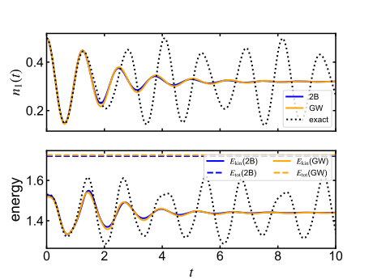

.. _SecChain:

Hubbard chain
=============

.. contents::
   :local:
   :depth: 2

:ref:`Back to top <P4>`

.. _SecChain_1:

Synopsis
--------

In this example we consider the one-dimension (1D) Hubbard model with the Hamiltonian

.. math::
   :label: eq:hubbmodel1

   \hat{H}_0 = -J \sum_{\langle i,j \rangle, \sigma}
   \hat{c}^\dagger_{i\sigma} \hat{c}_{j \sigma} + \frac{U}{2}\sum_{i,\sigma}
   \hat{n}_{i\sigma} \hat{n}_{i\bar\sigma} \ ,

where :math:`\langle i,j\rangle` constrains the lattice sites :math:`i,j` to the nearest neighbors, while :math:`\bar\sigma=\uparrow,\downarrow` for :math:`\sigma=\downarrow,\uparrow`. We consider :math:`M` lattice sites with open boundary conditions. Furthermore, we restrict ourselves to the paramagnetic case with an equal number of spin-up (:math:`N_\uparrow`) and spin-down (:math:`N_\downarrow`) particles. The number of particles determines the filling factor :math:`\bar{n}=N_\uparrow/M`.

In this example, the system is excited with an instantaneous quench of the on-site potential of the first lattice site to :math:`w_0`:

.. math::
   :label: eq:hubbchain_quench

   \hat{H}(t) = \hat{H}_0 + \theta(t) w_0 \sum_\sigma
   \hat{c}^\dagger_{1\sigma} \hat{c}_{1\sigma}  \ .

Here, we will treat the dynamics with respect to the Hamiltonian :eq:`eq:hubbchain_quench` within the second-Born (2B) and the :math:`GW` approximation.

.. _SecChain_2:

Details and implementation
--------------------------

The source code is organized as follows:

.. list-table::
   :header-rows: 0

   * - ``programs/hubbard_chain_2b.cpp``
     - main program for the 2B approximation
   * - ``programs/hubbard_chain_gw.cpp``
     - main program for the :math:`GW` approximation
   * - ``programs/hubbard_chain_selfen_impl.cpp``
     - implementation of self-energy approximations

Corresponding declarations of the routines are in the ``.hpp`` files with the same name as the ``.cpp`` files. We will discuss the implementation of the 2B approximation in detail and then remark on how to adopt it for the :math:`GW` approximation.

.. _SecChain_2_1:

Second-Born approximation
~~~~~~~~~~~~~~~~~~~~~~~~~

The 2B approximation corresponds to the second-order expansion in terms of the Hubbard repulsion :math:`U(t)`, which we treat as time dependent here for generality. Defining the Green's function with respect to the lattice basis :math:`i,j`, the 2B is defined by

.. math::
   :label: eq:sigma_hubb_2b

   \Sigma_{ij,\sigma}(t,t^\prime) = U(t)U(t^\prime) G_{ij,\sigma}(t,t^\prime)
   G_{ij,\bar\sigma}(t,t^\prime)G_{ji,\bar\sigma}(t^\prime,t) \ .

Due to the paramagnetic constraint, :math:`G_{ij,\sigma}(t,t^\prime) = G_{ij,\bar\sigma}(t,t^\prime)`; the spin index can be dropped throughout. The 2B self-energy :eq:`eq:sigma_hubb_2b` is implemented in two steps.

1. The (per-spin) polarization :math:`P_{ij}(t,t^\prime)= -i G_{ij}(t,t^\prime)G_{ji}(t^\prime,t)` is computed using the routine ``cntr::Bubble1`` and subsequent multiplication by (-1).
2. The self-energy is then given by :math:`\Sigma_{ij}(t,t^\prime)  = i U(t) U(t^\prime) G_{ij}(t,t^\prime) P_{ij}(t,t^\prime)`, which corresponds to a bubble diagram computed by the routine ``cntr::Bubble2``.

The 2B self-energy is computed by the routine ``Sigma_2B`` (found in ``programs/hubbard_chain_selfen_impl.cpp``) as follows:

.. code-block:: cpp

   void Sigma_2B(int tstp, GREEN &G, CFUNC &U, GREEN &Sigma){
       int nsites=G.size1();
       int ntau=G.ntau();
       GREEN_TSTP Pol(tstp,ntau,nsites,BOSON);

       Polarization(tstp, G, Pol);

       Pol.right_multiply(U);
       Pol.left_multiply(U);

       for(int i=0; i<nsites; i++){
           for(int j=0; j<nsites; j++){
               cntr::Bubble2(tstp,Sigma,i,j,G,i,j,Pol,i,j);
           }
       }

   }

First, the polarization ``Pol``, which represents :math:`P_{ij}(t,t^\prime)`, is defined for the given time step. After computing :math:`P_{ij}(t,t^\prime)` by the function

.. code-block:: cpp

   void Polarization(int tstp, GREEN &G, GREEN_TSTP &Pol){
       int nsites=G.size1();

       for(int i=0; i<nsites; i++){
           for(int j=0; j<nsites; j++){
               cntr::Bubble1(tstp,Pol,i,j,G,i,j,G,i,j);
           }
       }
       Pol.smul(-1.0);
   }

the lines

.. code-block:: cpp

   Pol.right_multiply(U);
   Pol.left_multiply(U);

perform the operation :math:`P_{ij}(t,t^\prime) \rightarrow P_{ij}(t,t^\prime) U(t^\prime)` and :math:`P_{ij}(t,t^\prime) \rightarrow U(t)P_{ij}(t,t^\prime)`, respectively. Finally, ``cntr::Bubble2`` computes :math:`\Sigma_{ij}(t,t^\prime)`.

.. _SecChain_2_2:

Mean-field Hamiltonian and onsite quench
~~~~~~~~~~~~~~~~~~~~~~~~~~~~~~~~~~~~~~~~

The total self-energy also includes the Hartree-Fock (HF) contribution, which we incorporate into the mean-field Hamiltonian :math:`\epsilon^{\mathrm{MF}}_{ij}(t) = \epsilon^{0}_{ij}(t) + U (n_i-\bar{n})` with the occupation (per spin) :math:`n_i(t)= \mathrm{Im}[G^<_{ii}(t,t)]`. The shift of chemical potential :math:`-U \bar{n}` is a convention to fix the chemical potential at half filling at :math:`\mu=0`. In the example program, the mean-field Hamiltonian is represented by the ``cntr::function`` ``eps_mf``. Updating ``eps_mf`` is accomplished by computing the density matrix using the class routine ``cntr::herm_matrix::density_matrix``.

The general procedure to implement a quench of some parameter :math:`\lambda` at :math:`t=0` is to represent :math:`\lambda` by a contour function :math:`\lambda_n`: :math:`\lambda_{-1}` corresponds to the pre-quench value which determines the thermal equilibrium, while :math:`\lambda_n` with :math:`n\ge 0` governs the time evolution. In the example program, we simplify this procedure by redefining :math:`\epsilon^{0}_{ij} \rightarrow \epsilon^{0}_{ij} + w_0 \delta_{i,1}\delta_{j,1}` after the Matsubara Dyson equation has been solved.

.. _SecChain_2_3:

Structure of the example program
~~~~~~~~~~~~~~~~~~~~~~~~~~~~~~~~~

The program is structured similar to the previous examples. After reading variables from file and initializing the variables and classes, the Matsubara Dyson equation is solved in a self-consistent fashion. The example below illustrates this procedure for the 2B approximation.

.. code-block:: cpp

   tstp=-1;
   gtemp = GREEN(SolverOrder,Ntau,Nsites,FERMION);
   gtemp.set_timestep(tstp,G);

   for(int iter=0;iter<=MatsMaxIter;iter++){
       // update mean field
       hubb::Ham_MF(tstp, G, Ut, eps0, eps_mf);

       // update self-energy
       hubb::Sigma_2B(tstp, G, Ut, Sigma);

       // solve Dyson equation
       cntr::dyson_mat(G, MuChem, eps_mf, Sigma, beta, SolveOrder);

       // self-consistency check
       err = cntr::distance_norm2(tstp,G,gtemp);

       if(err<MatsMaxErr){
           break;
       }

       gtemp.set_timestep(tstp,G);
   }

Updating the mean-field Hamiltonian (``hubb::Ham_MF``), the self-energy (``hubb::Sigma_2B``) and solving the corresponding Dyson equation (``cntr::dyson_mat``) is repeated until self-consistency has been reached, which in practice means that the deviation between the previous and updated Green's function is smaller than ``MatsMaxErr``. For other self-energy approximations, the steps described above (updating auxiliary quantities) have to be performed before the self-energy can be updated.

Once the Matsubara Dyson equation has been solved up to the required convergence threshold, the starting algorithm for time steps :math:`n=0,\dots,k` can be applied. To reach self-consistency for the first few time steps, we employ the bootstrapping loop:

.. code-block:: cpp

   for (int iter = 0; iter <= BootstrapMaxIter; iter++) {
       // update mean field
       for(tstp=0; tstp<=SolveOrder; tstp++){
           hubb::Ham_MF(tstp, G, Ut, eps0, eps_mf);
       }

       // update self-energy
       for(tstp=0; tstp<=SolveOrder; tstp++){
           hubb::Sigma_2B(tstp, G, Ut, Sigma);
       }

       // solve Dyson equation
       cntr::dyson_start(G, MuChem, hmf, Sigma, beta, h, SolveOrder);

       // self-consistency check
       err=0.0;
       for(tstp=0; tstp<=SolverOrder; tstp++) {
           err += cntr::distance_norm2(tstp,G,gtemp);
       }

       if(err<BootstrapMaxErr && iter>2){
           break;
       }

       for(tstp=0; tstp<=SolverOrder; tstp++) {
           gtemp.set_timestep(tstp,G);
       }
   }

Finally, after the bootstrapping iteration has converged, the time propagation for time steps ``n>SolveOrder`` is launched. The self-consistency at each time step is accomplished by iterating the update of the mean-field Hamiltonian, Green's function and self-energy over a fixed number of ``CorrectorSteps``. As an initial guess, we employ a polynomial extrapolation of the Green's function from time step :math:`n-1` to :math:`n`, as implemented in the routine ``cntr::extrapolate_timestep``. Thus, the time propagation loop takes the form

.. code-block:: cpp

   for(tstp = SolverOrder+1; tstp <= Nt; tstp++){
       // Predictor: extrapolation
       cntr::extrapolate_timestep(tstp-1,G,SolveOrder);
       // Corrector
       for (int iter=0; iter < CorrectorSteps; iter++){
           // update mean field
           hubb::Ham_MF(tstp, G, Ut, eps0, hmf);

           // update self-energy
           hubb::Sigma_2B(tstp, G, Ut, Sigma);

           // solve Dyson equation
           cntr::dyson_timestep(tstp,G,MuChem,eps_mf,Sigma,beta,h,SolveOrder);
       }
   }

After the Green's function has been computed for all required time steps, we compute the observables. In particular, the conservation of the total energy provides a good criterion to assess the accuracy of the calculation. The total energy for the Hubbard model :eq:`eq:hubbmodel1` is given in terms of the Galitskii-Migdal formula

.. math::
   :label: Eq:Total_ener

   E = \frac{1}{2}\mathrm{Tr}\left[\rho(t)\left(\epsilon^{(0)}
   +\epsilon^{\mathrm{MF}}(t)\right)\right] + \frac{1}{2} \mathrm{Im}\mathrm{Tr} \left[\Sigma\ast
   G\right]^<(t,t) \ .

The last term, known as the correlation energy, is most conveniently computed by the routine:

.. code-block:: cpp

   Ecorr = cntr::correlation_energy(tstp, G, Sigma, beta, h);

.. _SecChain_3:

GW approximation
----------------

Next we consider the :math:`GW` approximation. We remark that we formally treat the Hubbard interaction as spin-independent, while the spin-summation in the polarization :math:`P` (which is forbidden by the Pauli principle) is excluded by the corresponding prefactor.

Within the same setup as above, the :math:`GW` approximation is defined by

.. math::

   \Sigma_{ij}(t,t^\prime) = i G_{ij}(t,t^\prime) \delta
   W_{ij}(t,t^\prime) \ ,

where :math:`\delta W_{ij}(t,t^\prime)` denotes the dynamical part of the screened interaction :math:`W_{ij}(t,t^\prime) = U \delta_{ij}\delta_\mathcal{C}(t,t^\prime) + \delta W_{ij}(t,t^\prime)`. We compute :math:`\delta W_{ij}(t,t^\prime)` from the charge susceptibility :math:`\chi_{ij}(t,t^\prime)` by :math:`\delta W_{ij}(t,t^\prime) = U(t) \chi_{ij}(t,t^\prime) U(t^\prime)`. In turn, the susceptibility obeys the Dyson equation

.. math::
   :label: eq:dyson_chi

   \chi = P + P\ast U \ast \chi \ ,

The strategy to compute the :math:`GW` self-energy consists of three steps:

1. Computing the polarization :math:`P_{ij}(t,t^\prime)` by ``cntr::Bubble1`` (as in :ref:`SecChain_2_1`).
2. Solving the Dyson equation :eq:`eq:dyson_chi` as VIE. By defining the kernel :math:`K_{ij}=-P_{ij}(t,t^\prime)U(t^\prime)` and its hermitian conjugate, Eq. :eq:`eq:dyson_chi` amounts to :math:`[1+K]\ast \chi=P`, which is solved using ``cntr::vie2``.
3. Computing the self-energy by ``cntr::Bubble2``.

The implementation of step 1 was already discussed above. For step 2, we distinguish between the equilibrium and time stepping on the one hand, and the starting phase on the other hand. For the former, we have defined the routine

.. code-block:: cpp

   void GenChi(int tstp, double h, double beta, GREEN &Pol,
       CFUNC &U, GREEN &PxU, GREEN &UxP, GREEN &Chi, int order){

       PxU.set_timestep(tstp, Pol);
       UxP.set_timestep(tstp, Pol);
       PxU.right_multiply(tstp, U);
       UxP.left_multiply(tstp, U);
       PxU.smul(tstp,-1.0);
       UxP.smul(tstp,-1.0);

       if(tstp==-1){
           cntr::vie2_mat(Chi,PxU,UxP,Pol,beta,CINTEG(order));
       } else{
           cntr::vie2_timestep(tstp,Chi,PxU,UxP,Pol,CINTEG(order),beta,h);
       }
   }

Here, ``PxU`` and ``UxP`` correspond to the kernel :math:`K_{ij}` and its hermitian conjugate, respectively. Analogously, the starting routine is implemented as

.. code-block:: cpp

   void GenChi(double h, double beta, GREEN &Pol, CFUNC &U,
       GREEN &PxU, GREEN &UxP, GREEN &Chi, int order){

       for(int n = 0; n <= order; n++){
           PxU.set_timestep(n, Pol);
           UxP.set_timestep(n, Pol);
           PxU.right_multiply(n, U);
           UxP.left_multiply(n, U);
           PxU.smul(n,-1.0);
           UxP.smul(n,-1.0);
       }

       cntr::vie2_start(Chi,PxU,UxP,Pol,CINTEG(order),beta,h);

   }

Finally, the self-energy is computed by

.. code-block:: cpp

   void Sigma_GW(int tstp, GREEN &G, CFUNC &U, GREEN &Chi, GREEN &Sigma){
       int nsites=G.size1();
       int ntau=G.ntau();
       GREEN_TSTP deltaW(tstp,ntau,nsites,CNTR_BOSON);

       Chi.get_timestep(tstp,deltaW);
       deltaW.left_multiply(U);
       deltaW.right_multiply(U);

       for(int i=0; i<nsites; i++){
           for(int j=0; j<nsites; j++){
               cntr::Bubble2(tstp,Sigma,i,j,G,i,j,deltaW,i,j);
           }
       }
   }

The above implementation of the :math:`GW` self-energy can be found in ``programs/hubbard_chain_selfen_impl.cpp``. The structure of the program (``programs/hubbard_chain_gw.cpp``) is analogous to :ref:`SecChain_2_3`.

.. _SecChain_4:

Running the example programs
-----------------------------

There are two programs for the 2B and the :math:`GW` approximation, respectively: ``hubbard_chain_2b.x``, ``hubbard_chain_gw.x``. The driver script ``demo_hubbard_chain.py`` located in the ``utils/`` directory provides a simple interface to these programs. Simply run

.. code-block:: sh

   python utils/demo_hubbard_chain.py

After defining the parameters and convergence parameters, the script creates the corresponding input file and launches all three programs in a loop. The occupation of the first lattice site :math:`n_1(t)` and the kinetic and total energy are then read from the output files and plotted. The script ``demo_hubbard_chain.py`` also allows to pass reference data as an optional argument, which can be used to compare to exact results. For some parameters, results of the exact treatment are available in the ``data/`` directory.

.. _SecChain_5:

Discussion
----------

As an example, we consider the Hubbard dimer (:math:`M=2`) for :math:`U=1` at half filling (:math:`\mu=0`, :math:`\bar{n}=1/2`). The system is excited by a strong on-site quench :math:`w_0=5`. The results are obtained by running

.. code-block:: sh

   python utils/demo_hubbard_chain.py data/hubbardchain_exact_M2_U1_n1_w5.dat

This strong excitation leads to the phenomenon of artificial damping: although the density :math:`n_1(t)` exhibits an oscillatory behavior for all times in an exact treatment, the approximate NEGF treatment — with either self-energy approximation considered here — shows damping until an unphysical steady state is reached.

.. _hubbard_chain:

   Dynamics of the Hubbard chain: Here, we consider the Hubbard dimer with ``M=2`` and ``U=1`` at half filling. We used ``Nt=400`` and ``Ntau=400`` at an inverse temperature of ``beta=20.0`` and a time step of ``h=0.025``.

:ref:`Back to top <P4>`
