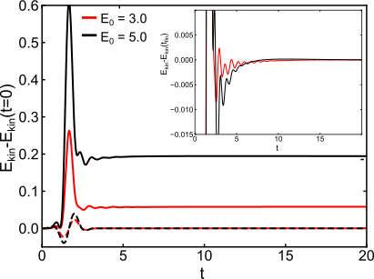
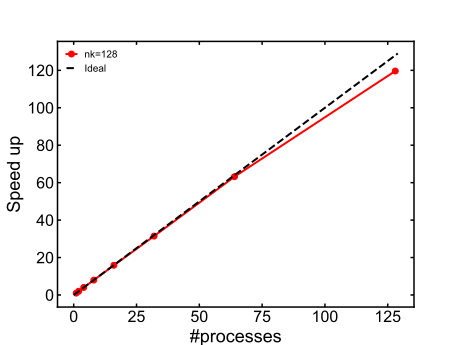

.. _SecGW:

Lattice GW
==========

.. contents::
   :local:
   :depth: 2

.. _BZ_def:

As in the discussion of the :ref:`SecChain`, we will consider the Hubbard model, but we will assume here a translationally invariant system with periodic boundary conditions. The translational invariance implies that all observables and propagators are diagonal in momentum space. Hence, all quantities can be labeled by the reciprocal lattice vector :math:`\vec k` within the first Brillouin zone (BZ). This reduces the computational and storage complexity from :math:`\mathcal{O}(N_k^2)` for the real space formalism introduced in :ref:`SecChain` to :math:`\mathcal{O}(N_k)`. Moreover, the Dyson equation is diagonal in momentum space and can be efficiently parallelized using a distributed-memory parallelization based on MPI.

.. _S4S6_1:

Synopsis
--------

We will consider a 1D chain described by the Hubbard model, see Eq. :eq:`eq:hubbmodel1`. The single particle part of the Hamiltonian can be diagonalized as

.. math::

   \hat{H}_0 = \sum_{\vec k,\sigma} \epsilon(\vec k) c_{\vec{k}\sigma}^{\dagger} c_{\vec{k}\sigma},

where we have introduced the free-electron dispersion :math:`\epsilon(\vec k)=-2 J \cos(\vec k_x)`. The system is excited via an electromagnetic excitation, which in translationally invariant systems is conveniently
introduced using the Peierls substitution. The latter involves the vector potential :math:`\vec A(\vec r,t)` as a phase factor in the hopping

.. math::

   J\rightarrow J \exp\Bigg[-\frac{i q}{\hbar} \int_{\vec R_i}^{\vec R_j} d\vec r \vec A(\vec r,t)\Bigg],

leading to a time-dependent single-particle dispersion

.. math::

   \epsilon(\vec k,t)=\epsilon(\vec k- q \vec A(t)/\hbar).

In this example, we treat the dynamics within the :math:`GW` approximation. The numerical evaluation of the respective self-energy expressions is implemented in the C++ module ``gw_selfen_impl.cpp``. In momentum space, the correlation part of the :math:`GW` self-energy can be written as

.. math::
   :label: Eq:Sigmak

   \Sigma_{\vec k}(t,t^\prime)=\frac{i}{N_k} \sum_{\vec q} G_{\vec k-\vec q}(t,t^\prime) \delta W_{\vec q}(t,t^\prime),

where we have introduced the Fourier transform of the propagator
:math:`X_{\vec q}(t,t^\prime)=(1/N_k)\sum_{i} \exp(i (\vec r_i-\vec r_j) \vec q) X_{ij}(t,t^\prime)`, see also the previous :ref:`SecChain` discussion for the definition of the propagators. In line with the previous notation, we have introduced the dynamical part of the effective interaction :math:`\delta W_{\vec q}` via :math:`W_{\vec q}(t,t^\prime)=U\delta_\mathcal{C}(t,t^\prime)+\delta W_{\vec q}(t,t^\prime)`. The retarded part of the interaction is obtained as a solution of the Dyson-like equation

.. math::
   :label: Eq:Wk

   W_{\vec k}(t,t')=U\delta_\mathcal{C}(t,t^\prime)+ U [ \Pi_{\vec k} \ast W_{\vec k} ](t,t^\prime),

the Fourier transform of the polarization is given by

.. math::
   :label: Eq:Pol

   \Pi_{\vec k}(t,t')= \frac{-i}{N_k} \sum_{\vec q} G_{\vec k+\vec q}(t,t') G_{\vec q}(t',t).

.. _S4S6_2:

MPI parallelization
-------------------

The main advantage of the translational invariance is that the propagators and corresponding Dyson equations are diagonal in momentum space. This leads to a significant speed-up of calculations since the most complex operation, the solutions of the VIE, can be performed in parallel. Moreover, the main bottleneck to reach longer propagation times is the memory restriction imposed by the hardware. The usage of the MPI parallelization scheme over momentum points alleviates this problem because memory can be distributed among different nodes.

The Dyson equation is diagonal in the momentum space and it is convenient to introduce a class called ``kpoint`` that includes all propagators and corresponding methods for a given momentum point :math:`\vec q`. In terms of data, the ``kpoint`` class includes single and two particle propagators for a given momentum point :math:`\vec q`, namely :math:`G_{\vec q}` and :math:`W_{\vec q}`, as well as the self-energy :math:`\Sigma_{\vec q}` and the polarization :math:`\Pi_{\vec q}`. The routines include wrappers around VIE2 solvers to solve the single-particle and two-particle Dyson equations.

While the Dyson equation is diagonal in momentum space, the evaluation of the self-energy diagrams mixes information between different momentum points and requires communication between different ranks. The communication between different ranks is performed using the ``cntr::distributed_timestep_array`` as described in the MPI section of the manual. Users should be careful that the simple example code presented there includes a global object of type ``cntr::herm_matrix_timestep_view<T>``, which only allocates memory if a given momentum is owned by that rank. In the following implementation we will rather work with a local copy of this object on every rank. The latter produces only a minimal overhead in the memory usage and simplifies the implementation. The strategy to compute the :math:`GW` self-energy :math:`\mathcal{T}[\Sigma_{\vec{k}}]_n` at time step :math:`n` thus consists of two steps:

1. At time :math:`t_n`, communicate the latest time slice of the Green's functions :math:`\mathcal{T}[G_{\vec k}]_n` and retarded interactions :math:`\mathcal{T}[W_{\vec k}]_n` for all momentum points among all MPI ranks.
2. Evaluate the self-energy diagram :math:`\mathcal{T}[\Sigma_{\vec k_{\text{rank}}}]_n` in Eq. :eq:`Eq:Sigmak` for a subset of momentum points :math:`\vec k_{\text{rank}}` present on a given rank using the routine ``cntr::Bubble2``.

Step 1 is implemented as

.. code-block:: cpp

   void gather_gk_timestep(int tstp,int Nk_rank,DIST_TIMESTEP &gk_all_timesteps,std::vector<kpoint> &corrK_rank,std::vector<int> &kindex_rank){
       gk_all_timesteps.reset_tstp(tstp);
       for(int k=0;k<Nk_rank;k++){
           gk_all_timesteps.G()[kindex_rank[k]].get_data(corrK_rank[k].G_);
       }
       gk_all_timesteps.mpi_bcast_all();
   }

and an analogous routine is used for the bosonic counterpart. We gather the information from all ranks into an object of type ``cntr::distributed_timestep_array`` named ``gk_all_timesteps``. We have introduced a map ``kindex_rank`` which maps an index of momenta from a subset on a given rank to the full BZ, like :math:`\mathbf{k}_{\text{rank}}\rightarrow \mathbf{k}`. The variable ``corrK_rank`` is just a collection of ``kpoints`` on a given rank. ``mpi_bcast_all()`` is a wrapper around the MPI routine ``Allgather`` adjusted to the type ``cntr::distributed_timestep_array``.

Step 2 is implemented as

.. code-block:: cpp

   void sigma_GW(int tstp,int kk,GREEN &S,DIST_TIMESTEP &gk_all_timesteps,DIST_TIMESTEP &wk_all_timesteps,lattice_1d_1b &lattice,int Ntau,int Norb){
       assert(tstp==gk_all_timesteps.tstp());
       assert(tstp==wk_all_timesteps.tstp());

       GREEN_TSTP stmp(tstp,Ntau,Norb,FERMION);
       S.set_timestep_zero(tstp);

       for(int q=0;q<lattice.nk_;q++){
           double wk=lattice.kweight_[q];
           int kq=lattice.add_kpoints(kk,1,q,-1);
           stmp.clear();
           for(int i1=0;i1<Norb;i1++){
               for(int i2=0;i2<Norb;i2++){
                   cntr::Bubble2(tstp,stmp,i1,i2,gk_all_timesteps.G()[kq],gk_all_timesteps.G()[kq],i1,i2,wk_all_timesteps.G()[q],wk_all_timesteps.G()[q],i1,i2);
               }
           }
       S.incr_timestep(tstp,stmp,wk);
       }
   }

As each rank includes only a subset of momentum points :math:`\mathbf{k}_{\text{rank}}` we only evaluate the self-energy diagrams :math:`\Sigma_{\mathbf{k}_{\text{rank}}}` for this subset of momentum points. All ranks carry information about the latest timestep for all momentum points and the internal sum over momentum :math:`\vec q` in Eq. :eq:`Eq:Sigmak` is performed on each rank.

.. _S4S6_3:

Generic structure of the example program
-----------------------------------------

As the generic structure is similar to the above examples, we will focus on the peculiarities connected to the usage of MPI. First, we need to initialize the MPI session

.. code-block:: cpp

   MPI::Init(argc,argv);
   ntasks=MPI::COMM_WORLD.Get_size();
   tid=MPI::COMM_WORLD.Get_rank();
   tid_root=0;

and the ``cntr::distributed_timestep_array`` for the electronic and bosonic propagators

.. code-block:: cpp

   DIST_TIMESTEP gk_all_timesteps(Nk,Nt,Ntau,Norb,FERMION,true);
   DIST_TIMESTEP wk_all_timesteps(Nk,Nt,Ntau,Norb,BOSON,true);

To simplify the mapping between a subset of points on a given rank and the full BZ we introduce a map ``kindex_rank`` which at position :math:`j=0,\ldots,N_{\text{rank}}-1` includes an index of the corresponding momenta in the full BZ.

The program consists of three main parts, namely solving the Matsubara Dyson equation, bootstrapping (``tstp`` :math:`\leq` ``SolverOrder``) and time propagation for ``tstp`` :math:`>` ``SolverOrder``. The selfconsistency iterations include the communication of all fermionic and bosonic propagators between different ranks using the routine ``gather_gk_timestep`` (introduced above) and the determination of the local propagators using a routine ``get_loc``

.. code-block:: cpp

   for(int iter=0;iter<=MatsMaxIter;iter++){
       // update propagators via MPI
       diag::gather_gk_timestep(tstp,Nk_rank,gk_all_timesteps,corrK_rank,kindex_rank);
       diag::gather_wk_timestep(tstp,Nk_rank,wk_all_timesteps,corrK_rank,kindex_rank);

       diag::set_density_k(tstp,Norb,Nk,gk_all_timesteps,lattice,density_k,kindex_rank,rho_loc);
       diag::get_loc(tstp,Ntau,Norb,Nk,lattice,Gloc,gk_all_timesteps);
       diag::get_loc(tstp,Ntau,Norb,Nk,lattice,Wloc,wk_all_timesteps);
   }

As on each MPI rank, the momentum-dependent single-particle density matrix :math:`\rho(\vec k)` is known for the whole BZ, the evaluation of the HF contribution is done as in :ref:`SecChain`. The self-energies :math:`\Sigma_{k_{\text{rank}}}` for the momentum points :math:`k_{\text{rank}}=0,\ldots,N_{\text{rank}}-1` on each rank are obtained by the routine ``sigma_GW`` (introduced above).

.. code-block:: cpp

   // update mean field and self-energy
   for(int k=0;k<Nk_rank;k++){
       diag::sigma_Hartree(tstp,Norb,corrK_rank[k].SHartree_,lattice,density_k,vertex);
       diag::sigma_Fock(tstp,Norb,kindex_rank[k],corrK_rank[k].SFock_,lattice,density_k,vertex);
       diag::sigma_GW(tstp,kindex_rank[k],corrK_rank[k].Sigma_,gk_all_timesteps,wk_all_timesteps,lattice,Ntau,Norb);
       }

Similarly, the solution of the Dyson equation for the fermionic (bosonic) propagators for each momentum point is obtained by ``step_dyson_with_error`` (``step_W_with_error``) which is just a wrapper around the Dyson solver which returns an error corresponding to the difference between the propagators at the previous and current iterations. The momentum-dependent error for the fermionic propagators is stored in ``err_ele`` and at the end we use ``MPI_Allreduce`` to communicate among the ranks.

.. code-block:: cpp

   // solve Dyson equation
       double err_ele=0.0,err_bos=0.0;
       for(int k=0;k<Nk_rank;k++){
         err_ele += corrK_rank[k].step_dyson_with_error(tstp,iter,SolverOrder,lattice);
         diag::get_Polarization_Bubble(tstp,Norb,Ntau,kindex_rank[k],corrK_rank[k].P_,gk_all_timesteps,lattice);
         err_bos += corrK_rank[k].step_W_with_error(tstp,iter,tstp,SolverOrder,lattice);
       }
       MPI::COMM_WORLD.Allreduce(MPI::IN_PLACE,&err_ele,1,MPI::DOUBLE_PRECISION,MPI::SUM);
       MPI::COMM_WORLD.Allreduce(MPI::IN_PLACE,&err_bos,1,MPI::DOUBLE_PRECISION,MPI::SUM);

The bootstrapping and the real-time propagation have a similar structure as the Matsubara solver. The main difference lies in the predictor-corrector scheme as explained in :ref:`SecChain`. At the beginning of each time step, we extrapolate the momentum-dependent Green's function :math:`G_{k}` and the retarded interactions :math:`W_{k}`, which works as a predictor

.. code-block:: cpp

   // Predictor: extrapolation
   diag::extrapolate_timestep_G(tstp-1,Nk_rank,SolverOrder,Nt,corrK_rank);
   diag::extrapolate_timestep_W(tstp-1,Nk_rank,SolverOrder,Nt,corrK_rank);

Then we make several iterations at a given time step until convergence, which acts as a corrector.

After the non-equilibrium Green's functions are obtained, we evaluate the kinetic energy :math:`E_{\text{kin}}(t)=\frac{1}{2 N_k}\sum_{\vec k}\text{Tr}[ \rho_{\vec k}(t) \epsilon_{\vec k}(t)]` using the routine ``diag::KineticEnergy``. The interaction energy is obtained from the Galitskii-Migdal formula

.. math::

   E_{\text{int}}(t)=\frac{1}{2 N_k} \sum_{\vec k} \left ( \mathrm{Tr}\left[\rho_{\vec k}(t) h^{\mathrm{MF}}_{\vec k}(t)\right] + \mathrm{Im}\mathrm{Tr} \left[\Sigma_{\vec k}\ast G_{\vec k}\right]^<(t,t) \right),

using the routine ``diag::CorrelationEnergy``. The two operations include the MPI reduction as the momentum sum is performed over the whole BZ.

.. _S4S6_4:

Running the example program
----------------------------

There is one program for the :math:`GW` calculation, called ``gw.x``. The driver script ``demo_gw.py`` located in the ``utils/`` directory provides a simple interface to this program. Similar to the previous cases, the script creates an input file and launches the program. The user can specify the shape of the electric field pulse, but by default, we use a single-frequency pulse with a Gaussian envelope

.. math::
   :label: Eq:pulse

   E(t)=E_0 \exp(-4.6(t-t_0)^2/t_0^2) \sin(\omega (t-t_0)),

where :math:`t_0=2\pi/\omega N_{p}` is determined by the number of cycles :math:`N_p`. After the simulation, the time evolution of the kinetic energy and potential energy are plotted.

The relevant programs for the lattice :math:`GW` example are

.. list-table::
   :header-rows: 0

   * - ``programs/gw.cpp``
     - Main program
   * - ``utils/demo_gw.py``
     - Running script
   * - ``programs/gw_latt_impl.cpp``
     - Implementation of lattice and single-particle properties
   * - ``programs/gw_selfene_impl.cpp``
     - Evaluation of self-energy contributions including MPI communication
   * - ``programs/gw_latt_impl.cpp``
     - Solution of the Dyson equation for each momentum point

Corresponding declarations of the routines are in the ``.hpp`` files with the same name as the ``.cpp`` files.

.. _S4S6_5:

Discussion
----------

Here, we will briefly illustrate the dynamics after a photo-excitation. We excite the system with a short oscillating electric field pulse, see Eq. :eq:`Eq:pulse`. The amplitude of the excitation :math:`E_0` determines the absorbed energy. In :numref:`FigGW_ekin`, we present the time evolution of the kinetic energy for the two excitation strengths :math:`E_0=3` and :math:`E_0=5`. As the energy is increased (during the pulse) and the system heats up, the kinetic energy increases. The observed behavior is consistent with thermalization at a higher temperature, but the transient evolution is complicated by the energy exchange between the electronic and bosonic subsystems (plasmon emission). For the strongest excitations, there is a clear relaxation dynamics to the final state, see inset of :ref:`FigGW_ekin`, accompanied with strongly damped oscillations.

.. _FigGW_ekin:

   Time evolution of the kinetic energy for the two excitation strengths :math:`E_0=3.0`, :math:`5.0`, respectively. The dashed lines show the shape of the electric field pulse scaled down by 100 to fit on the scale. The inset presents a zoom into the relaxation dynamics by subtracting the long-time limit :math:`E_\text{kin}(t)-E_\text{kin}(t_\text{fin})`. Both simulations have been performed with :math:`N_k=256`, time step :math:`h=0.01` and for inverse temperature :math:`\beta =20`.

As discussed in the introduction, the usage of the MPI parallelization scheme over momentum points reduces the memory restrictions and also speeds up the execution of the program. To demonstrate this, we have performed a scaling analysis for a system with fixed number of momentum points :math:`N_k=128`, and parallelized up to 128 processors, see :numref:`FigGW_scaling`.
Moreover, for all tests we have fixed the number of tasks per node to one, since in a real-world scenario we want to maximally distribute the memory. We can see that the scaling is almost perfect up to 128 processors, with only a slight deviation from optimal scaling. The main reason for the deviation is the communication overhead, since a substantial amount of data, namely timesteps of propagators for all momentum points, has to be communicated among all nodes.

.. _FigGW_scaling:

   MPI scaling analysis. Speed-up of the total calculation time as a function of the MPI processes for systems with :math:`N_k=128` momentum points, where we fixed one task per node. The maximum number of time steps used is :math:`N_t=2500`. These calculations have been performed on the Popeye cluster at the Flatiron Institute.
