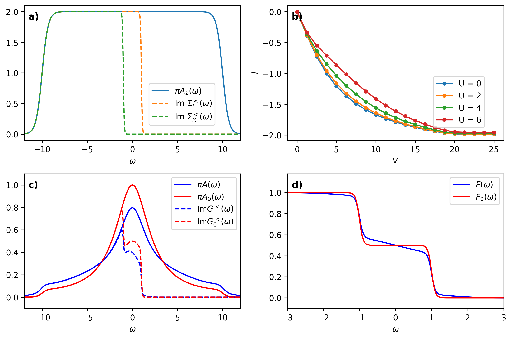
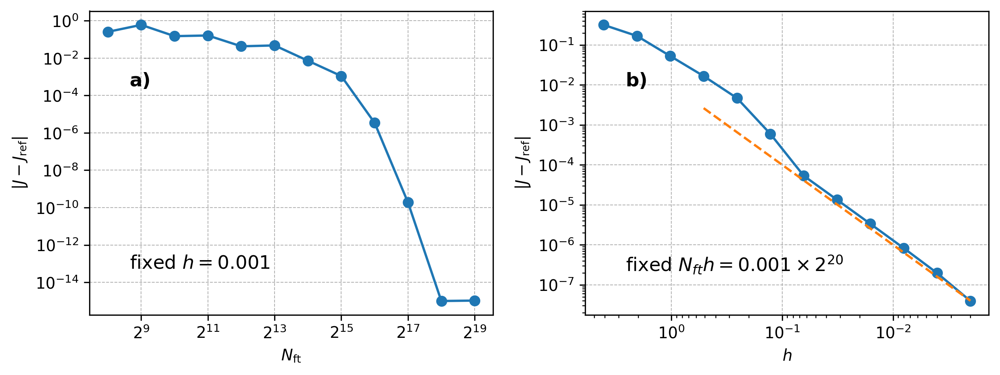
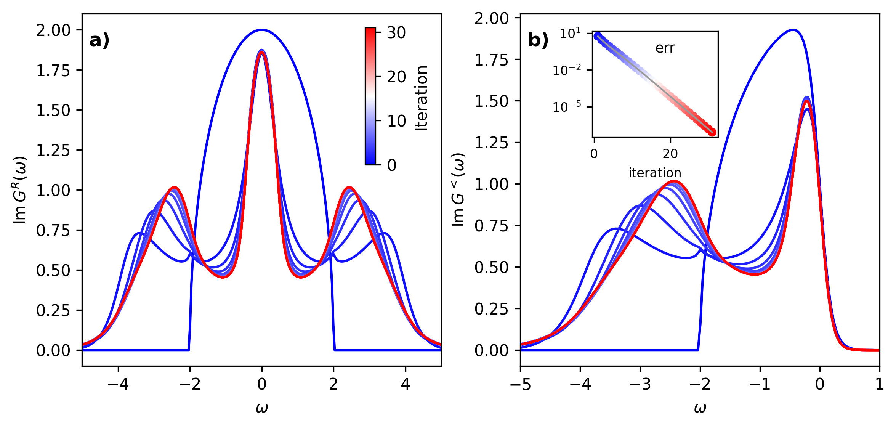
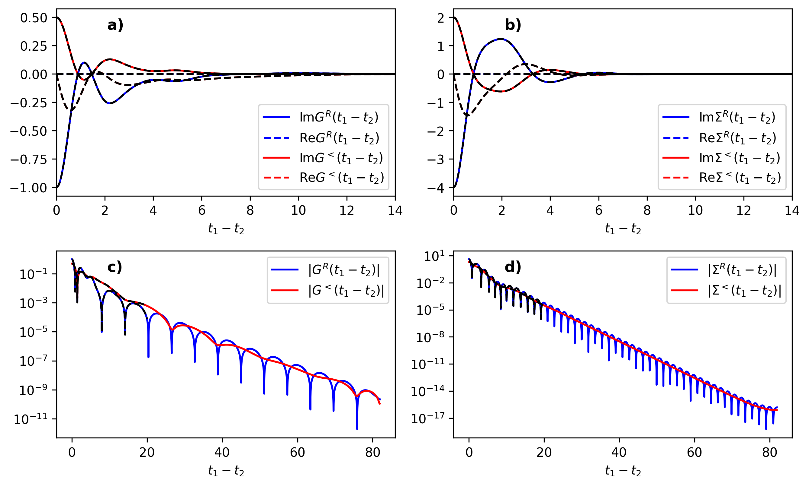
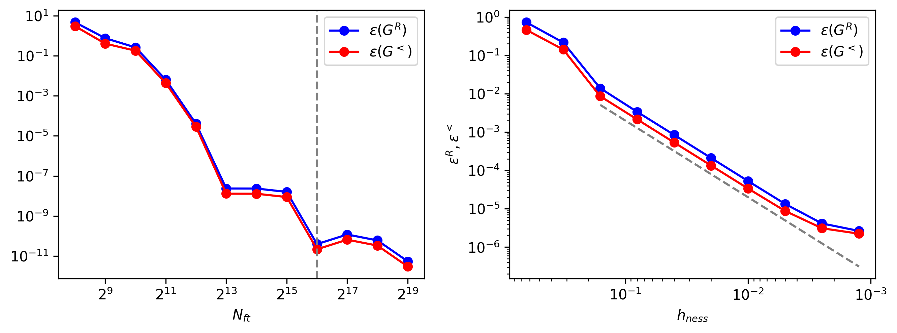
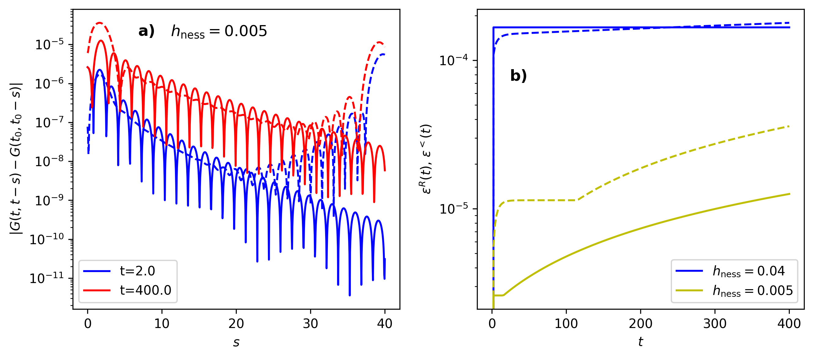

.. _NessEx:

Steady-State Examples
=====================

.. contents::
   :local:
   :depth: 2

.. _NessEx01:

Steady-state Dyson equation: Anderson Impurity model
-----------------------------------------------------

.. _NessEx01S01:

Synopsis
~~~~~~~~

We first demonstrate the use of the steady-state implementation for a perturbative solution of transport through a single impurity Anderson model. The on-site impurity Hamiltonian is

.. math::

   H_{loc} = U n_\uparrow n_\downarrow + \left(\mu-\frac{U}{2} + \epsilon_d\right)(n_\uparrow + n_\downarrow),

where :math:`U` is the local interaction, and :math:`\epsilon_d` the bare level energy; :math:`\mu=0` will be set to zero in the following, such that :math:`\epsilon_d=0` corresponds to a particle-hole symmetric case. The impurity is coupled to two infinite metallic leads, the left (:math:`L`) and right (:math:`R`) bath, which are kept at a voltage bias :math:`V`. Integrating out the leads gives rise to an embedding self-energy :math:`\Sigma_{\rm bath}=\Sigma_{L}+\Sigma_{R}`, which is defined via a spectral representation. We use a smooth box density of states

.. math::

   A_\Sigma(\omega) = \frac{\Gamma/\pi}{(1+e^{\nu(\omega-\omega_c)})(1+e^{-\nu(\omega_c+\omega)})},

where :math:`\Gamma` is the hybridisation strength, :math:`\omega_c` is the half bandwidth, and :math:`\nu` a smoothening parameter.
While the density of states :math:`A_\Sigma(\omega)` is identical for the left and right baths, :math:`\Sigma^<_{L,R}` is given by the equilibrium distribution with different chemical potentials :math:`\mu_{L/R}=\pm V/2`. In the following, we use :math:`\omega_c=10\Gamma` and :math:`\nu=3/\Gamma`; :math:`\Gamma=1` defines the energy unit, and :math:`1/\Gamma` is the unit of time.

The noninteracting impurity Green's function :math:`G_{0}` is therefore determined through the steady-state variant of the Dyson equation :math:`G_0 =( i\partial_t + \mu - \Sigma_{\rm bath})^{-1}`, while the interacting Green's function :math:`G` is obtained from a Dyson equation :math:`G =( i\partial_t + \mu - \Sigma_{\rm bath}+\Sigma_U)^{-1}`, with an additional self-energy :math:`\Sigma_U` due to interactions. In the example below, we approximate :math:`\Sigma_U` by a (non self-consistent) 2nd order perturbation theory, i.e., :math:`\Sigma_U` is given by

.. math::

   \Sigma(t,t') = U(t) G_0(t,t') G_0(t,t') G_0(t',t) U(t'),

evaluated in the steady state.

Finally, the current is defined by the rate of particle transfer from the left to the right reservoir, :math:`J= \frac{dN_L}{dt}= -\frac{dN_R}{dt}`. An exact expression can be derived using equations of motion for the Green's functions, and is given by equal-time convolution

.. math::

   J = 2\left(\Sigma_L\ast G -  G\ast\Sigma_L\right)^<(t,t),

where the factor :math:`2` is due to spin. This relation is in general not satisfied away from half-filling in bare (non-conserving) second order perturbation theory. In the steady state, the current can be evaluated using the ``convolution_density_matrix`` method, see :ref:`PNess02S02E`,

.. math::

   J =  -2i\left( \rho_{\Sigma_L,G} -  \rho_{G,\Sigma_L} \right) =4\text{Im} \left( \rho_{\Sigma_L,G}   \right).

Here the second equation uses hermitian symmetry :math:`\rho_{\Sigma_L,G} = \rho_{G,\Sigma_L}^\dagger`.

.. _NessEx01S02:

Details and Implementation
~~~~~~~~~~~~~~~~~~~~~~~~~~~

The relevant files for the implementation, found in ``nessi/examples/``, are listed in the table below.

.. list-table::
   :header-rows: 0

   * - ``programs/ness2_siam.cpp``
     - Source code.
   * - ``utils/demo_ness2_siam.ipynb``
     - Jupyter notebook to run the program.
   * - ``utils/demo_ness2_siam.py``
     - A Python script; same as the notebook.

The implementation is built on the functions in the ``ness2`` namespace. The input parameters for the main program are the physical parameters ``U`` (interaction :math:`U`), ``beta`` (inverse temperature :math:`\beta`), ``V`` (voltage bias :math:`V`), and ``epsd`` (on-site energy :math:`\epsilon_d`), as well as the numerical parameters ``Nft`` (number of time/frequency points) and ``h`` (timestep :math:`h`). Moreover, we allow for a nonzero ``eta`` for the regularization of the Dyson equation (which can however be set to zero in the example below, and would only be relevant if the level :math:`\epsilon_d` has no spectral overlap with the baths). After reading the input parameters from the input file we initialize ``herm_matrix_ness`` objects

.. code-block:: cpp

   herm_matrix_ness G0(Nft,size);

for the noninteracting Green's functions :math:`G_0`, and similar for
``G`` (:math:`G`),
``SL`` (:math:`\Sigma_L`),
``SR`` (:math:`\Sigma_R`),
``Sbath`` (:math:`\Sigma_L+\Sigma_R`),
``SU`` (:math:`\Sigma_U`), and
``S`` (:math:`\Sigma_L+\Sigma_R+\Sigma_U`). Next, the left and right baths are initialized with the given smooth box density of states. For this, we define a class to provide the density of states.

.. code-block:: cpp

   class box_dos{
   public:
     double hi_,lo_,wc_,nu_;
     box_dos() wc_(10.0), nu_(3.0), hi_(15.0), lo_(-15.0) {}
     double operator()(double w){
       return 1/((1+exp(nu_*(w-wc_))*(1+exp(-nu_*(wc_+w)));
     }
   };

Here ``hi_`` and ``lo_`` define the bounds of the integrals in the spectral representation. The bath self-energies are then initialized using

.. code-block:: cpp

   box_dos dos();
   green_equilibrium_ness(FERMION,SL,dos,beta,+0.5*V,h,FFT_TRAPEZ);
   green_equilibrium_ness(FERMION,SR,dos,beta,-0.5*V,h,FFT_TRAPEZ);
   Sbath=SL;
   Sbath.incr(SR,1.0,fft_domain::time); // Sbath+= SR on time-data

Next we solve the noninteracting Dyson equation using

.. code-block:: cpp

   cdmatrix eps_matrix(1,1);
   eps_matrix(0,0) = epsd;
   dyson(G0,mu,eps_matrix,Sbath,h,FFT_TRAPEZ,BATH_GAUSS,eta,beta,mu);

Here we allow for the regularization using the gaussian bath if ``eta`` is nonzero.
With the resulting ``G0`` one can determine the 2nd order self-energy. The structure of the diagram is analogous as for the previous real-time example, and hence also the implementation is similar:

.. code-block:: cpp

   herm_matrix_ness W(Nft, size1);  // temporary W
   Bubble1_ness(W, G0, G0);  //W(t,t') <- ii*G(t,t')G(t',t)
   W.smul(U*U,fft_domain::time); // W(t,t') <- U^2 W(t,t')
   Bubble2_ness(SU,G,W); //Sigma_U(t,t')<-ii*G(t,t')W(t',t)
   SU.smul(-1.0,fft_domain::time);

Finally, we solve the interacting Dyson equation:

.. code-block:: cpp

   S=Sbath;
   S.incr(SU,1.0,fft_domain::time); // S += SU
   dyson(G,mu,eps_matrix,S,h,FFT_TRAPEZ,BATH_GAUSS,eta,beta,0);

For postprocessing we compute the convolutions

.. code-block:: cpp

   cdmatrix SUG,SLG,rho;
   convolution_density_matrix(SLG,FERMION,SL,G,h); // ii*[SL*G]^<(t=0)
   convolution_density_matrix(SUG,FERMION,SU,G,h); // ii*[SU*G]^<(t=0)
   density_matrix(rho,FERMION,G); //   = ii*G^<(t=0)
   double Current = 4.0*SLG.trace().imag();
   double Eint = (SUG).trace().real(); // interaction energy
   double dens = 2*rho.trace().real(); // <n_up + n_do >

Finally we update the frequency-domain Green's functions, such that we can later analyze the spectra:

.. code-block:: cpp

   G.transform_to_freq(h,FFT_TRAPEZ);

At the end, all output is stored into a single HDF5 file:

.. code-block:: cpp

   // create the hdf5 file (char *flout points to the filename)
   hid_t file_id = open_hdf5_file(flout);
   // write Nft to group "/Nft" in the file :
   store_int_attribute_to_hid(file_id, "Nft", Nft);
   [...] // similar for dens, Eint, Current
   G0.write_to_hdf5(file_id, "G0"); // new group "/G0" in file
   [...]  // same for G,S,...
   close_hdf5_file(file_id);

The HDF5 output is conveniently interpreted using the Python utilities provided with the ``ReadNESS`` modules.

.. _NessEx01S03:

Discussion
~~~~~~~~~~~

:numref:`AIM_ness_1` c) shows converged results for the interacting impurity spectral functions :math:`A(\omega)` and the noninteracting impurity spectral functions :math:`A_0(\omega)`, for a given bath as shown in :numref:`AIM_ness_1` a). The spectrum is essentially a Lorentzian peak, which becomes slightly more broadened for nonzero interaction :math:`U`. The non-equilibrium nature of the state is evident from the distribution function

.. math::

   F(\omega) = \frac{G^<(\omega)}{2\pi i A(\omega)}.

The latter becomes clearly non-thermal, simultaneously reflecting the Fermi edges in the left and right bath (see :numref:`AIM_ness_1` d)). Interactions support thermalization and therefore slightly reduce the sharp edges, compare the blue and red curves in :numref:`AIM_ness_1` d) for :math:`F(\omega)=G^<(\omega)/2\pi i A(\omega)` and :math:`F_0(\omega)=G_0^<(\omega)/2\pi i A_0(\omega)`, respectively.

:numref:`AIM_ness_1` b) shows the current as a function of the voltage, which evolves from the linear response regime at small :math:`V` to a saturated value of :math:`J=2` (corresponding one transport channel for each spin) when :math:`V` becomes comparable to bandwidth :math:`2\omega_c`, such that the left (right) bath is full (empty). In the interacting case, the current is reduced, consistent with the broadening of the steps in the distribution function. Of course, the bare second order perturbation theory cannot correctly describe the Kondo effect at low temperatures and large :math:`U`, which is not in the scope of the present code. The steady state code can however be easily combined with a more accurate diagrammatic computation of real-time Green's functions and self-energies in the steady state.

.. _AIM_ness_1:

   Results for the Anderson model. Anderson model for :math:`U=6`, and :math:`\beta=20`.
   a) Bath spectral functions and occupation functions (dashed) for voltage :math:`V=2`.
   b) Current as function of voltage :math:`V`, for :math:`\beta=20`.
   c) Interacting spectral function :math:`A(\omega)` (full blue lines) and noninteracting spectral function :math:`A_0(\omega)` (full red lines) for :math:`V=2`. The dashed lines show the imaginary part of the corresponding lesser Green's functions.
   d) Occupation functions for the interacting case (:math:`F(\omega)`) and noninteracting case (:math:`F_0(\omega)`) for :math:`V=2`.

In :numref:`AIM_ness_2`, we demonstrate the numerical convergence of the steady state approach (for :math:`U=6`, :math:`V=2`, :math:`\beta=20`). We first fix a small value :math:`h=0.001` of the timestep, and perform simulations with different length :math:`N_{\rm ft}` of the Fourier domain. This tests the convergence with the maximal real time :math:`t_{\rm c}= h N_{\rm ft}/2` which is represented by the time grid. For accurate results, it is necessary that all functions :math:`G^{R,<}(t)` and :math:`\Sigma^{R,<}(t)` essentially decay to zero within the domain :math:`|t|<t_{\rm max}`. In :numref:`AIM_ness_2` a), we plot the difference :math:`|J(N_{\rm ft}) - J_{\rm ref}|`, where the reference result :math:`J_{\rm ref}` is simply the result for the largest grid (:math:`N_{\rm ft}=2^{20}`). The sharp drop in the error :math:`|J(N_{\rm ft}) - J_{\rm ref}|` is consistent with an exponential decay of :math:`|G^{R,<}(t)|` and :math:`|\Sigma^{R,<}(t)|`, such that there is no dependence on :math:`t_{\rm c}` for sufficiently large :math:`t_{\rm c}`.

To analyze the convergence with the timestep :math:`h`, we perform simulations with different :math:`N_{\rm ft}` and :math:`h`, keeping the product :math:`N_{\rm ft}h` fixed. This corresponds to varying :math:`h` at fixed cutoff :math:`t_c`; the latter is chosen as the largest value in :numref:`AIM_ness_2` a), i.e., :math:`hN_{\rm ft} = 0.001 \times 2^{20}`. The error :math:`|J(N_{\rm ft}) - J_{\rm ref}|` with respect to the reference result :math:`J_{\rm ref}` at the largest :math:`N_{\rm ft}` (smallest :math:`h`) is shown in :numref:`AIM_ness_2` b). The plot demonstrates an error of order :math:`\mathcal{O}(h^2)`, consistent with the trapezoidal evaluation of the convolution integrals.

.. _AIM_ness_2:

   Convergence results.
   a) Convergence of the steady state solution for fixed timestep :math:`h=0.001` with :math:`N_{\rm ft}` (maximal time :math:`t_{\rm c}\sim hN_{\rm ft}/2`), for :math:`U=6`, :math:`V=2`, :math:`\beta=20`.
   b) Convergence of the steady state solution with the timestep :math:`h`, for fixed :math:`h N_{\rm ft}=0.001\times 2^{20}` (fixed :math:`t_{\rm c}`). In both cases, the difference :math:`\varepsilon=|J-J_{\rm ref}|` of the current to a reference :math:`J_{\rm ref}` is analyzed, where :math:`J_{\rm ref}` corresponds to the largest grid :math:`N_{\rm ft}=2^{20}` and smallest :math:`h=0.001`. The dashed line in b) indicates the scaling behavior :math:`\varepsilon\sim h^2`.

.. _NessEx02:

DMFT in the steady state
-------------------------

.. _NessEx02S01:

Synopsis
~~~~~~~~

In order to benchmark the steady-state code with respect to the real-time propagation, we use a similar physical setup as in :ref:`Trunc`. We again consider the :ref:`P4S1` Hubbard model on the Bethe lattice at half-filling, now with time-independent interaction :math:`U`. This requires the self-consistent solution of the equations in :ref:`Trunc` in the steady state. The self-energy is approximated by the second order diagram, but here we allow for two variations: (i) Self-consistent perturbation theory, where the self-energy is expanded in the fully interacting Green's function, such that :math:`\mathcal{G}=G`, and (ii), iterated perturbation theory (IPT), for which :math:`\Sigma_U` is expanded in the bare Green's function of the impurity model. The latter is obtained via another Dyson equation,

.. math::

   \mathcal{G}^{-1} = i\partial_t + \mu - \Delta,

with the self-consistent :math:`\Delta` given in :ref:`Trunc`.

We will solve the problem in thermal equilibrium at temperature :math:`T=1/\beta` in three ways: (i) First we will use the two-time implementation with a timestep :math:`h_{\rm cntr}` up to a given time :math:`t_{\rm max}` (referred to as real-time or 'cntr' simulation in the following). Here the equilibrium state is prepared through the imaginary time branch with a given number of timesteps :math:`n_{\tau}`. The resulting Green's function should be translationally invariant in time, :math:`G_{\rm cntr}^{R,<}(t_1,t_2)\equiv G^{R,<}(t_1-t_2)`. (ii) Thereafter, the same problem is solved using the steady-state implementation with a given Fourier domain size :math:`N_{\rm ft}` and a timestep :math:`h_{\rm ness}` (referred to as 'NESS' simulation in the following). The resulting NESS solution should match the real-time solution, :math:`G_{\rm cntr}^{R,<}(t_1,t_2)= G_{\rm ness}^{R,<}(t_1-t_2)` up to numerical accuracy, so that the real-time result can be used as a benchmark for the steady state result. (iii) Finally, we will demonstrate how the steady-state result can be used to prepare an initial equilibrium solution for the real-time evolution in the memory-truncated KBE, thereby avoiding the need for the imaginary time simulation.

.. _NessEx02S02:

Details and Implementation
~~~~~~~~~~~~~~~~~~~~~~~~~~~

The relevant files for the implementation, found in ``nessi/examples/``, are listed in the table below. For installation, see :ref:`S4S1`.

.. list-table::
   :header-rows: 0

   * - ``programs/ness2_bethe_prop.cpp``
     - Source code for real-time evolution
   * - ``programs/ness2_bethe.cpp``
     - Source code for NESS solution
   * - ``programs/ness2_bethe_trunc.cpp``
     - Memory-truncated KBE starting from NESS
   * - ``utils/demo_ness2_bethe.ipynb``
     - Jupyter notebook to run the program
   * - ``utils/demo_ness2_bethe.py``
     - Python script; same as the notebook

**Implementation: Real-time simulation**

The real-time benchmark ``ness2_bethe_prop.cpp`` is almost identical to the startup routine ``trunc_bethe_start.cpp`` in the example for the memory truncated KBE (:ref:`Trunc`), and will therefore not be discussed in detail here. The difference is that the evolution is computed at time-independent :math:`U` (such that a DMFT iteration is also needed for the imaginary time branch), there is no determination of momentum-dependent Green's functions :math:`G_k`, and there is an input flag ``ipt_flag`` to choose between an IPT self-energy (``ipt_flag=1``) and self-consistent perturbation theory (``ipt_flag=0``). The IPT solution just involves one more call at each timestep to solve the :ref:`NessEx02S01` Dyson equation.

**Implementation: NESS simulation**

The input parameters for the main program are the flag ``ipt_flag`` to choose the self-energy, the physical parameters ``U`` (interaction :math:`U`), ``beta`` (inverse temperature :math:`\beta`), ``mu`` (chemical potential :math:`\mu`), as well as the numerical parameters ``Nft`` (number of time/frequency points) and ``h`` (timestep :math:`h_{\rm ness}`). In addition, the parameters ``N_it`` (maximum number of iterations), ``errmax`` (error cutoff), and ``mix`` (linear mixing) are used to control the DMFT iteration (see below). Finally, the flag ``out_every`` allows to save the Green's functions at every DMFT iteration. The implementation is built on the functions in the ``ness2`` namespace, which is included at the top of the source code:

.. code-block:: cpp

   using namespace cntr;
   using namespace ness2;

After reading the input from a file we allocate a ``herm_matrix_ness`` object with ``size=1`` for the local Green's function :math:`G`.

.. code-block:: cpp

   herm_matrix_ness G_ness(Nft,size);

and similar for ``SU_ness`` (:math:`\Sigma`), ``Gweiss_ness`` (:math:`\mathcal{G}`), and some temporary variables. Next, :math:`G` is initialized with the noninteracting Green's function.

.. code-block:: cpp

    ness2::bethedos dos(-2,2); // bethe dos: dos(w)=sqrt(4-w**2)/(2pi)
   green_equilibrium_ness(FERMION,G_ness,dos,beta,mu,h,FFT_TRAPEZ);

Because the accuracy of the initialization is not too important, we can use the faster ``FFT_TRAPEZ`` method instead of the slower ``FFT_ADAPTIVE``. Following this, we enter a loop over at most ``N_it`` iterations for the DMFT self-consistency. At the beginning of each loop, we copy the current Green's function into a new ``herm_matrix_ness`` object ``G_old``. We can then compute :math:`\mathcal{G}` either by copying :math:`\mathcal{G}=G` (self-consistent perturbation theory), or by solving the :ref:`NessEx02S01` Dyson equation (IPT):

.. code-block:: cpp

   if(ipt_flag) dyson(Gweiss_ness,mu,ham,G_ness,h,FFT_TRAPEZ); // IPT
   else  Gweiss_ness=G_ness;

Here ``ham`` is a zero matrix of dimension ``size=1``. The computation of the self-energy is then identical to the corresponding section in the steady state example :ref:`NessEx01` (``W_ness`` is a temporary ``herm_matrix_ness``):

.. code-block:: cpp

   Bubble1_ness(W_ness, Gweiss_ness, Gweiss_ness);  // W = ii * G * G
   W_ness.smul(U*U,fft_domain::time);  // W ==> W*U**2
   Bubble2_ness(SU_ness, Gweiss_ness, W_ness);  // SU = ii * G * W
   SU_ness.smul(-1.0, fft_domain::time);       // SU *= -1
   K_ness.set_zero(fft_domain::time);          // kernel K=0
   K_ness.incr(SU_ness,1.0,fft_domain::time);  // K += SU
   K_ness.incr(G_ness,1.0,fft_domain::time);   // K += G (using Delta=G)

Finally, we solve the :ref:`P4S1` Dyson equation, and compute the :math:`L_2` norm difference to the previous iteration (stored in ``G_old``) on the time-grid:

.. code-block:: cpp

   dyson(G_ness, mu, ham, K_ness, h, FFT_TRAPEZ); // update G_ness
   err = distance_norm2(G_ness,G_old,fft_domain::time);

The convergence of the DMFT iteration is typically improved if the Green's function at the new iteration is not taken as the updated result :math:`G'`, but as a linear combination :math:`G_{\rm new} = \alpha G' + (1-\alpha) G_{\rm old}` (:math:`\alpha` is the mixing parameter ``mix``).

.. code-block:: cpp

   G_ness.smul(mix,fft_domain::time); // linear mixing for convergence
   G_ness.incr(G_old,1.0-mix,fft_domain::time);

The DMFT iteration loop is now ended if the maximum number of iteration is reached, or if the :math:`L_2` error ``err`` falls below the cutoff provided by ``errmax``. Finally, we write all relevant Green's functions to an HDF5 file, just as in the example :ref:`NessEx01`. To read the file one can again use the Python utilities provided with the ``ReadNESS`` modules.

.. _NessEx02S03:

Discussion
~~~~~~~~~~~

For illustration, we first show in :numref:`ness_bethe_1` the convergence of the spectrum :math:`A(\omega)` and the occupied density of states :math:`G^<(\omega)` during the DMFT loop. In general, we observe that the linear mixing can be more relevant for the DMFT loop in the steady-state implementation than for the imaginary-time evolution within the real-time code. (In the example, we use a mixing factor :math:`\alpha=0.5`). Moreover, if the time cutoff :math:`\sim hN_{\rm ft}` in the simulation is not sufficient for the Dyson equation to be accurately solved, the decrease of the DMFT error with iteration would slow down around a value that is determined by the accuracy of the Dyson equation.

.. _ness_bethe_1:

   DMFT convergence analysis. Steady state DMFT loop (:math:`U=4`, :math:`\beta=10`, IPT), with :math:`N_{\rm ft}=2^{13}` and a timestep :math:`h_{\rm ness}=0.02`.
   (a) Convergence of spectral function :math:`A_{\rm iter}(\omega)` with iteration iter=:math:`0\,...\,30` (see color bar in a)).
   b) Same as (a), but for :math:`G^<(\omega)`. Inset in b) Convergence error :math:`\epsilon_{\rm iter}= |G_{\rm iter+1}-G_{\rm iter}|_2` as function of iteration; the difference is evaluated in the time-domain.

In :numref:`ness_bethe_2`, we demonstrate that the NESS simulation and the real-time simulation converge to the same result. In equilibrium, the real-time solution results in Green's functions which are translationally invariant in time. Their value on a given timestep :math:`t_1` should therefore coincide with the NESS results,

.. math::

   X_{\rm cntr}(t_1,t_2) = X_{\rm ness}(t_1-t_2),

for :math:`X=G^{R,<},\Sigma^{R,<}`. The colored lines in :numref:`ness_bethe_2` a) and b) show the results for the NESS simulation, while the dashed black lines correspond to the last timeslice (:math:`t_1=h_{\rm cntr}\cdot n_t`) of the real-time simulation.
The results indeed coincide within the line-width of the plots. Moreover, :numref:`ness_bethe_2` c) and d) shows :math:`G^{R,<}(t)` and :math:`\Sigma^{R,<}(t)` on a logarithmic scale over the full time domain :math:`|t|<t_{\rm c}=h_{\rm ness}(N_{\rm ft}/2-1)` of the NESS simulation. This demonstrates the decay of the functions at the boundary of the domain, which is needed for an accurate solution of the Dyson equation in the steady-state.

.. _ness_bethe_2:

   Real-time comparison. Converged Green's function :math:`G` (a) and self-energy :math:`\Sigma` (b) for the same parameters as in :numref:`ness_bethe_1`. Colored lines correspond to the results for the NESS simulation, while the dashed black lines, which lie on top of the colored lines, correspond to the results obtained from the last timestep of the real-time simulation (see main text). The real time simulation has been performed with :math:`h_{\rm cntr}=h_{\rm ness}=0.02`, ``nt=1000``, and ``ntau=1000``. c) and d) Same data as in panels a) and b), but on a larger time window and on a logarithmic scale.

Finally, we can quantitatively demonstrate the convergence of the NESS and real-time calculations against each other, for the same parameters (:math:`U=4`, :math:`\beta=10`, IPT). Because of the high-order accurate quadrature used in the NESSi real-time simulation, the real-time result :math:`G_{\rm cntr}` with :math:`h_{\rm cntr}=0.02` and ``ntau=1000`` can be taken as an accurate benchmark. We first show the convergence of the NESS result at a fixed timestep :math:`h_{\rm ness}=0.02` for increasing :math:`N_{\rm ft}`, corresponding to an increasing time cutoff :math:`t_{\rm c}\sim h_{\rm ness}N_{\rm ft}/2`. One can see that the results are converged with the cutoff for :math:`N_{\rm ft}\gtrsim 2^{13}`, corresponding to a cutoff :math:`t_{\rm c}\approx 80`. This is consistent with the exponential decay of :math:`G` and :math:`\Sigma`. Next we perform a series of simulations with different :math:`N_{\rm ft}` and fixed :math:`h_{\rm ness}N_{\rm ft}`, i.e., essentially varying the timestep :math:`h_{\rm ness}` at fixed cutoff :math:`t_{\rm c}`. The convergence is analyzed in terms of the difference :math:`\epsilon^{R,<} = |G^{R,<}_{\rm ness}(t_1-t_2)-G^{R,<}_{\rm cntr}(t_1,t_2)|_2` between the steady state result and the real-time benchmark :math:`G_{\rm cntr}`, on the largest timestep :math:`t_1=n_th_{\rm cntr}` of the real-time simulation. The comparison confirms the decrease of the error like :math:`\mathcal{O}(h^2)`, consistent with the trapezoidal evaluation of the convolution integrals.

.. _ness_bethe_3:

   NESS convergence analysis. Convergence of the NESS simulation with increasing :math:`N_{\rm ft}` and decreasing :math:`h_{\rm ness}` (:math:`U=4`, :math:`\beta=10`, IPT).
   a) Difference :math:`\epsilon(G^{R,<}) = |G^{R,<}_{N}-G^{R,<}_{N^*}|_2` between a steady-state DMFT solution with domain size :math:`N_{\rm ft}=N` and a reference simulation with large :math:`N_{\rm ft}=N^*=2^{19}`, at fixed timestep :math:`h_{\rm ness}=0.02`. The difference is computed on the smallest common grid.
   b) Difference :math:`\epsilon^{R,<}\equiv |G^{R,<}_{\rm ness}(t_1-t_2)-G^{R,<}_{\rm cntr}(t_1,t_2)|_2` between the steady state result and the real-time benchmark :math:`G_{\rm cntr}`, as function of :math:`h_{\rm ness}` (see main text). Results are obtained for fixed :math:`N_{\rm ft}\times h_{\rm ness}=2^{16}\times 0.02`; corresponding to a cutoff :math:`t_{\rm c}\approx 650` well beyond the convergence threshold found in a). The dashed line in (b) indicates an error scaling :math:`\epsilon \sim h^2`.

.. _NessEx02S04:

Interface with truncated KBE
~~~~~~~~~~~~~~~~~~~~~~~~~~~~~

Because both the memory-truncated and the NESS Green's functions are entirely defined in terms of their real-time components :math:`G^R` and :math:`G^<`, one can straightforwardly exchange data between the two objects. Here we provide an example that illustrates how a NESS simulation can be used to initialize the time evolution with the truncated KBE. This circumvents the initialization via the imaginary time propagation, as in the startup routine of the example in :ref:`Trunc`. In detail, we will initialize memory-truncated Green's functions and self-energies for the Hubbard model on a Bethe lattice using the result of the steady-state simulation in ``ness2_bethe.x``, and then use the truncated KBE to further propagate the solution in time. While the expected result should simply maintain the time-translationally invariant solution for all times, this is still a numerically nontrivial test which can be used straightforwardly to access the accuracy of the approach.

Running the test is also part of ``demo_ness2_bethe.ipynb``. We first use the NESS simulation with ``ness2_bethe.x`` to prepare a steady-state equilibrium solution with a given timestep :math:`h_{\rm ness}` and domain size :math:`N_{\rm ft}`. The output file of the NESS simulation is then read by the executable ``ness2_bethe_trunc.x``, to perform the truncated KBE simulation. Because the numerical error in the NESS simulation decreases with the timestep only like :math:`\mathcal{O}(h^2)`, in contrast to the higher order accurate real-time KBE implementation, it can be beneficial to perform the NESS simulation with a smaller timestep than the one used in the truncated evolution. We will set :math:`h_{\rm cntr}=d\cdot h_{\rm ness}`, with an integer factor :math:`d`.

The truncated simulation thus takes as input the parameters ``downsampling`` (the factor :math:`d`), ``tc`` (memory cutoff in the KBE simulation), ``tmax`` (the number of timesteps over which the KBE is propagated), ``out_every`` (frequency at which timeslices of the KBE are written to file), and ``CorrectorSteps`` (number of DMFT iterations at each timestep, see explanation in :ref:`P4S2`). Further parameters (:math:`U`, :math:`\beta`, :math:`h_{\rm ness}`, :math:`N_{\rm ft}`, and the ``ipt_flag``) are read, together with the Green's functions, from the HDF5 file which is written as output of the NESS simulation.

After reading the input, the main step is the initialization of the memory-truncated functions, which we explain exemplarily for the Green's function. (All routines use namespaces ``ness2`` and ``cntr``.) First we allocate the memory truncated function with a cutoff ``tc`` and orbital dimension ``size=1``,

.. code-block:: cpp

   herm_matrix_moving<double> Gcntr(tc,1,FERMION);

We then read the NESS Green's functions from the HDF5 output of the NESS simulation (with name ``ness_filename``),
where it is stored under a group ``G``:

.. code-block:: cpp

   herm_matrix_ness Gness;
   Gness.read_from_hdf5(ness_filename,"G");

The object ``Gness`` is thereby also resized to the correct dimension ``Nft``. Since the real-time evolution will be run on a grid that is coarser by a factor :math:`d`, we must downsample the steady-state Green's function:

.. code-block:: cpp

   herm_matrix_ness Gness1;
   Gness1=downsample(Gness,downsampling);

This will automatically resize ``Gness1`` to the correct dimension ``Nft1``, where ``Nft1=Nft/downsampling``. In the time-domain, downsampling simply copies every :math:`d`-th value of ``Gness`` (on the fine grid) to ``Gness1`` (coarse grid). In turn, the frequency grid is restricted to the lowest frequencies ``{-Nft1/2, ..., Nft1/2-1}``. The routine therefore requires ``Nft`` to be an integer multiple of :math:`d`, and ``Nft1`` to be a multiple of :math:`2`. Here we choose both ``Nft`` and :math:`d` to be a power of :math:`2`. Finally, the memory truncated Green's function is initialized using

.. code-block:: cpp

   ness2cntr(Gcntr, Gness1);

Here ``ness2cntr`` will initialize :math:`G_{\rm cntr}` such that

.. math::

   G_{\rm cntr}^{<,R}(t_1,t_2)=G^{<,R}_{\rm ness}(t_1-t_2)

is translationally invariant in time in the full domain :math:`\mathcal{M}[G]`.
The cutoff ``tc`` of :math:`G_{\rm cntr}` should be smaller or equal to the maximum number of timesteps in ``Gness1``, which is ``Nft1/2-1``; otherwise part of :math:`G_{\rm cntr}` would be left zero. The initialization is repeated for the self-energy and for :math:`\mathcal{G}`, which are both stored in the NESS output file.

After this point, the truncated time evolution in ``ness2_bethe_trunc.x`` is identical to the example of :ref:`P4S2`, where the truncated Green's functions are initialized from a full real-time simulation. Selected timeslices ``t`` of the KBE simulation will be stored in the HDF5 output file under a group with key ``t[t]/G``. Alternatively to writing the slices directly, as in the example ``trunc_bethe`` above, we can use the reverse data exchange ``cntr2ness`` to initialize a ``herm_matrix_ness`` from the real-time Green's function, and store the latter:

.. code-block:: cpp

   void write_slice(hid_t fl_id,int t,herm_mat_moving<double> &Gcntr){
     // fl_id is a handle to an open and writable HDF5 file
     [...] // create herm_matrix_ness Gness with Nft/2-1>=G.tc_
     cntr2ness(Gness,Gcntr); // read last timestep of G into Gness
     // write Gness to new group t[t]/G in file fl_id:
     hid_t sub_group_id = create_group(file_id,"t"+std::to_string(t));
     Gness.write_to_hdf5(sub_group_id, "G");
     close_group(sub_group_id);
   }

Exemplary results are shown in :numref:`ness_bethe_4`. We perform the test for similar parameters as in the example in :ref:`P4S3`, using a self-consistent perturbation theory for :math:`U=1` and :math:`\beta=2`. Note that this high temperature rather corresponds to the order of magnitude of the final thermalised temperature in the previous example, rather than to the initial temperature before the quench. Lower temperatures typically require a longer memory cutoff, because a sharp Fermi edge in the distribution function :math:`G^<(\omega)` implies a slower decay of :math:`G^<(t)`. We also observe that the IPT simulation is less stable under a long-time evolution, which may be related to its non-conserving nature.

.. _ness_bethe_4:

   Memory truncated time-evolution of an equilibrium state initialized with a NESS simulation.
   Self-consistent perturbation theory, :math:`U=1`, :math:`\beta=2`. The truncated KBE evolution is performed with :math:`h_{\rm cntr}=0.04` and a cutoff ``tc=1000``, and the initial NESS simulation uses :math:`h_{\rm ness}=0.005`.
   a) Difference :math:`\epsilon^{R,<}(t,s)=|G_{\rm cntr}^{R,<}(t,t-s)-G_{\rm cntr}^{R,<}(t_0,t_0-s)|` between the Green's functions on timeslice :math:`t` and the first timeslice :math:`t_0=0`. Full (dashed) lines show :math:`\epsilon^R` (:math:`\epsilon^<`).
   b) Maximum difference :math:`\epsilon^{R,<}(t)=\text{max}_s (\epsilon^{R,<}(t,s))` as function of :math:`t`, for different :math:`h_{\rm ness}`.

:numref:`ness_bethe_4` a) shows the comparison of the real-time result :math:`G_{\rm cntr}^{R,<}(t,t-s)` to the initial NESS Green's function :math:`G_{\rm ness}^{R,<}(s)`, which match by construction on the initial timeslice :math:`t=0`. The two timeslices :math:`t=2` and :math:`t=400` correspond to :math:`50` and :math:`10000` timesteps :math:`h_{\rm cntr}=0.04`, respectively. One can see that very early a difference is built up in the lesser component at large relative times :math:`s`, which is related to the finite cutoff :math:`t_c` in the memory-truncated evolution. Thereafter, the difference :math:`|G_{\rm cntr}^{R,<}(t,t-s)-G_{\rm ness}^{R,<}(s)|` grows slowly with time due to a regular linear error accumulation (but remains small on the absolute scale). In :numref:`ness_bethe_4` b) we analyze the maximum difference

.. math::

   \epsilon^{R,<}(t)=\text{max}_s\left(|G_{\rm cntr}^{R,<}(t,t-s)-G_{\rm ness}^{R,<}(s)|\right)

over a timeslice :math:`t` as function of :math:`t`. If the NESS simulation is performed with the same timestep as the real-time simulation, the NESS simulation is less accurate and therefore slightly inconsistent with a translationally invariant real-time solution (see the results for :math:`h_{\rm ness}=h_{\rm cntr}=0.04` in :numref:`ness_bethe_4` b). The time-evolution then leads to the buildup of a finite difference :math:`\epsilon^{R,<}(t)` over few timesteps, so that the linear error accumulation starts from a higher level. This initial error buildup can be simply reduced by performing the NESS simulation with a smaller timestep (see the results for :math:`h_{\rm ness}=0.005` in :numref:`ness_bethe_4` b). Since the numerical cost of the NESS simulation scales only with :math:`\mathcal{O}(N_{\rm ft}\log N_{\rm ft})` due to the use of FFT, the preparation of the equilibrium state via the NESS simulation is still cheaper than the preparation via a full real-time evolution.
