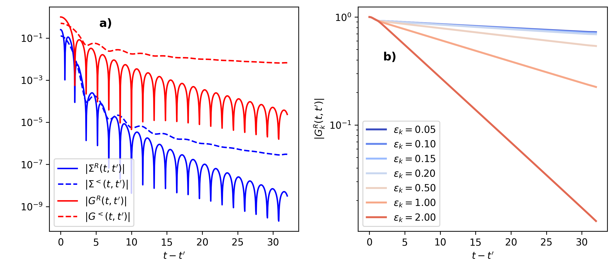
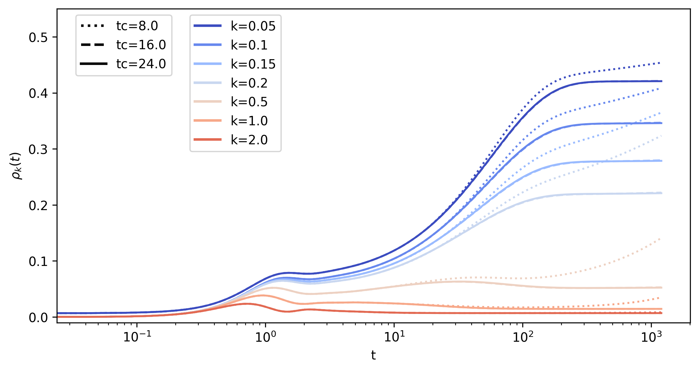

.. _Trunc:

DMFT with a memory-truncated time propagation
==============================================

.. contents::
   :local:
   :depth: 2

.. _P4S1:

Synopsis
--------

This example program provides a demonstration and benchmark for the truncated KBE. We consider a Hubbard model with time-dependent interaction :math:`U(t)`, solved within DMFT with a second-order perturbation theory impurity solver. The Hubbard model is defined by the Hamiltonian

.. math::

   H = -J \sum_{\langle i,j \rangle, \sigma} c_{i \sigma}^\dagger c_{j \sigma} + U(t) \sum_i \Big(n_{i \uparrow}-\tfrac12\Big)\Big(n_{i \downarrow}-\tfrac12\Big),

where :math:`c_{i \sigma}^\dagger` and :math:`c_{i \sigma}` are the creation and annihilation operators for fermions at site :math:`i` with spin :math:`\sigma` (where :math:`\sigma \in \{\uparrow, \downarrow\}`), and :math:`n_{i \sigma} = c_{i \sigma}^\dagger c_{i \sigma}` is the number operator. The first term represents the hopping of fermions between neighboring sites :math:`\langle i,j \rangle`, with hopping amplitude :math:`J`, and :math:`U` is the on-site interaction between fermions of opposite spins.
We consider an interaction quench, where the system is prepared in an equilibrium state with temperature :math:`T=1/\beta` and :math:`U=0` for :math:`t<0`, and the interaction is switched to a nonzero value :math:`U(t)=U` for :math:`t\ge 0`. The model is studied on a Bethe lattice, where the self-consistency for the DMFT impurity model becomes particularly simple. Within second order perturbation theory, the equations reduce to the Dyson equation for the local contour-ordered Green's function :math:`G(t,t') = -i \langle T_\mathcal{C} c_{i\sigma}(t)c_{i\sigma}^\dagger(t')\rangle`,

.. math::

   G^{-1} = (i\partial_t +\mu - K),

with a self-consistent memory kernel

.. math::

   K(t,\bar{t}) = \Delta(t,\bar{t}) + \Sigma(t,\bar{t}).

Here :math:`\Delta(t,t')` is the hybridization function and :math:`\Sigma(t,t')` is the self-energy.
For the Bethe lattice, the hybridization function takes the closed form

.. math::

   \Delta(t,t') = J_0^2 G(t,t'),

with a rescaled hopping :math:`J_0`. We take :math:`J_0=1` as the unit of energy, and :math:`1/J_0` as the unit of time (:math:`\hbar=1`). The expression for the impurity model self-energy in second order perturbation theory is given by

.. math::

   \Sigma(t,t') = U(t) \mathcal{G}(t,t') \mathcal{G}(t,t') \mathcal{G}(t',t) U(t'),

where :math:`\mathcal{G}` is again self-consistently given by :math:`\mathcal{G}=G`. The chemical potential :math:`\mu` will be set to :math:`\mu=0` throughout this example, which corresponds to the particle-hole symmetric case.

From the converged solution of the previous equations we can calculate the momentum-dependent Green's function :math:`G_k(t,t')`. Due to the :math:`k`-independent self-energy, :math:`G_k` depends on :math:`k` only via the single-particle energy :math:`\epsilon_k`, and is the solution of the Dyson equation

.. math::

   G_k^{-1} = \big( i\partial_t +\mu - \epsilon_k - \Sigma\big).

For the given particle-hole symmetric case (:math:`\mu=0`), :math:`\epsilon_k = 0` corresponds to the Fermi energy, while states at the edge of the noninteracting bandwidth have :math:`| \epsilon_k| = 2`. From :math:`G_k`, we can finally extract the momentum occupation

.. math::

   \rho(\epsilon_k) = \langle c_{k\sigma}^\dagger (t) c_{k\sigma}(t) \rangle = -i G_k^<(t,t).

This quantity is particularly well suited to reveal the two-stage dynamics characterized by a fast prethermalization and a slow thermalization.

.. _P4S2:

Details and Implementation
--------------------------

- We solve the equations from the :ref:`P4S1` section on an equidistant time grid with discretization :math:`h`, up to a maximum of timestep ``tmax``. The solution is generated with the same memory cutoff of ``tc`` timesteps in the kernel :math:`K` and the kernel :math:`\Sigma`, and convergence with ``tc`` is verified at the end.
- To generate the solution with memory cutoff ``tc``, we will first solve the equations on the full contour up to a given number ``nt`` of timesteps, where ``nt`` :math:`\ge` ``tc``. The resulting full Green's functions :math:`G`, :math:`\Sigma`, and :math:`G_k` are stored as ``cntr::herm_matrix<double>`` to a HDF5 file.
- In a separate program, we read the functions :math:`G`, :math:`\Sigma`, :math:`G_k` from the file, initialize corresponding moving Green's function windows of type ``cntr::herm_matrix_moving<double>``, and perform the truncated time evolution over timesteps ``tstp = tc+1``, ..., ``tmax``.

Relevant files for the memory truncated DMFT example are

.. list-table::
   :header-rows: 0

   * - ``programs/trunc_bethe_start.cpp``
     - Source for initial non-truncated evolution.
   * - ``programs/trunc_bethe.cpp``
     - Source for memory-truncated evolution.
   * - ``utils/demo_trunc_bethe.ipynb``
     - Jupyter notebook to run the program.
   * - ``utils/demo_trunc_bethe.py``
     - A Python script; same as the notebook.

- For the installation, follow the instruction for the installation of the NESSi examples (:ref:`S4S1`).
- To run simulations, copy the Python notebook to a working directory and adapt the path of the executables.

**Non-truncated simulation**

The structure of the program is similar to the example files for the main code, e.g. :ref:`testneq`:
The implementation is built on functions in the ``cntr`` namespace, and the input parameters like ``nt``, ``h``, ``beta``, ``ntau``, ``U1``, as well as the numerical parameters ``BootstrapMaxIter``, ``BootstrapMaxErr`` and ``CorrectorSteps`` are read in from the input file. After initializing the data structures, the noninteracting equilibrium problem is initialized by

.. code-block:: cpp

   cntr::green_equilibrium_mat_bethe(G, beta);

which fills the Matsubara component of the Green's function :math:`G` with the noninteracting Green's function for a semi-elliptic density of states (of the Bethe lattice). The following loop then encompasses the bootstrapping and the actual time propagation step using ``cntr::dyson_timestep``. To compute the self-consistent kernel :math:`K(t, \bar{t}) = \Delta(t, \bar{t}) + \Sigma(t, \bar{t})` we use the following two functions. The self energy :math:`\Sigma` at a given timestep ``tstp`` is obtained from (``GREEN`` and ``CFUNC`` are synonymous with ``cntr::herm_matrix<double>`` and ``cntr::function<double>``, respectively)

.. code-block:: cpp

   void get_Sigma_timestep(int tstp,GREEN &Sigma,GREEN &G,CFUNC &U) {
     // temporary variable W to store time slice
     GREEN_TSTP W(tstp, Sigma.ntau(), Sigma.size1(), BOSON);
     cntr::Bubble1(tstp, W, G, G);   // W(t,t') <-- ii*G(t,t')G(t',t)
     W.left_multiply(tstp, U);   // W(t,t') <-- U(t)W(t,t')
     W.right_multiply(tstp, U);  // W(t,t') <-- W(t,t')U(t'):
     Bubble2(tstp, Sigma, G, W); //Sigma(t,t') <-- ii*G(t,t')W(t',t);
     Sigma.smul(tstp, -1.0); // a final -1 sign.
   }

The Kernel :math:`K` is then summed up using

.. code-block:: cpp

   void get_K_timestep(int tstp, GREEN &K, GREEN &Sigma, GREEN &G) {
     K.set_timestep(tstp, Sigma); // K=Sigma at timestep tstp
     K.incr_timestep(tstp, G, 1.0);  // K += G at timestep tstp
   }

Timestepping starts with a bootstrapping phase, which solves the KBE simultaneously on time slices ``0``, ..., ``SolveOrder``, where ``SolveOrder`` is the order of the Volterra integrator. We use the maximum value ``SolveOrder=MAX_SOLVE_Order`` :math:`5` in the present implementation.

.. code-block:: cpp

   tstp = SolveOrder;
   GREEN_TSTP gtemp(tstp, ntau, 1); // to store last timestep
   set_t0_from_mat(G); // initialize time 0 from Matsubara
   for (iter = 0; iter <= BootstrapMaxIter; iter++) {
     gtemp.set_timestep(tstp, G); // store last iteration
     // K<--Sigma[G]+G on all timesteps 0...SolveOrder:
     for (int n = 0; n <= SolveOrder; n++) {
       get_Sigma_timestep(n, Sigma, G, U);
       get_K_timestep(n, K, Sigma, G);
     }
     // Solve Dyson [idt + mu - eloc]G - K*G =1 for G
     // on all timesteps 0...SolveOrder (here eloc=0):
     dyson_start(G, mu, eloc, K, beta, h, SolveOrder);
     double err = distance_norm2(tstp, gtemp, G); // convergence?
     if (err < BootstrapMaxErr && iter > 3) break;

The iteration does a maximum number of ``BootstrapMaxIter`` iterations, where the equations for :math:`K` and :math:`\Delta` are solved iteratively to determine :math:`K` from :math:`G`, and the Dyson equation is solved for :math:`G` from :math:`K`. The error measure ``cntr::distance_norm2`` returns a sum of the 2-norm of the difference between the previous iteration of :math:`G` (stored in ``gtemp``) and the updated :math:`G` on the last time slice ``tstp``. After the bootstrapping, a similar iteration of the self-consistent equations is performed for each timestep ``tstp``= ``SolveOrder+1``,...,``nt``:

.. code-block:: cpp

   // extrapolate G from tstp-1,...tstp-SolveOrder to timestep tstp:
   cntr::extrapolate_timestep(tstp - 1, G, SolveOrder);
   // self-consistent iteration:
   for (iter = 0; iter <= CorrectorSteps; iter++) {
       G.get_timestep(tstp, gtemp); // store last iteration
       get_Sigma_timestep(tstp, Sigma, G, U); // get Sigma on tstp
       get_K_timestep(tstp, K, Sigma, G); // K<--Sigma+G
       // solve [idt + mu - eloc]G - K*G =1 for G on timestep tstp
       cntr::dyson_timestep(tstp,G,mu,eloc,K,beta,h,SolveOrder);
       ... // convergence error to previous iteration,  etc.  ...
   }

Since an initial guess for :math:`G` on the timestep can be obtained by extrapolation, the iterations converge quickly, and we keep a fixed number ``CorrectorSteps`` of iterations at each time (typically ``CorrectorSteps=3`` is sufficient).

After the solution of the self-consistent equations, we solve the Dyson equation for :math:`G` with a single call to ``cntr::dyson`` (no self-consistency is needed for the Kernel in this case). At the end, all Green's functions are stored into a single HDF5 file using the file i/o routine described in the Input Files section of the manual.

.. code-block:: cpp

   hid_t file_id = open_hdf5_file(flout); // create hdf5 file flout
   G.write_to_hdf5(file_id, "G"); // write G to group /G in the file
   ... // ... similar writing of Sigma, and other params nt, h, etc.
   close_hdf5_file(file_id);

The file can be read using the Python utilities in ``ReadCNTR`` and ``ReadCNTRhdf5``.

**Memory truncated simulation**

The memory-truncated simulation over the timesteps ``tc+1,..,tmax`` is performed in a separate program, which reads the previously computed Green's functions from file; ``tc`` :math:`\le` ``nt`` is required to be able to initialize the moving Green's functions from the data, and ``tc`` :math:`\ge` ``SolveOrder`` is needed such that Volterra Integrators of order ``SolveOrder`` can be used. After reading the input parameters ``tc``, ``tmax``, ``CorrectorSteps``), the program reads the HDF5 input and initializes the moving Green's functions
(``GTRUNC`` and ``CTRUNC`` are short for ``cntr::herm_matrix_moving<double>`` and ``cntr::function_moving<double>``, respectively):

.. code-block:: cpp

   hid_t file_id = read_hdf5_file(fldata); // open HDF5 file fldata
   nt = read_primitive_type<int>(file_id, "nt"); // read nt from file
   // allocate moving window with memory depth tc and matrix size 1:
   GTRUNC G_t(tc, 1, FERMION);
   CTRUNC U_t(tc, 1); // allocate moving contour function
   ... // similar allocation for other functions
   GREEN Gtmp; // temporary herm_matrix<double>
   Gtmp.read_from_hdf5(file_id, "G"); // read G and store into Gtmp
   // Initialize G_t from timesteps  tc, tc-1,...,0:
   // (two args are G and its herm conj.)
   G_t.set_from_G_backward(Gtmp, Gtmp, tc);

The functions to compute the kernel on a given time slice are very similar to the corresponding functions for the full ``herm_matrix<double>`` objects explained above. They only differ in the referencing of the time slices: For the memory-truncated Green's functions, the functions below always act on the leading time slice ``0`` of the moving window:

.. code-block:: cpp

   void get_Sigma_timestep(GTRUNC &Sigma, GTRUNC &G, CTRUNC &U) {
     // temporary W to store time slice of memory depth tc:
     GTRUNC_TSTP W(Sigma.tc(), Sigma.size1(), BOSON);
     Bubble1(W,G,G); // W(t,t') <-- ii*G(t,t')G(t',t) on leading time
     W.left_multiply(U); // W(t,t') <-- U(t)W(t,t')  on leading time
     W.right_multiply(U); // W(t,t') <-- W(t,t')U(t'):
     Bubble2(Sigma, G, W); // Sigma(t,t') <--=ii*G(t,t')W(t',t):
     Sigma.smul(0, -1.0); // *=-1 on timestep 0 (first argument)
   }

.. code-block:: cpp

   void get_K_timestep(GTRUNC &K, GTRUNC &Sigma, GTRUNC &G)  {
     K.set_timestep(0, Sigma, 0); // K <-- Sigma on step 0
     K.incr_timestep(0, G, 0, 1.0); // K += G on step 0
   }

Finally, we present the implementation of the timestepping, which, similar to the timestepping of the full KBE,
performs a self-consistent iteration for the Kernel and :math:`G`
with a fixed number ``CorrectorSteps`` of iterations for each ``tstp = tc + 1, ..., tmax``:

.. code-block:: cpp

   GTRUNC_TSTP gtmp(tc, 1, FERMION);
   // move windows forward by one step
   Sigma_t.forward();
   K_t.forward();
   G_t.forward();
   // extrapolate G from tstp-1,...tstp-SolveOrder to timestep tstp:
   extrapolate_timestep(G_t, SolveOrder);
   // self-consistent iteration
   for (iter = 0; iter <= CorrectorSteps; iter++) {
     gtmp.set_timestep(G_t, 0); // store leading time of G into gtmp
     get_Sigma_timestep(Sigma_t,G_t,U_t); //get Sigma on leading time
     get_K_timestep(K_t, Sigma_t, G_t); // K=G+Sigma  on leading time
     // solve Dyson G^{-1} = (idt + mu - eloc - K) on leading time
     dyson_timestep(G_t, K_t, eloc_t, mu, SolveOrder, h);
   }

Within the loop over timesteps from ``tc+1,...,tmax``, the first operation is to move the windows forward by one step, using the ``forward()`` method. If the leading timestep of the window initially corresponds to the physical timestep ``tstp-1``, then after the action of ``forward()`` the leading timestep of the window corresponds to the physical timestep ``tstp``. Next, an estimate for :math:`G` on its leading timestep is obtained by extrapolating from the sub-leading timesteps ``1,..., SolveOrder``. The self-consistent iteration itself, inside the loop over ``iter``, then proceeds in the same way as the standard KBE time-stepping described above.

For the computation of :math:`G_k` it is important to note that :math:`\Sigma` is not stored as the window is moved forward. Hence, the timestepping for the solution for :math:`G_k` must be computed within the same timestepping loop as :math:`\Sigma`, following the convergence of the DMFT iteration above. This is in contrast to the non-truncated simulation, where one can compute :math:`G_k` outside the timestepping loop for :math:`\Sigma`. For each ``k = 0,...,nk``, :math:`G_k` is obtained as

.. code-block:: cpp

   Gk_t[k].forward();
   // solve Dyson [idt + mu - esp_k]G_k - K*G_k = 1 for each k
   dyson_timestep(Gk_t[k],Sigma_t,epsk_t[k],mu,SolveOrder,h);
   Gk_t[k].density_matrix(0, mtmp); // rho_k(t)= -i Gk^les(t,t)
   densk[k][tstp] = mtmp(0, 0).real(); // save rho_k(t)

The last lines extract the values for the momentum occupation.

**HDF5 output of timeslices**

Finally, since in the memory truncated KBE Green's functions are not stored as the window is moved forward, one must actively save the intermediate Green's function data as needed. As an example, in ``trunc_bethe.cpp`` we have implemented the possibility to write selected timeslices to an HDF5 file during the timestepping. For this we create an HDF5 file for writing before entering the propagation loop

.. code-block:: cpp

   hid_t  file_id=open_hdf5_file(flout1); // flout1 is filename

using the function ``open_hdf5_file`` from the HDF5 section of the manual. During step ``tstp`` of the evolution, we can write the current leading timeslice of the moving window to a new group ``t[tstp]/G`` within this file by calling (assuming the group ``t[tstp]`` does not yet exist)

.. code-block:: cpp

   hid_t sub_group = create_group(file_id,"t"+std::to_string(tstp));
   G_t.write_timestep_to_hdf5(0,sub_group,"G");
   close_group(sub_group);

In the Python notebook, we can use the helper functions of ``readCNTRhdf5`` to extract the data at a timestep ``tstp`` as simple arrays:

.. code-block:: python

   with h5py.File(out_file_name, 'r') as fd:
     key=f"t{tstp}/G" # the key under which the timestep is stored
     G=read_herm_matrix_timestep_moving_group(fd[key])
     # now G.ret[s,a,b]=G^R(t,t-s)_{ab}, G.les[s,a,b]=G^<(t,t-s)_{ab}.

A similar routine ``read_herm_matrix_moving_group`` can be used to read a full moving window from an HDF5 group.

.. _P4S3:

Discussion
----------

The results shown below have been obtained for an interaction quench to :math:`U=1`, with an initial temperature :math:`T=0.01` (``beta=100``), ``ntau=2000`` steps on the imaginary contour, and a time discretization ``dt=0.04``. The initial time evolution is performed up to ``nt=800`` (corresponding to a time :math:`32`). The memory truncated simulation is performed for ``tmax=30.000`` timesteps (:math:`t_\text{max}=1200`) with memory depth of ``tc=200,400,600`` steps (:math:`t_c=8,16,24`). The simulation runs in roughly :math:`10` minutes on a MacBook with an Apple M2 processor, consuming :math:`130` MB of memory to simultaneously store the temporary ``cntr::herm_matrix<double>`` object for initialization as well as the moving windows for :math:`\Sigma`, :math:`G`, :math:`K`, and :math:`G_k` for :math:`7` values of :math:`k`. In contrast, a single full ``cntr::herm_matrix<double>`` with ``tmax=30.000`` real-timesteps and ``ntau=2.000`` imaginary timesteps would require roughly 14GB of memory.

.. _trunc1:

   Results for the Green's function and self-energy.
   Left panel: Retarded and lesser component of the Green's function and self-energy as a function of the time difference :math:`t-t'` at a given time slice :math:`t=32` on a logarithmic scale.
   Right panel: The retarded Green's function as a function of the time difference :math:`t-t'` at a given time slice (:math:`t=32`), on a logarithmic scale for different values of the dispersion, where :math:`\epsilon_k=0` corresponds to the Fermi edge. Note the different vertical scale in the two plots.

All functions :math:`|\Sigma^{R}(t,t')|`, :math:`|\Sigma^{<}(t,t')|` and :math:`|G^{R}(t,t')|`, :math:`|G^{<}(t,t')|` show a fast decay with :math:`|t-t'|`. In particular, for the self-energy, we find an exponentially decaying envelope over several orders of magnitude (see the line plots in the left panels of :numref:`trunc1`). Because :math:`\Sigma` is a point-wise product of Green's functions, it decays faster than :math:`G`. The decay of the Kernel :math:`K=\Sigma+G` is therefore dominated by :math:`G`, and one can expect that the memory-truncated evolution for :math:`G_k`, with memory kernel :math:`\Sigma`, is faster convergent than the determination of :math:`G`. However, because the memory integrals are convolutions of the Green's functions and the Kernel, it is not easy to estimate a priori the required memory depth ``tc``, and the parameter ``tc`` will instead be used as a numerical convergence parameter.

.. note::

   It is important to note that for the memory-truncated time propagation to work, it is sufficient that the Kernel decays, while the Green's function (which is the solution of the Dyson equation) can still be large outside the memory truncated window. This becomes evident for the momentum-resolved Green's functions :math:`G_k`, for which the kernel :math:`\Sigma` decays quickly (left panels of :numref:`trunc1`), while the decay of the Green's functions is much slower (right panels of :numref:`trunc1`). The decay of :math:`G_k` reflects the quasi-particle lifetime, which becomes long in particular close to the Fermi energy :math:`\epsilon_k=0`.

Finally, in :numref:`trunc2` we show the momentum occupation :math:`\rho_k(t)` for selected values of :math:`\epsilon_k` close to the Fermi energy (:math:`\epsilon_k=0`), in the middle of the band (:math:`\epsilon_k=1`) and at the band edge (:math:`\epsilon_k=2`). By increasing ``tc`` (compare the different linestyles), one can see that a relatively short memory window of :math:`t_c=24` is sufficient to reach a converged solution over the full interval. On the other hand, if the truncation window is too small, the results strongly deviate. For even shorter :math:`t_c=4` (not shown here) the solution of the memory-truncated KBE becomes unstable within the simulated time range of :numref:`trunc2`.

In the converged results one can clearly see the two-stage dynamics: The prethermal state is reached after times of order :math:`1` (few inverse hoppings). The prethermal momentum distribution still has a pronounced step at the Fermi energy, which is evident by comparing :math:`\rho_k` at the smallest value of :math:`\epsilon_k` (:math:`\epsilon_k=0.05`) to :math:`\rho_{k_f}=0.5` at the Fermi energy :math:`\epsilon_{k_F}` (not shown in the plot). The thermalization time is of the order of a few :math:`100` hopping times, after which the momentum distribution takes the smooth form corresponding to the equilibrium distribution :math:`\rho_{k}(T_f,U)` at the final interaction :math:`U` and a final temperature :math:`T_f` which is set by the total energy of the system.

.. _trunc2:

   Results for the momentum occupation.
   Momentum occupation :math:`\rho_k(t)` for selected values of :math:`\epsilon_k`, obtained with the memory-truncated time-evolution with different ``tc``. Different line colors represent different values of :math:`\epsilon_k` close to the Fermi energy (:math:`\epsilon_k=0`), in the middle of the band (:math:`\epsilon_k=1`) and close the band edge (:math:`\epsilon_k=2`). Different line-styles distinguish different values of ``tc``.
