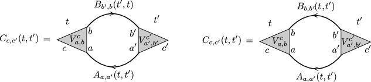

.. _PMan05:

Diagram Utilities
=================

.. contents::
   :local:
   :depth: 2

The basic building blocks of Feynman diagrams are particle-hole bubbles and particle-particle bubbles, such as:

The figure shows a typical particle-hole (left) and particle-particle (right) bubble, where :math:`V^c_{ab}` is an interaction vertex depending on three orbital indices, and :math:`A` and :math:`B` are Green's functions. The diagrams above correspond to the following algebraic expressions:

.. math::
   :label: diagram1

   \text{particle-hole bubble:}\,\,\,C_{c,c'}(t,t')
   =
   \sum_{a,a'}
   \sum_{b,b'}
   V^c_{a,b}
   \Big[
   iA_{a,a'}(t,t')
   B_{b',b}(t',t)
   \Big]
   V^{c'}_{a',b'},

.. math::
   :label: diagram2

   \text{particle-particle bubble:}\,\,\,C_{c,c'}(t,t')
   =
   \sum_{a,a'}
   \sum_{b,b'}
   V^c_{a,b}
   \Big[
   i
   A_{a,a'}(t,t')
   B_{b,b'}(t,t')
   \Big]
   V^{c'}_{a',b'}.

**Note on hermitian conjugation:** The complex :math:`i` factor has been inserted for convenience. With this definition, the hermitian conjugate :math:`C^\ddagger` of :math:`C` is obtained simply by replacing ``A`` and ``B`` by their hermitian conjugates, and :math:`V^c_{a,b}` by its element-wise complex conjugate. In particular, if :math:`V` is real and ``A`` and ``B`` are hermitian symmetric, then also ``C`` is hermitian symmetric (as a matrix-valued Green's function; its individual components are not hermitian, but :math:`(C_{1,2})^\ddagger = C_{2,1}`).

The basic building blocks are therefore products of the type :math:`C(t,t')=iA_{a,a'}(t,t') B_{b',b}(t',t)` and :math:`C(t,t')=iA_{a,a'}(t,t') B_{b,b'}(t,t')`, where :math:`t,t'` are arbitrary times on the contour. To evaluate those products, one uses Langreth rules. For example:

.. math::
   :label: langreth-product-1

   C(t,t')=iA(t,t')B(t',t) \,\,\,\Rightarrow\,\,\,  C^<(t,t')=iA^<(t,t')B^>(t',t)

We provide two basic functions that allow to compute particle-particle and particle-hole Bubbles on a given timestep:

.. list-table::
   :header-rows: 0

   * - ``cntr::Bubble1(int tstp, GG &C,int c1,int c2,GG &A,GG &Acc,int a1,int a2,GG &B,GG &Bcc,int b1,int b2)``
     - :math:`C_{c1,c2}(t,t')=i A_{a1,a2}(t,t')  B_{b2,b1}(t',t)` is calculated on timestep ``tstp`` of ``C`` for given two-time objects ``A,B`` with matrix indices ``a1``, ``a2`` and ``b1``, ``b2``, respectively. **output:** object ``C`` with matrix indices ``c1``, ``c2``
   * - ``cntr::Bubble2(int tstp, GG &C,int c1,int c2,GG &A,GG &Acc,int a1,int a2,GG &B,GG &Bcc,int b1,int b2)``
     - :math:`C_{c1,c2}(t,t')=i A_{a1,a2}(t,t')  B_{b1,b2}(t,t')` is calculated on timestep ``tstp`` of ``C`` for given two-time objects ``A,B`` with matrix indices ``a1``, ``a2`` and ``b1``, ``b2``, respectively. **output:** object ``C`` with matrix indices ``c1``, ``c2``

- ``C``, ``A``, ``Acc``, ``B``, ``Bcc`` can be of type ``cntr::herm_matrix`` or ``cntr::herm_matrix_timestep``
- For ``X``=``A`` or ``B``: ``Xcc`` contains the hermitian conjugate :math:`X^\ddagger` of :math:`X`. If the argument ``Xcc`` is omitted, it is assumed that ``X`` is hermitian, :math:`X=X^\ddagger`.
- If the index pairs ``(c1,c2)``, ``(a1,a2)``, or ``(b1,b2)`` are omitted, they are assumed to be ``(0,0)``
- The following size requirements apply:

  - For all ``X`` = ``C``, ``A``, ``Acc``, ``B``, ``Bcc``: ``X.tstp()==tstp`` required if ``X`` is of type ``herm_matrix_timestep``, and ``X.nt()>=tstp`` required if ``X`` is of type ``herm_matrix``
  - ``A.size1()>=a1,a2`` required, analogous for ``C``, ``A``, ``Acc``, ``B``, ``Bcc``
  - ``X.ntau()`` must be equal for all ``X`` = ``C``, ``A``, ``Acc``, ``B``, ``Bcc``

- From :eq:`langreth-product-1` one can see that in general ``A`` and ``B`` must be known outside the hermitian domain in order to compute ``C`` in the hermitian domain, which is why the hermitian conjugates :math:`A^\ddagger` and :math:`B^\ddagger` must be provided as arguments.

**Example 1:**

The following example calculates the second-order self-energy for a general time-dependent interaction :math:`U(t)` out of a scalar local Green's function, :math:`\Sigma(t,t') = U(t) G(t,t') G(t',t) U(t') G(t,t')`. The diagram is factorised in a particle-hole bubble :math:`\chi` and a particle-particle bubble:

.. math::

   \Sigma(t,t') = -i W(t,t') G(t,t'),
   \,\,\,\,
   W(t,t')=U(t) \chi(t,t') U(t'),
   \,\,\,\,\,
   \chi(t,t') = iG(t,t') G(t',t).

.. code-block:: cpp

   int nt=10;
   int ntau=100;
   int size1=1;
   GREEN G(nt,ntau,size1,FERMION);
   GREEN Sigma(nt,ntau,size1,FERMION);
   CFUNC U(nt,size1);
   // ...
   // ... do something to set G and U
   // ...
   // compute Sigma on all timesteps:
   for(int tstp=-1;tstp<=nt;tstp++){
       GREEN_TSTP tW(tstp,ntau,size1,BOSON); // used as temporary variable; Note that a bubble of two Fermion GF is bosonic
       cntr::Bubble1(tstp,W,G,G); // W(t,t') is set to chi=ii*G(t,t')G(t',t);
       // Note: Because G is scalar and have hermitian symmetry, many arguments can be replaced by default. The above extends to
       // cntr::Bubble1(tstp,W,0,0,G,G,0,0,G,G,0,0,);
       W.left_multiply(tstp,U);
       W.right_multiply(tstp,U); // now W is set to W(t,t')=U(t)chi(t,t')U(t')
       cntr::Bubble2(tstp,Sigma,G,W); // Sigma(t,t') is set to Sigma=ii*G(t,t')W(t',t);
       // Note that by construction, W is hermitian, see above
       Sigma.smul(tstp,-1.0); // the final -1 sign.
   }

**Example 2:**

Evaluation of the diagrams :eq:`diagram1` and :eq:`diagram2`, where ``A`` and ``B`` are two-dimensional, ``C`` is one-dimensional, and ``V`` is a corresponding contraction. The contraction over internal indices is done by an explicit four-dimensional summation.

.. code-block:: cpp

   int nt=10;
   int ntau=100;
   int size1=2;
   int sizec=1;
   GREEN A(nt,ntau,size1,FERMION);
   GREEN B(nt,ntau,size1,FERMION);
   GREEN CPH(nt,ntau,sizec,BOSON);
   GREEN CPP(nt,ntau,sizec,BOSON);
   // ...
   // compute particle-hole bubble (CPH) and particle-particle bubble (CPP) on all timesteps:
   for(int tstp=-1;tstp<=nt;tstp++){
       GREEN_TSTP ctmp(tstp,ntau,1,BOSON); // temporary
       CPH.set_timestep_zero(tstp);
       CPP.set_timestep_zero(tstp);
       for(int a1=0;a1<size1;a1++){
        for(int a2=0;a2<size1;a2++){
         for(int b1=0;b1<size1;b1++){
          for(int b2=0;b2<size1;b2++){
               double v1=get_vertex(a1,b1); // supposed to return V_{a1,b1}
               double v2=get_vertex(a2,b2); // supposed to return V_{a2,b2}
               cntr::Bubble1(ctmp,0,0,A,A,a1,a2,B,B,b1,b2); // Note the order of the arguments b1,b2!
               CPH.incr_timestep(tstp,ctmp,v1*v2);
               cntr::Bubble2(ctmp,0,0,A,A,a1,a2,B,B,b1,b2);
               CPP.incr_timestep(tstp,ctmp,v1*v2);
          }
         }
        }
       }
   }
