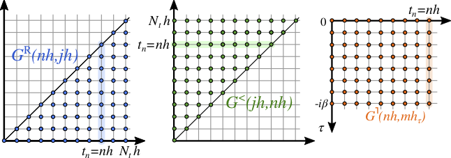

.. _PMan01:

Green Functions
===============

.. contents::
   :local:
   :depth: 2

.. _green_def:

.. _PMan01S01:

Overview
--------

.. list-table::
   :header-rows: 0

   * - class
     - ``cntr::herm_matrix<T>``

This class contains the data structures for representing two-time contour functions :math:`C(t,t')` on the equidistantly discretized time-contour :math:`\mathcal{C}` with points :math:`\{i\Delta t: i=0,1,2,...,{\tt nt}\}` along the real time branch, and :math:`\{i\Delta\tau,i=0,1,...,{\tt ntau}\}` along the imaginary branch. The Green's functions are defined by the following parameters:

- ``T`` (template parameter): Precision, usually set to ``double``; we use the global definition

  .. code-block:: cpp

     #define GREEN cntr::herm_matrix<double>

- ``nt`` and ``ntau`` (integer): number of discretization points on the real and imaginary time axis.
- ``size1`` (integer): orbital dimension. Each element :math:`C(t,t')` is a square matrix of dimension ``size1`` :math:`\times` ``size1``.
- ``sig`` (integer): Takes the values ``FERMION`` (defined as ``-1``) or ``BOSON`` (``+1``).

``herm_matrix`` stores the following Keldysh components on the equidistantly discretized Keldysh contour with time discretization :math:`\Delta t` and :math:`\Delta \tau` on the real and imaginary time, respectively (The real-time domain of a ``herm_matrix`` object is illustrated in the Figure):

- Matsubara component :math:`C^\mathrm{M}(i\Delta \tau)` for ``i=0,...,ntau``,
- retarded component :math:`C^\mathrm{R}(i\Delta t,j\Delta t)` for ``i=0,...,nt``, ``j=0,...,i``,
- lesser component :math:`C^<(i\Delta t,j\Delta t)` for ``j=0,...,nt``, ``i=0,...,j``,
- left-mixing component :math:`C^\rceil(i\Delta t,j\Delta \tau)` for ``i=0,...,nt``, ``j=0,...,ntau``.

If ``nt = -1``, only the Matsubara component is stored.

Size arguments of ``herm_matrix`` are returned by the following read-only member functions:

.. code-block:: cpp

   GREEN G;
   cout << "The object G of type herm_matrix has the following dimensions:" << endl;
   cout << "nt= " << G.nt() << endl;
   cout << "ntau= " << G.ntau() << endl;
   cout << "size1= " << G.size1() << endl;
   cout << "sig= " << G.sig() << endl;

.. _herm_domain:

**Hermitian symmetry and conjugate:**

In the following, we call the components mentioned above the **hermitian domain** of a two-time contour function.

.. _herm_sym:

The Hermitian conjugate :math:`C^\ddagger` of a Green's function :math:`C` is defined (:math:`\xi=` ``+1`` and ``-1`` for ``BOSON`` and ``FERMION``, respectively):

- :math:`[C^\ddagger]^\mathrm{R}(t,t^\prime) = \left( C^\mathrm{A}(t^\prime,t)\right)^\dagger \ ,`
- :math:`[C^\ddagger]^\gtrless(t,t^\prime) = -\left( C^\gtrless(t^\prime,t) \right)^\dagger \ ,`
- :math:`[C^\ddagger]^{\rceil}(t,\tau) = - \xi \left( C^\lceil(\beta-\tau,t) \right)^\dagger \ ,`
- :math:`[C^\ddagger]^{\mathrm{M}}(\tau)  =\left( C^{\mathrm{M}}(\tau) \right)^\dagger \ .`

Apparently, :math:`C=(C^\ddagger)^\ddagger`.

Hence, if a Green's function has **hermitian symmetry** (:math:`C=C^\ddagger`), it is sufficient to use one object of type ``herm_matrix`` and store the hermitian domain. If a Green's function is not hermitian, one must store the hermitian domain of :math:`C` and of :math:`C^\ddagger` in two separate ``herm_matrix`` variables.

For a summary of all member functions, see :ref:`PMan01S02Special`. The following paragraphs give detailed explanations of some functionalities.

.. _PMan01S02:

Constructors
------------

.. list-table::
   :header-rows: 0

   * - ``herm_matrix<T>()``
     - Default constructor, does not allocate memory, sets ``nt=-2``
   * - ``herm_matrix<T>(int nt,int ntau,int size1,int sig)``
     - Allocate memory, and sets all entries to ``0``. It requires ``nt>=-1``, ``ntau>0``, ``size1>0``, and ``sig`` :math:`\in\{` ``FERMION``, ``BOSON`` :math:`\}`.
   * - ``herm_matrix<T>(int nt,int ntau)``
     - Equivalent to ``herm_matrix(int nt,int ntau,int size1,int sig)`` with ``size1=1`` and ``sig=FERMION``.

.. _PMan01S03:

Accessing individual elements
-----------------------------

The following routines allow to read/write the elements of a contour function :math:`C(t,t')` stored as ``herm_matrix`` at individual time arguments from/to another variable ``M``. The latter can be either a scalar of type ``std::complex<T>``, or a complex square matrix defined in Eigen (see :ref:`PMan00S02`).

**Member functions of** ``herm_matrix``:

Member functions of ``herm_matrix`` allow to read/write elements of :math:`C` in the hermitian domain. To read elements of :math:`C` outside the hermitian domain (which are reconstructed from :math:`C` and :math:`C^\ddagger`), one can use the non-member element access functions defined later.

The following member functions set components of a contour function :math:`C` in the hermitian domain from ``M``:

.. list-table::
   :header-rows: 0

   * - ``C.set_les(i,j,M)``
     - :math:`C^<(i\Delta t,j\Delta t)` is set to ``M``
     - required: ``0 <= j <= C.nt()``, ``0<=i<=j``
   * - ``C.set_ret(i,j,M)``
     - :math:`C^R(j\Delta t,i\Delta t)` is set to ``M``
     - required: ``0 <= i <= C.nt()``, ``0<=j<=i``
   * - ``C.set_tv(i,j,M)``
     - :math:`C^{\rceil}(i\Delta t,j\Delta \tau)` is set to ``M``
     - required: ``0 <= i<= C.nt()``, ``0 <= j<= C.ntau()``
   * - ``C.set_mat(i,M)``
     - :math:`C^M(i\Delta \tau)` is set to ``M``
     - required: ``0 <= i <= C.ntau()``

- If ``C.size1()>1``, ``M`` must be a complex eigen matrix (``cdmatrix`` for double precision)
- If ``C.size1()==1``, ``M`` can be a scalar (``cdouble``) or a matrix
- If ``M`` is a Matrix, it must be a square matrix of dimension ``size1``

The following member functions read components of a contour function :math:`C` in the hermitian domain to ``M``:

.. list-table::
   :header-rows: 0

   * - ``C.get_les(i,j,M)``
     - ``M`` is set to :math:`C^<(i\Delta t,j\Delta t)`
     - required: ``0 <= j <= C.nt()``, ``0<=i<=j``
   * - ``C.get_ret(i,j,M)``
     - ``M`` is set to :math:`C^R(i\Delta t,j\Delta t)`
     - required: ``0 <= i <= C.nt()``, ``0<=j<=i``
   * - ``C.get_tv(i,j,M)``
     - ``M`` is set to :math:`C^{\rceil}(i\Delta t,j\Delta \tau)`
     - required: ``0 <= i<= C.nt()``, ``0 <= j<= C.ntau()``
   * - ``C.get_mat(i,M)``
     - ``M`` is set to :math:`C^M(i\Delta \tau)`
     - required: ``0 <= i <= C.ntau()``

- If ``M`` is a matrix, it is resized to a square matrix of dimension ``C.size1()``
- If ``M`` is a scalar, only the (0,0) entry of :math:`C(t,t')` is read.

Remark: Member functions ``set_les`` and ``set_ret`` can return also values outside the hermitian domain (assuming that :math:`C` has hermitian symmetry), but this functionality is no longer supported. Similarly, there are non-supported member functions like ``get_gtr(...)`` which return other Keldysh components. Use instead the general access functions described in the next paragraph.

**General element access:**

The following functions read components of a contour function :math:`C` to ``M``:

.. list-table::
   :header-rows: 0

   * - ``cntr::get_les(i,j,M,C,Ccc)``
     - ``M`` is set to :math:`C^<(i\Delta t,j\Delta t)`
     - required: ``0 <= i,j <= C.nt()``
   * - ``cntr::get_gtr(i,j,M,C,Ccc)``
     - ``M`` is set to :math:`C^>(i\Delta t,j\Delta t)`
     - required: ``0 <= i,j <= C.nt()``
   * - ``cntr::get_ret(i,j,M,C,Ccc)``
     - ``M`` is set to :math:`C^>(i\Delta t,j\Delta t)-C^<(i\Delta t,j\Delta t)`
     - required: ``0 <= i,j <= C.nt()``
   * - ``cntr::get_tv(i,j,M,C,Ccc)``
     - ``M`` is set to :math:`C^{\rceil}(i\Delta t,j\Delta \tau)`
     - required: ``0 <= i<= C.nt()``, ``0 <= j<= C.ntau()``
   * - ``cntr::get_vt(i,j,M,C,Ccc)``
     - ``M`` is set to :math:`C^{\lceil}(i\Delta \tau,j\Delta t)`
     - required: ``0 <= i<= C.ntau()``, ``0 <= j<= C.nt()``
   * - ``cntr::get_mat(i,M,C,Ccc)``
     - ``M`` is set to :math:`C^M(i\Delta \tau)`
     - required: ``0 <= i <= C.ntau()``

- ``C`` and ``Ccc`` are (size-matched) arguments of type ``herm_matrix`` which store the hermitian domain of :math:`C` and its hermitian conjugate :math:`C^\ddagger`.
- If the argument ``Ccc`` is omitted, hermitian symmetry :math:`C=C^\ddagger` is assumed.
- If ``M`` is a matrix, it is resized to a square matrix of dimension ``C.size1()``.
- ``M`` may always be a scalar; in this case only the (0,0) entry of :math:`C(t,t')` is read.

.. note::

   All ``set_XXX`` and ``get_XXX`` element access functions are not optimised for massive read/write operations. (In particular, ``set_XXX`` and ``get_XXX`` are not used inside the numerically costly tasks like the solution of integral equations). Mostly, data are anyway read and written timestep-wise (see :ref:`PMan02`).

.. _PMan01S04:

Density matrix
--------------

The equal-time elements of Green's functions contain expectation values of physical observables. If :math:`C_{ab}(t,t') = -i \langle T_\mathcal{C} \hat A_a(t)\hat B_b(t')\rangle` is the contour ordered expectation value of two operators :math:`\hat A` and :math:`\hat B` (such as creation and annihilation operators with orbital indices ``a`` and ``b``) then the time-dependent expectation value :math:`\rho_{ab}(t) = \langle B_{b} A_{a} \rangle_t` is given by (:math:`\xi` is the ``BOSON``/``FERMION`` sign):

.. math::

   \rho_{ab}(t) &= i \xi C^<_{a,b}(t,t) \quad \text{for general real times} \\
   \rho_{ab} &= - C^M_{a,b}(\beta) \quad \text{for the equilibrium initial state}

We therefore define the **Density matrix** of a two-time Green's function on the discretized contour at timestep ``tstp`` as:

.. math::

   \text{DensityMatrix}[C]({\tt tstp})
   &= - C^M({\tt ntau}\,\Delta\tau) \quad \text{for the equilibrium initial state}\,({\tt tstp}=-1) \\
   &= i \xi C^<_{a,b}({\tt tstp}\Delta t,{\tt tstp}\Delta t) \quad \text{for}\,{\tt tstp}>=0.

The following member function of a ``cntr::herm_matrix<T>`` object ``C`` writes the Density matrix to an object ``M``:

.. list-table::
   :header-rows: 0

   * - ``C.density_matrix(int tstp,M)``
     - ``M`` is set to :math:`\text{DensityMatrix}[C]({\tt tstp})`

- ``tstp <=  C.nt()`` required.
- If ``C.size1()>1``, ``M`` must be a complex eigen matrix (``cdmatrix`` for double precision)
- If ``C.size1()==1``, ``M`` can be a scalar (``cdouble``) or a matrix
- If ``M`` is a matrix, it is resized to a square matrix of dimension ``C.size1()``.

.. _PMan01S05:

File I/O
--------

**Reading/writing to text files**

The member functions ``print_to_file`` and ``read_to_file`` of a ``herm_matrix`` implement text-file access, as apparent by example:

.. code-block:: cpp

   int nt=10;
   int ntau=10;
   int size1=2;
   int sig=FERMION;
   GREEN A(nt,ntau,size1,sig);
   // ... set elements of  A ...

   //WRITE:
   // create a file filename.txt and store the data of A:
   A.print_to_file("filename.txt");

   // READ
   GREEN B;
   // if the file "filename.txt" has been written previously with print_to_file ,
   // the parameters (nt,ntau,size1,sig) and the data of B are modified
   // according to the information in the file:
   B.read_from_file("filename.txt");
   // now B is resized to B.nt()=10, B.ntau()=10,B.size1()=2,B.sig()=FERMION, and the data of B match the data of A.

The file format is rather explicit (and storage intensive):

- First line: ``# nt ntau size1 sig``
- The following lines list the Matsubara component in the format:
  ``mat: i Re_C^mat(i)_{0,0} Im_C^mat(i)_{0,0} ... Re_C^mat(i)_{size1,size1} Im_C^mat(i)_{size1,size1}``
- If ``nt>-1``, the following lines list the other components in the format:
  ``XXX: i j Re_C^XXX(i,j)_{0,0} Im_C^XXX(i,j)_{0,0} ... Re_C^XXX(i,j)_{size1,size1} Im_C^XXX(i,j)_{size1,size1}``
  where ``XXX`` is ``ret`` for :math:`C^R`, ``les`` for :math:`C^<`, ``tv`` for :math:`C^{\rceil}`, and ``i,j`` loop through the corresponding time arguments of the hermitian domain.

.. note::

   Writing to text files is supposed as a quick way to generate human-readible data. For compressed storage, one should use the `HDF5 <https://www.hdfgroup.org/solutions/hdf5/>`_ format below.

**Reading/writing to hdf5 files**

The `HDF5 <https://www.hdfgroup.org/solutions/hdf5/>`_ format, as well as some scripts to interpret the hdf5 files are discussed in a separate section :ref:`PMan11` below.
