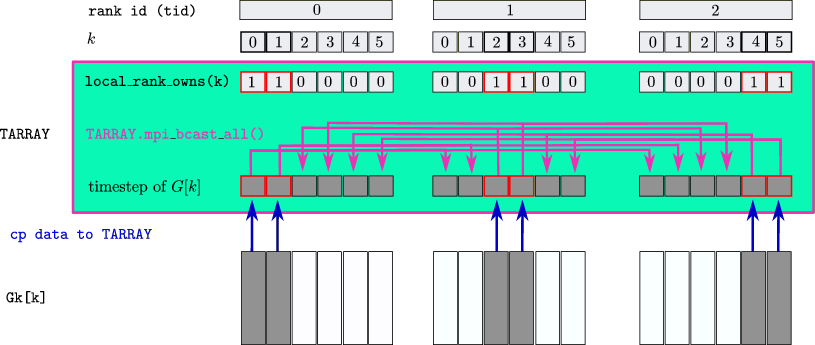

.. _PMan10:

MPI Parallelization
===================

.. contents::
   :local:
   :depth: 2

In large-scale applications, one often encounters problems that can be parallelized by distributing the calculation of different Green's functions across different computing ranks. A typical example are lattice simulations, where the solution of the Dyson equation for the Green's function :math:`G_k` on each point :math:`k` on a discrete momentum grid can be performed in parallel. The library provides some features for distributed-memory parallelization via ``MPI``:

- Member functions of ``cntr::herm_matrix`` and ``cntr::herm_matrix_timestep`` allow sending/receiving the data at one timestep
- A class ``cntr::distributed_timestep_array`` can be used to handle all-to-all communication of Green's function on a given timestep.
- The class ``cntr::distributed_timestep_array`` is derived from a class ``distributed_array``, which implements an array of data with distributed ownership.

.. _PMan10S01:

Communicating timesteps
-----------------------

Member functions of ``A``, where ``A`` is of type ``cntr::herm_matrix`` and ``cntr::herm_matrix_timestep``:

.. list-table::
   :header-rows: 0

   * - ``void Bcast_timestep(int tstp, int root)``
     - Broadcast the data of :math:`A(t,t')` on timestep ``tstp`` from rank ``root`` to all other ranks.
   * - ``void Reduce_timestep(int tstp, int root)``
     - In place reduction, replacing :math:`A(t,t')` on rank ``root`` by :math:`\sum_{\text{rank}\,j} A_{\text{at rank}\,j}(t,t')` for one timestep ``tstp``.
   * - ``void Send_timestep(int tstp, int dest, int tag)``
     - Send the data of :math:`A(t,t')` on timestep ``tstp`` to rank ``dest`` with a message tag ``tag``.
   * - ``void Recv_timestep(int tstp, int root, int tag)``
     - Receive a message with tag ``tag`` from rank ``root`` which contains the data of :math:`A(t,t')` on timestep ``tstp``.

A simple reduction operation:

.. list-table::
   :header-rows: 0

   * - ``cntr::Reduce_timestep(int tstp,int root,GG &A,GG &B)``
     - :math:`A(t,t')` at ``root`` is set to :math:`\sum_{\text{rank}\,j} B_{\text{at rank}\,j}(t,t')` for all time arguments on the timestep ``tstp``

- The type GG of ``A`` and ``B`` is ``cntr::herm_matrix<T>`` or ``cntr::herm_matrix_timestep<T>``
- ``B`` must exist on each rank, ``A`` on the ``root`` rank.
- Size requirements:

  - ``A`` and ``B`` must have equal ``size1`` and ``ntau``
  - For ``X=A,B``: If ``X`` is ``herm_matrix``, then ``X.nt()>=tstp`` is required; if ``X`` is ``herm_matrix_timestep``, then ``X.tstp()==tstp`` is required.

**Example:**

In the following example, each rank owns the Green's function :math:`G_k` for one momentum :math:`k` out of a given discrete grid of :math:`N_k` momenta, which are equidistantly spaced over the first Brillouin zone :math:`[0,2\pi)` of a one-dimensional lattice. Rank ``0`` owns a local Self-energy, which is sent to all ranks to solve the Dyson equation:

.. math::

   i\partial_t G_k(t,t^\prime) + \mu G_k(t,t^\prime)  - \epsilon_k(t) G_k(t,t^\prime) -
   \int_\mathcal{C} d\bar t\, \Sigma_{loc}(t,\bar t) G_k(\bar t,t^\prime) = \delta_{\mathcal{C}}(t,t^\prime).

The data are then collected to compute a local Green's function :math:`G_{loc} = \sum_{k} w_k G_k` on rank ``0``, with some given weights ``w_k`` (which are just ``w_k=1/N_k`` in the example).

.. code-block:: cpp

   // MPI is initialized as:
   MPI::Init(argc,argv);
   int nranks=MPI::COMM_WORLD.Get_size();
   int tid=MPI::COMM_WORLD.Get_rank();
   int root=0;
   int nk=ranks;  // Here : # of momentum points = # of MPI ranks
   double local_k = (2.0*M_PI/nk)*tid; // momentum kept at the local rank
   double wk=1.0/nk;

   // allocate Gk and epsilonk with same size nt,ntau,size1,sig on all ranks
   GREEN Gk(nt,ntau,size1,sig);
   CFUNC epsilonk(nk,size1);
   GREEN Sigma,Gloc;
   // the variable Sigma and Gloc is allocated  only on root:
   if(tid==root){
       Sigma=GREEN(nt,ntau,size1,sig);
       Gloc=GREEN(nt,ntau,size1,sig);
   }
   // ... do something to initialize function epsilonk at every rank, depending on local_k

   // typical simulation loop at timestep tstp (tstp>SolveOrder):
   // send Sigma to all ranks:
   Sigma.Bcast_timestep(tstp,root);
   // Solve dyson equation separately on each rank:
   cntr::dyson_timestep(tstp,Gk,mu,H,Sigma,SolveOrder,beta,dt);
   // compute the local Green's function at the root, using a temporary variable:
   GREEN_TSTP tGk(tstp,ntau,size1,sig);
   tGk.set_timestep(tstp,Gk);
   tGk.smul(tstp,wk);
   cntr::Reduce_timestep(tstp,root,Gloc,tGk);

.. _PMan10S02:

Distributed timestep array
---------------------------

While the previous example was based on simple ``root`` to all reduction and broadcasting operations, calculating lattice susceptibilities and self-energies often requires an all-to-all communication of a set of Green's functions at one timestep. We provide a class ``cntr::distributed_timestep_array`` which is customized for this application:

.. list-table::
   :header-rows: 0

   * - class
     - ``cntr::distributed_timestep_array<T>``

- The ``cntr::distributed_timestep_array<T>`` contains an array ``T_k`` of ``n`` ``herm_matrix_timestep`` s (each with the same ``tstp``, ``ntau``, ``size1`` and ``sig`` parameters, see :ref:`PMan02`), which are indexed by an index ``k`` :math:`\in\{` ``0,...,n-1`` :math:`\}`. ``k`` can be, e.g., a momentum label for lattice simulations.
- The full array is accessible at each ``MPI`` rank, but each timestep ``T_k`` is owned by precisely one rank (a vector ``tid_map[k]`` stores the id of the rank which owns timestep ``k``). Typically, each rank first performs local operations on the timesteps ``T_k`` which it owns. All timesteps are then broadcasted from the owning rank to all other ranks, so that finally each timestep ``T_k`` is known to all ranks.

Important member functions of ``cntr::distributed_timestep_array<T>``:

.. list-table::
   :header-rows: 0

   * - ``distributed_timestep_array(int n,int nt,int ntau,int size,int sig,bool mpi)``
     - Constructor. ``ntau``, ``size`` and ``sig`` are parameters of the individual timesteps. They cannot be changed later. The ``tstp`` parameter of the timesteps can later be adjusted (see ``reset_tstp``) up to a maximal value of ``nt``. ``mpi`` should be ``true`` (otherwise each rank owns each timestep, and ``mpi`` operations are ignored). The constructor automatically determines the ownership map ``tid_map`` (as evenly as possible).
   * - ``int nt()``
     - Returns ``nt``. Analogous for ``size()``, ``ntau()``, ``tstp()``, ``sig()``, ``n()``
   * - ``void reset_tstp(int tstp)``
     - The ``tstp`` parameter of all timesteps is reset to ``tstp``. ``tstp<=nt`` required.
   * - ``int tid()``, ``int ntasks()``
     - Returns rank id (``tid``) of the local process and number of ``MPI`` ranks (``ntasks``)
   * - ``void clear(void)``
     - All data set to ``0``.
   * - ``bool rank_owns(int k)``
     - Return ``true`` if local rank owns timestep with index ``k``, return ``false`` otherwise. ``0 <= k < n`` required.
   * - ``cntr::herm_matrix_timestep_view<T> &G(int k)``
     - Return a handle to the timestep of index ``k``. See Note below.
   * - ``void mpi_bcast_block(int k)``
     - Broadcast timestep :math:`T_k` from its owner to all other ranks.
   * - ``void mpi_bcast_all(void)``
     - Broadcast all timesteps from their owner to all other ranks.
   * - ``std::vector<int> data().tid_map()``
     - A way to return the vector ``tid_map``, where ``tid_map[k]`` for ``0 <= k < n`` is the rank which owns timestep ``T_k``.
   * - ``data()``
     - Returns a handle to an underlying ``cntr::distributed_array`` on which the ``distributed_timestep_array`` is built. Not needed in standard applications.

.. note::

   In the implementation, the ``distributed_timestep_array`` is not an array of ``cntr::herm_matrix_timestep<T>`` variables, but a sufficiently large contiguous data block and an array of shallow ``cntr::herm_matrix_timestep_view<T>`` objects. This allows for an easier adjustment of the size of the timesteps. The ``herm_matrix_timestep_view<T>`` object has the same functionality as the ``herm_matrix_timestep`` (see :ref:`PMan02S01`).

**Example:**

The usage of the ``distributed_timestep_array`` can be understood best by means of an example. In the example below we consider a vector (``std::vector<GREEN> Gk``) of momentum-dependent Green's functions :math:`G_k` on a grid of ``nk=6`` momenta (``k=0,...,5``). The memory-intensive Green's functions should be distributed on ``ntasks=3`` MPI ranks, such that each :math:`G_k` is available only on one rank. One can use a ``distributed_timestep_array`` object ``TARRAY`` to make a given timestep of all ``Gk`` available to each rank:

- The ``distributed_timestep_array`` specifies which ``k`` is owned by which rank.
- The vector ``Gk`` is available at each rank, but at a given rank memory for ``Gk[k]`` is only allocated if ``k`` is owned by that rank (i.e., if ``TARRAY.rank_owns(k)==true``).
- Each rank can perform local operations on its own Green's functions ``Gk[k]``, and then copy the data of a given timestep ``tstp`` to the ``TARRAY``
- The global ``MPI`` operation ``TARRAY.mpi_bcast_all();`` then makes all timesteps visible to all ranks.

.. code-block:: cpp

   // MPI initialized with ntasks=6 ranks, local rank has rank-ID tid
   int nk=6;
   // ... set nt,ntau,size1,sig ...
   GREEN Gloc(nt,ntau,size1,sig);
   std::vector<GREEN> Gk(nk);
   cntr::distributed_timestep_array<double> TARRAY(nk,nt,ntau,size1,FERMION,true);
   for(int k=0;k<nk;k++){
       if(TARRAY.rank_owns(k)){
           cout << "rank " << tid << " owns k= " << k << endl;
           Gk[k]=GREEN(nt,ntau,size1,sig); // allocate memory for full Green's function Gk only on ranks which own k
       }else{
           cout << "rank " << tid << " does not own k= " << k << endl;
       }
   }

   // typical simulations at a given timestep:
   TARRAY.reset_tstp(tstp);
   for(int k=0;k<nk;k++){
       if(TARRAY.rank_owns(k)){
           // ... rank owns k, do some heavy numerics on Gk[k]
           // then copy timestep to TARRAY:
           TARRAY.G(k).set_timestep(tstp,Gk[k]); // read in data from Gk[k] to the array
       }
   }
   TARRAY.mpi_bcast_all();
   // now on all ranks and for all k TARRAY.G(k) contains the data of Gk[k]
   // this can be used, e.g., to calculate a local Green's function:
   Gloc.set_timestep_zero(tstp);
   for(int k=0;k<nk;k++) Gloc.incr_timestep(tstp,gk_timesteps.G(k),1.0/nk);
   // or do more complicated stuff, such as calculating a self-energy diagram with internal k summations

.. _PMan10S03:

Distributed array
-----------------

.. list-table::
   :header-rows: 0

   * - class
     - ``cntr::distributed_array<T>``

- The ``cntr::distributed_array<T>`` contains an array of ``n`` equally sized data blocks, each containing ``blocksize`` data of type ``T``, which are indexed by an index ``k`` :math:`\in\{` ``0,...,n-1`` :math:`\}`. All data are stored contiguous in memory.
- The full data set is accessible at each MPI rank, but each block is owned by precisely one rank (a vector ``tid_map[k]`` stores the id of the rank which owns block ``k``). ``MPI`` routines are used to send the blocks between ranks.

Important member functions of ``cntr::distributed_array<T>``:

.. list-table::
   :header-rows: 0

   * - ``distributed_array(int n,int maxlen,bool mpi)``
     - Constructor. ``maxlen`` sets the maximum block size. ``mpi`` should be ``true`` (otherwise each rank owns each timestep, and ``mpi`` operations are ignored).
   * - ``void reset_blocksize(int blocksize)``
     - The number of elements in each block is set to ``blocksize``. ``blocksize<=maxlen`` required.
   * - ``int n()``
     - Returns ``n``. Analogous for ``maxlen()``, ``blocksize()``
   * - ``int tid()``, ``int ntasks()``
     - Returns rank id (``tid``) of the local process and number of MPI ranks (``ntasks``)
   * - ``void clear(void)``
     - All data set to ``0``.
   * - ``bool rank_owns(int k)``
     - Return ``true`` if local rank owns block with index ``k``, return ``false`` otherwise. ``0 <= k < n`` required.
   * - ``std::vector<int> tid_map()``
     - Return the vector ``tid_map``, where ``tid_map[k]`` for ``0 <= k < n`` is the rank which owns block ``k``.
   * - ``T* block(int k)``
     - Return a pointer to the first element of block ``k``. ``0 <= k < n`` required.
   * - ``int numblock_rank(void)``
     - Return the number of blocks owned by the local rank.
   * - ``void mpi_bcast_block(int k)``
     - Broadcast data of block ``k`` from its owner to all other ranks.
   * - ``void mpi_bcast_all(void)``
     - Broadcast the data of all blocks from their owner to all other ranks.
   * - ``void mpi_send_block(int k,int dest)``
     - Send block ``k`` from its owner to rank ``dest``.
   * - ``void mpi_gather(int dest)``
     - MPI Gather all blocks from their owner at rank ``dest``
