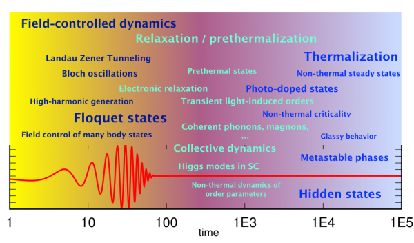
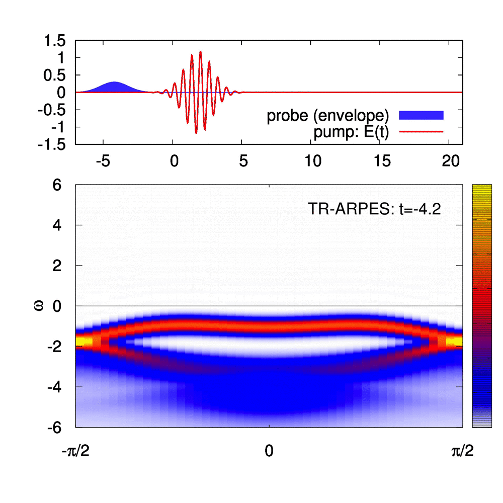
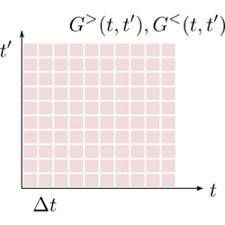
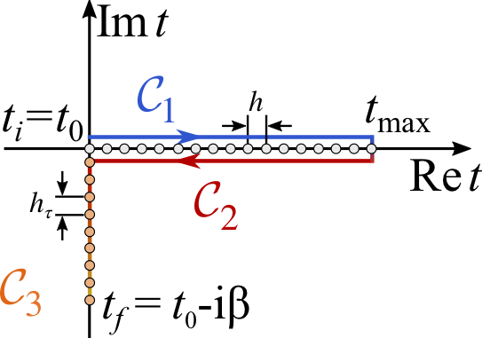
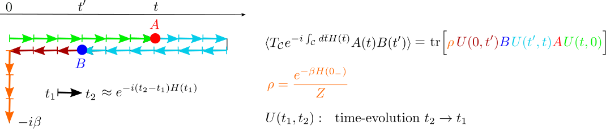
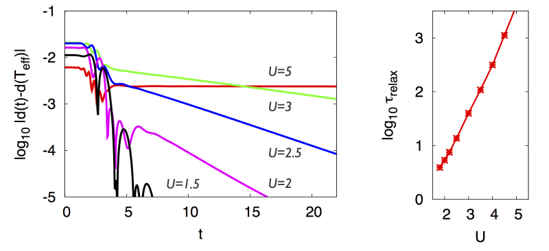
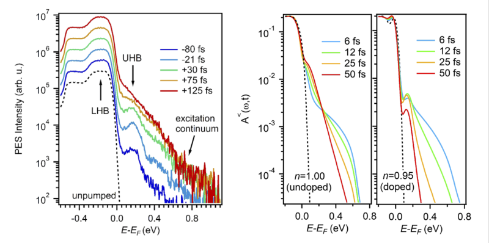
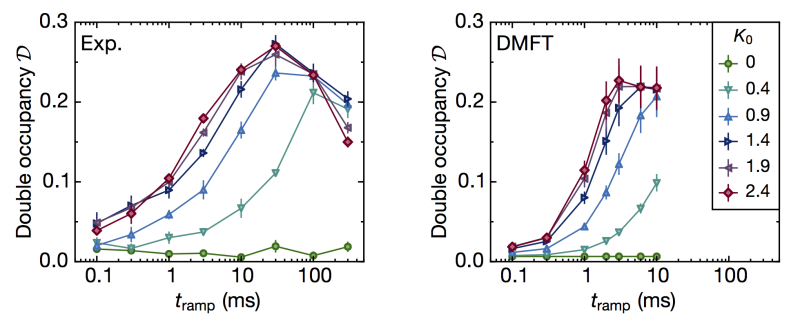

.. _P3:

====================
Physics Background
====================

.. contents::
   :local:
   :depth: 2

.. _P3Sec01:

Non-equilibrium quantum many-particle physics
=============================================

Simulating the time evolution of strongly driven many-body quantum systems is challenging because behavior distinct from the equilibrium properties can emerge on vastly different timescales.

   Time scales for different light-induced phenomena in lattice systems.

Such simulations are relevant in a broad variety of contexts:

- By driving condensed matter with tailored light one can **engineer novel quantum phases**.  
  Light-induced superconductivity or Floquet states are among the tantalizing examples.  
  See D. N. Basov, R. D. Averitt, and D. Hsieh,  
  *Towards properties on demand in quantum materials*, Nature Materials **16**, 1077 (2017).
- **Analog quantum simulation platforms** allow exploration of genuine non-equilibrium phenomena, such as dynamics at the boundary between integrable and ergodic behavior.
- **Dissipative driven quantum systems** are relevant for quantum transport and nanotechnology, including quantum computing architectures.
- **Time-resolved pump-probe spectroscopy** reveals the interplay of quasiparticles and collective excitations on microscopic timescales.  
  See Claudio Giannetti *et al.*,  
  *Ultrafast optical spectroscopy of strongly correlated materials...*, Advances in Physics **65**, 58 (2016).

   Example: Simulated time- and angular-resolved photoemission spectrum (tr-ARPES)
   of an excitonic insulator. The movie (GIF) illustrates how tr-ARPES reveals
   electronic structure out of equilibrium, including filling, broadening,
   internal relaxation, gap closing, and thermalization.
   Time-dependent GW simulations performed using the ``NESSi`` library.
   See Denis Golež, Philipp Werner, and Martin Eckstein,  
   *Photo-induced gap closure in an excitonic insulator*, Phys. Rev. B **94**, 035121 (2016).

:ref:`Back to top <P3>`

.. _P3Sec02:

Keldysh Formalism and Nonequilibrium Green's Functions
======================================================

Non-equilibrium Green's functions (NEGF)
----------------------------------------

.. _NEGF_def:

Field-theoretical approaches based on **Green's functions** provide a versatile
framework for deriving systematic approximations to quantum many-particle systems.
Green's functions measure spectra and occupations of quasiparticles and therefore
directly give spectroscopic quantities like tr-ARPES.

This complements *exact* many-body methods whose Hilbert-space scaling is
exponential.

The **NEGF** approach, pioneered by Keldysh, Kadanoff and Baym,
extends equilibrium many-body tools (diagrams, functional integrals) to
nonequilibrium phenomena.

For basic introductions, see:

- A. Kamenev, *Field Theory of Non-equilibrium Systems*, CUP (2011).
- G. Stefanucci and R. van Leeuwen,  
  *Nonequilibrium Many-Body Theory of Quantum Systems*, CUP (2013).
- H. Haug and A.-P. Jauho,  
  *Quantum Kinetics in Transport and Optics of Semiconductors*, Springer (2008).

The Keldysh formalism underlies the quantum Boltzmann equation,  
fluctuation–dissipation relations, and numerical two-time Green’s function
methods. This is where ``NESSi`` enters.

Kadanoff–Baym (KB) equations
----------------------------

.. _KB_def:

Very schematically, a non-equilibrium propagator :math:`G_{ij}(t,t')`
describes a **two-time correlation** between excitations. Its equation of motion is

.. math::
   :label: dyson_schematic

   i \partial_t G(t,t')
   - H_{mf}(t) G(t,t')
   - \int_{\text{previous time}} d\bar t\,
     \Sigma(t,\bar t) G(\bar t, t')
   = \delta(t,t').

Here :math:`H_{mf}` is an effective one-body Hamiltonian including mean-fields,
and :math:`\Sigma(t,t')` is the **self-energy**, describing interaction effects
and coupling to environments. Equation :eq:`dyson_schematic` is non-Markovian.

   Causal propagation of a two-time NEGF: computing :math:`G(t,t')` at the red
   point requires knowledge of all previous Green’s functions and self-energies
   (yellow region).

``NESSi`` implements these equations using the formulation successful in
nonequilibrium DMFT (see Aoki *et al.*, *Rev. Mod. Phys.*, 2014; Eckstein 2010).

:ref:`Back to top <P3>`

.. _P3Sec05:

Mathematical formulation
========================

The Keldysh contour
-------------------

Non-equilibrium many-body theory is naturally formulated on a **time contour**.

- The **L-shaped contour** :math:`\mathcal{C}` represents a system that begins in
  a thermal state with density matrix :math:`\rho = e^{-\beta H(0_-)}/Z`.  
  ``libcntr`` is tailored to this contour.
- **Non-equilibrium steady states (NESS)** typically depend only on relative
  time, suggesting a contour pushed to :math:`t=-\infty`.

   L-shaped Kadanoff–Baym contour with real-time and Matsubara branches,
   discretized for numerical evaluation.

Contour-ordered Green’s functions
---------------------------------

All relevant expectation values appear as contour-ordered objects:

.. math::

   T_{\mathcal{C}} \{ A(t_1) B(t_2) \}
   =
   \begin{cases}
     A(t_1) B(t_2) & t_1 \succ t_2 \\
     \xi\, B(t_2) A(t_1) & t_2 \succ t_1 ,
   \end{cases}

where :math:`\xi=+1` for bosons and :math:`-1` for fermions.

The basic two-time correlator is

.. math::
   :label: twotimegreens

   C_{A,B}(t,t')
   = -i \langle T_\mathcal{C} A(t) B(t') \rangle_\mathcal{S}
   = -i \frac{
     \mathrm{tr}[T_\mathcal{C} e^\mathcal{S} A(t) B(t')]
   }{
     \mathrm{tr}[T_\mathcal{C} e^\mathcal{S}]
   }.

   Unfolding contour-ordered expectation values into real-time correlators
   when :math:`\mathcal{S}` corresponds to Hamiltonian evolution.

Important Keldysh components
----------------------------

- **Lesser**: :math:`C^<(t,t') = -i\xi \langle B(t') A(t) \rangle`
- **Greater**: :math:`C^>(t,t') = -i \langle A(t) B(t') \rangle`
- **Retarded**:  
  :math:`C^R(t,t') = -i \theta(t-t') [A(t),B(t')]_\xi`
- **Matsubara**: imaginary-time component

In ``libcntr`` they are stored as  
:math:`\{C^<, C^R, C^\rceil, C^M\}`  
on the contour :math:`\mathcal{C}[h,N_t,h_\tau,N_\tau]`.

:ref:`Back to top <P3>`

.. _P3Sec06:

Numerical solution and accuracy
===============================

Dyson equations are reduced to **Volterra integral equations** and solved using
Gregory quadrature rules (Brunner & van Houven, *The numerical solution of
Volterra equations*, North Holland, 1986).

A rule of degree :math:`k` approximates

.. math::

   I = \int_0^{Nh} f(t)\, dt
   \approx \sum_{j=0}^{m(N,k)} w_j f(jh).

The numerical error scales as :math:`\mathcal{O}(N^{-(k+2)})`.

Order :math:`k=0` corresponds to trapezoidal integration with error
:math:`\mathcal{O}(N^{-2})`.

.. _P3Sec04:

Previous use of NESSi
=====================

Before public release (2019), ``NESSi`` was used extensively in nonequilibrium
DMFT studies of correlated systems. Over 60 publications rely on it.

Thermalization of a pump-excited Mott insulator
-----------------------------------------------

   Dynamics of doublon density and relaxation times as function of :math:`U`.
   From Eckstein & Werner, *Phys. Rev. B* **84**, 035122 (2011).

Doublon relaxation in photo-excited 1T-TaS₂
-------------------------------------------

   Comparison between experiment and DMFT simulations for doublon dynamics.
   From Ligges *et al.*, *PRL* **120**, 166401 (2018).

Benchmarking quantum simulators
-------------------------------

   Doublon production in driven cold atom systems vs. nonequilibrium DMFT.
   From K. Sandholzer *et al.*, arXiv:1811.12826.

:ref:`Back to top <P3>`