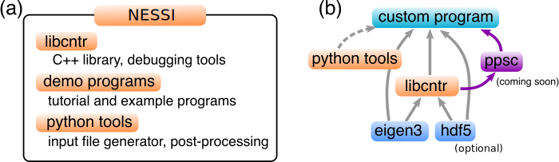

Welcome to the Non-Equilibrium Systems Simulation (NESSi) library!
===================================================================

.. contents::
   :local:
   :depth: 2

What is NESSi?
--------------

``NESSi`` is an open-source software package for the manipulation of nonequilibrium Green’s functions defined on the Kadanoff–Baym contour.  
The Green's function method in its time-dependent formulation is a versatile framework for solving interacting many-body problems out of equilibrium.

``NESSi`` provides classes representing the various types of Green’s functions, implements the basic operations on these functions, and allows one to solve the corresponding equations of motion. The library is aimed at the study of transient dynamics from an initial equilibrium state, induced by time-dependent model parameters.

**Overview**

- ``NESSi`` provides tools for constructing Feynman diagrams and solving equations of motion for nonequilibrium Green's functions on the Kadanoff–Baym contour.
- ``NESSi`` is based on high-order quadrature rules: for :math:`N` time slices, the error scales as :math:`\mathcal{O}(N^{-p})` with :math:`p` up to :math:`7`.
- Efficient distributed-memory parallelization over reciprocal space enables large-scale calculations on extended systems.
- The first extension of ``NESSi`` enables memory-truncated time propagation and steady-state calculations.

**Future developments**

- This software is the basis of a follow-up package for nonequilibrium dynamical mean-field theory in the strong-coupling limit.

How to cite
-----------

Please cite the following paper whenever you use parts of ``NESSi``:

M. Schüler, D. Golež, Y. Murakami, N. Bittner, A. Herrmann, H. U. R. Strand,  
P. Werner, and M. Eckstein, *NESSi: The Non-Equilibrium Systems Simulation package*,  
Comput. Phys. Commun. **257**, 107484 (2020).

If you use truncated or steady-state objects (see :ref:`Ptrunc` and :ref:`PNess`),  
please also cite:

*Version 2.0.0 paper, to be published.*

.. note::
   This will be updated for v2.0.0.

Structure of the software
-------------------------

- The core constituent of ``NESSi`` is the shared library ``libcntr``. It is written in C++ and provides the essential functionalities to treat Green's functions on the Kadanoff–Baym contour (see :ref:`P3`) as well as memory-truncated and steady-state equations.
- Users can write custom C++ programs based on ``libcntr`` to solve nonequilibrium Green’s function problems (see :ref:`PMan`).
- All callable routines perform sanity checks in debugging mode.
- ``NESSi`` includes example programs demonstrating ``libcntr`` usage (see :ref:`P4`).
- ``libcntr`` and the examples depend on the `eigen3`_ library for matrix operations.  
  The `hdf5`_ library is optionally used for binary, machine-independent output.
- Python tools are provided for preprocessing and for reading/post-processing Green’s functions stored in HDF5 (see :ref:`PMan13`).
- An extension of ``libcntr`` for strongly correlated impurity problems and DMFT (Pseudo-Particle Strong Coupling, PPSC) is in preparation.

Core functionalities
--------------------

The ``libcntr`` library provides highly accurate methods for calculating nonequilibrium Green's functions. A brief overview of the core routines is shown below.

Summary of main routines
~~~~~~~~~~~~~~~~~~~~~~~~

.. list-table::
   :header-rows: 1

   * - Routine
     - Description
   * - :ref:`PMan12S02`
     - Constructs free Green's functions for a general time-dependent Hamiltonian.
   * - :ref:`PMan07`
     - Solves the Dyson equation along the full Kadanoff–Baym contour  
       :math:`[i\partial_t - h(t)] G(t,t') - [\Sigma * G](t,t') = \delta_{\mathcal{C}}(t,t')`.
   * - :ref:`PMan08`
     - Solves contour integral equations of the form  
       :math:`G + F * G = Q`.  
       Example: the self-consistent :math:`GW` approximation.
   * - :ref:`PMan06`
     - Computes the contour convolution  
       :math:`[A * B](t,t') = \int_{\mathcal{C}} d\bar{t}\, A(t,\bar{t}) B(\bar{t},t')`.
   * - :ref:`PMan05`
     - Constructs bubble diagrams  
       :math:`C(t,t') = i A(t,t') B(t',t)` or  
       :math:`C(t,t') = i A(t,t') B(t,t')`.

New routines in version 2.0.0
~~~~~~~~~~~~~~~~~~~~~~~~~~~~~

.. list-table::
   :header-rows: 1

   * - Routine
     - Description
   * - :ref:`Ptrunc09`
     - Solves the truncated Dyson equation along the Kadanoff–Baym contour.
   * - :ref:`Ptrunc10`
     - Solves truncated contour integral equations of the form :math:`G + F * G = Q`.
   * - :ref:`Ptrunc07`
     - Constructs bubble diagrams for truncated Green’s functions.
   * - :ref:`PNess05`
     - Solves the steady-state Dyson equation in frequency space.
   * - :ref:`PNess03`
     - Constructs equilibrium steady-state Green’s functions
       :math:`G(t) = \int d\omega\, A(\omega) g_\omega(t)`.
   * - :ref:`PNess04`
     - Constructs bubble diagrams for steady-state Green’s functions.

Perspective: dynamical mean-field theory
----------------------------------------

.. _dmft_def:

While ``NESSi`` provides a general framework for real-time Green's functions, it has been used primarily for real-time DMFT simulations.

Two approximate impurity solvers are:

1. Weak-coupling expansions (e.g., IPT)
2. Strong-coupling pseudo-particle methods (NCA, OCA)

A Pseudo-Particle Strong Coupling (PPSC) library based on ``libcntr`` is under development.

Developers and contributors
---------------------------

**v1.0.2**

- Michael Schüler
- Denis Golež
- Yuta Murakami
- Nikolaj Bittner
- Andreas Herrmann
- Hugo U. R. Strand
- Philipp Werner
- Martin Eckstein
- Christopher Stahl

The development of this library has been supported by the Swiss National Science Foundation, the European Research Council, and the Flatiron Institute.  
We acknowledge F. Petocchi for help with graphical representation of the NESSi logo.

**v2.0.0**

- Fabian Künzel
- Michael Schüler
- Denis Golež
- Yuta Murakami
- Sujay Ray
- Christopher Stahl
- Jiajun Li
- Hugo U. R. Strand 
- Philipp Werner
- Martin Eckstein

*Version 2.0.0 acknowledgements and final author list will be updated.*

.. note::
   This will be updated for v2.0.0.

License
-------

This source code is licensed under the Mozilla Public License v2.0.  
See https://mozilla.org/MPL/2.0/.

**Next page:** :ref:`P2`

.. _eigen3: http://eigen.tuxfamily.org/index.php?title=Main_Page
.. _hdf5: https://www.hdfgroup.org/solutions/hdf5/
